# Dan Boneh密码学笔记——基于陷门置换的公钥加密

## 公钥加密机制：定义和安全性

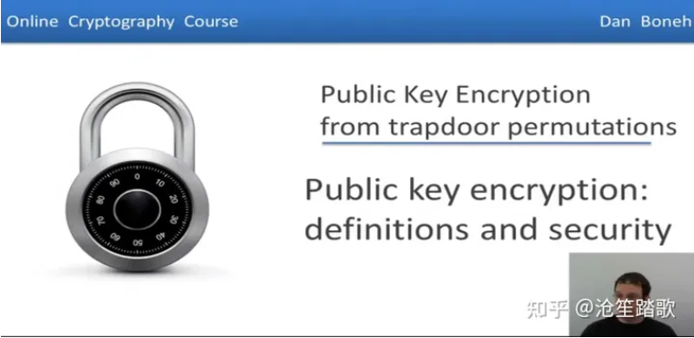

首先我们需要定义什么是公钥加密，以及安全的公钥加密是什么意思？

公钥加密机制中，加密算法E，解密算法D。加密算法取一个公钥为输入，解密算法取一个私钥为输入。公钥私钥这一对叫密钥对。公钥用于加密信息，私钥用于解密信息

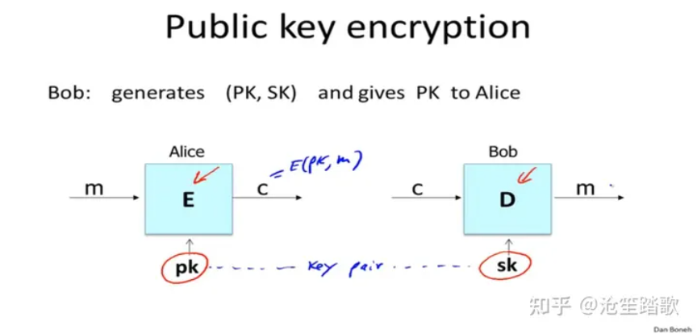

公钥加密有许多应用，上周我们看了很多经典的应用，比如会话建立，密钥交换，目前我们只看了仅对窃听攻击安全的密钥交换。这个协议的工作过程，Alice会产生一个公钥、私钥对，她会把公钥发给Bob。Bob会产生一个随机X，X被作为共享密钥，然后Bob把X加密后发送给Alice，使用Alice的公钥进行加密。Alice可以解密，还原X，现在双方都有了这个共享密钥X了，他们可以使用它来安全的互相通信。攻击者当然只能看见公钥和使用公钥加密后的X，根据这些他不应该能获得任何关于X的信息。我们要更精确的定义不能学到任何关于X的信息是什么意思。

公钥加密实际上有很多应用，例如它在非互动应用中非常有用。考虑一个电子邮件系统为例，这里Bob想发送电子邮件给Alice，随着Bob发送了这份邮件，电子邮件经由一个个邮件中转点，最终到达Alice，Alice可以解密之。这样建立的电子邮件系统是为Bob发送邮件的非互动情形设计的，然后Alice应收到邮件，为解密邮件，Alice不应与Bob通信，这里，因为这种非互动性，没有建立Alice和Bob之间的共享密钥的机会，这里Bob会发送加密的邮件，使用Alice的公钥。他发送了邮件，是节省任何人可以发送加密后的电子邮件给Alice，使用她的公钥。当Alice接收到邮件时，她使用她的私钥来解密密文，还原明文。当然，这种系统有一个警告，事实上Bob需要通过某种方法知道Alice的公钥。目前我们还只是假设Bob已经有了Alice的公钥，但待会当我们讨论数字签名时，我们会看到，这点使用所谓的公钥管理将非常有效。

公钥加密用于会话建立，这在网络上很普遍，公钥加密用于建立起一个浏览器和网页服务器之间的安全密钥。公钥加密对非互动的应用也很实用，这个世界的任何人，需要非互动的发送信息给Alice时，可以使用Alice的公钥加密信息。Alice可以解密并还原明文。

公钥加密系统由三个算法构成G，E，D

G密钥生成算法，会生成这个密钥对，即公钥和私钥。G无输入参数，但在现实中，G其实有一个参数叫做安全参数，指定了这个密钥生成算法将要生成的密钥大小

E加密算法，它们取一个公钥和明文为输入，产生一个密文

D解密算法，取对应私钥和密文作为输入产生对应明文

通常为求一致性，我们说如果我们使用一个给定的公钥加密了一个明文，然后我们用对应的私钥解密。我们应该可以获得原先的明文。

那么一个公钥加密是安全的，是什么意思呢？

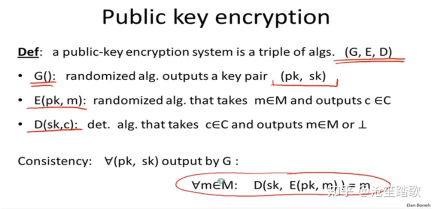

首先从定义对抗窃听的安全性出发，然后我们在定义对抗主动攻击的安全性。

定义对抗窃听的安全性，与对称密码的情况很类似。这个攻击游戏如下定义，我们定义两个实验。实验0和实验1，在这两个实验中，挑战者都会生成一对公钥和私钥。他把公钥给攻击者，攻击者产生两个信息m0和m1，长度相同，然后攻击者会得到m0或m1的加密，在实验0中他会得到m0的加密，在实验1中会得到m1的加密。然后攻击者要识别他得到的是哪个信息的加密，他得到的是m0还是m1的加密？

在这个游戏中，攻击者只会得到一个密文，这个对应于窃，听攻击中他监听到的密文C，现在他的目标是费编出密文C是m0还是m1的加密，对密文C的篡改是不被允许的。通常我们说，这个公钥加密机制是语义安全的，如果攻击者不能区分实验0和实验1。换句话说，他不能区分他获得的是m0的加密还是m1的加密。

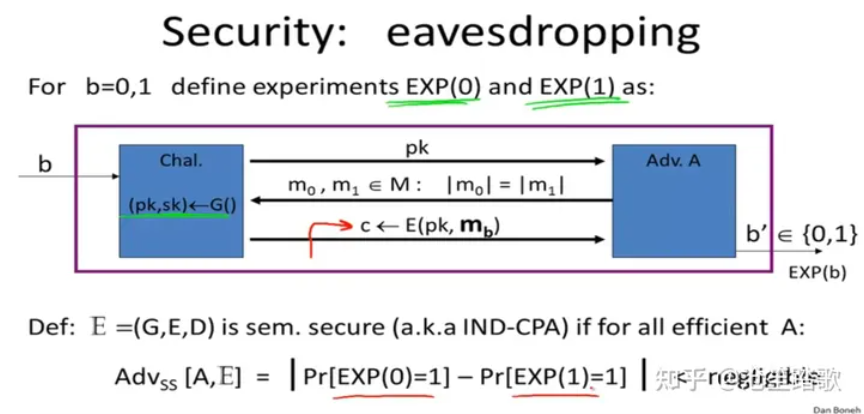

在我们讨论主动攻击之前，先简单提一下这个定义与对称密码的窃听安全的定义之间的关系。

当我们讨论对称密码的窃听攻击时，我们区分了两种情况，密钥只使用一次和密钥使用多次。事实上我们看到了有明确的区分。例如一次性密码本是安全的，如果密钥只被用于加密单个明文，但如果密钥用于加密多个明文，将是完全不安全的了。

事实上，我们有两个不同的定义，一个是一次性安全，我们还有另一个不同的定义，更强一点，当密钥被使用多次。上一张幻灯片里的定义与对称密码的一次性安全很类似。事实上，对于公钥加密，如果系统的一次性密钥是安全的，那么它对多次密钥也是安全的。换句话说，如果我们不必赋予攻击者请求加密他选择的明文的能力，因为他可以自己创建这些加密。他有了公钥，因此他可以自己加密任何他喜欢的明文。因此从某种意义上，公钥私钥对天生就是用来加密多个信息的。因为攻击者可以加密很多他选择的明文使用我们第一步给她的给定的公钥。所以事实上，一次性安全的定义足以蕴含着多次安全，这就是为什么我们称这个概念是选择明文攻击下的不可区分性。这只是稍微解释了为什么在公钥加密的设定里，我们不需要更复杂的定义来理解窃听安全。

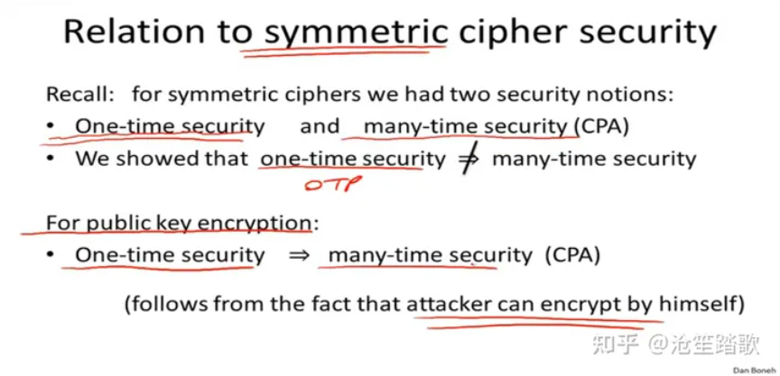

现在，我们理解了窃听安全性，下面我们来看更强大的攻击者，他们可以实施主动攻击，特别的，我们看电子邮件的例子，那么这里我们有我们的朋友Bob想发送邮件给他的朋友Caroline，Caroline正好在Gmail上有账号。过程如下。

这份加密的邮件发送给Gmail服务器，Gmail服务器解密邮件，查看接收方，如果接收方是Caroline，它会把这份邮件转发给Caroline。如果接收方是攻击者，它会把邮件转发给攻击者。这与Gmail的工作方式类似，因为发送方会通过SSL把邮件加密后发给Gmail服务器，Gmail服务器会中断SSL连接，然后把邮件转发给合适的接收方，现在假设Bob加密了邮件，使用的系统允许攻击者篡改密文，且不会被检测到。例如，想象这份邮件是使用计数器模式加密的或类似的，然后攻击者截获了这个邮件，他可以改变接收方，这样使得接收方变成了[attacker@gmail.com](mailto:attacker@gmail.com)。我们知道对于计数器模式，这是非常容易做到的。攻击者知道邮件是发往Caroline的，他只对邮件的内容感兴趣，所以他更改邮件的接收方，这样当服务器接收到偶见是，他会解密看到接收方是攻击者，然后就把邮件转发给了攻击者，现在攻击者可以读到邮件的内容了，这些内容本该是给Caroline的。

以上是一个经典的主动攻击的例子。攻击者只能解密接收方是攻击者的邮件，也就是以“致攻击者”开头的明文所对应的密文。我们的目标是设计安全的公钥系统，即使攻击者可以篡改密文还可以解密特定的密文。

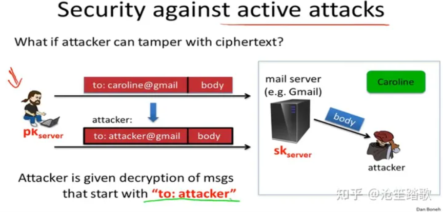

上面的攻击就引入了选择密文安全的定义，事实上这是公钥加密的标准安全性观念。

我们的目标是构建安全系统使用非常保守的加密观念，那么我们有一个加密机制（G,E,D），我们定义在明文空间和密文空间（M,C）上。通常，我们定义两个实验，这里的b表示挑战者时实现实验0或是实验1.挑战者开始时生成一对公钥和私钥，然后把公钥给攻击者。现在攻击者可以说这里有很多密文，请为我解密它们，这里攻击者提交了密文c1，他获得了密文c1的解密，即m1，攻击者可以一次次的这么做，最终攻击者说，游戏结束了。现在他提交两个等长度的明文m0和m1，他会收到挑战密文c，也就是m0或m1的加密，取决于我们是在实验0还是实验1。现在，攻击者可以继续提交这些密文询问，他可以继续请求解密。那么它提交了一个密文，他获得了他提交的密文的解密，但当然必须警告，如果攻击者可以提交他选择的任意密文，那么他可以破解这个挑战。他只需提交这个挑战密文c作为解密请求。然后他被告知他在挑战阶段获得的是m0还是m1的加密结果。因为我么有这么一个限制，攻击者可以提交任何他选择的密文，除了挑战密文，攻击者可以询问他选择的任何密文的解密。即使攻击者有所有的解密，他依然不能分辨出他得到的是m0还是m1的加密

如果攻击者的表现在实验0和实验1中是一样的，那么他不能区分m0与m1的加密，即使他拥有这么多的能力。那么我们说这个系统是选择密文CCA安全的，有时有一个缩写词对选择密文攻击的不可区分性记为CCA安全。

假设使用的加密系统满足给定信息的加密，攻击者可以改变接收方，从“致Alice”改成“致Charlie”，那么我们可以这样赢得游戏。第一步攻击者当然得到了公钥，那么攻击者会发出两个等长度的明文，第一个明文内容是0，第二个明文内容是1，两个明文都给Alice，Alice回复后，攻击者会得到密文c，那么现在，我们有我们的挑战密文c了。现在攻击者会使用他的能力取修改接收方，他会返回个Alice一个密文c'，c'是Charlie的明文加密结果，其内容是挑战密文的内容b，现在因为明文不同我们知道密文也不同，特别的，c'一定和挑战密文c不一样，因此可怜的挑战者现在必须解密，根据CCA游戏的定义，挑战者必须解密任何不同于挑战密文的密文，那么挑战者解密了，给攻击者解密结果m'，他给了攻击者b，现在攻击者可以输出挑战结果b，他以优势1赢得了这个游戏。那么他对这个游戏的优势是1，因为攻击者能够改变挑战密文从一个接收方改到另一个，使得他能以优势1赢下这个CCA游戏。

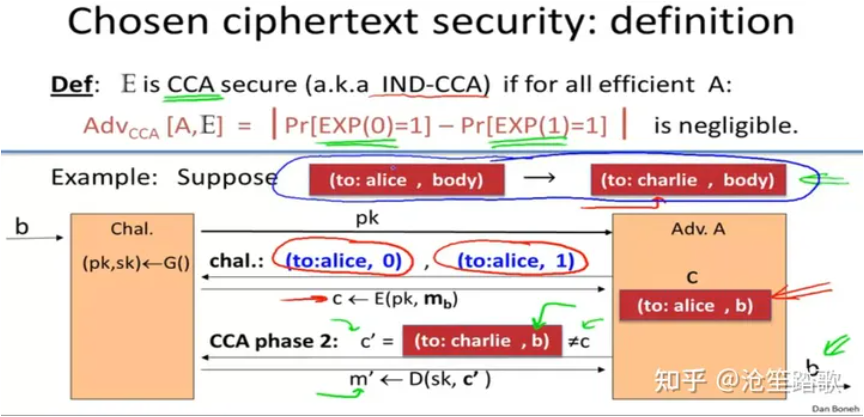

选择密文安全事实上是公钥加密的正确的观念。

## 构建公钥加密

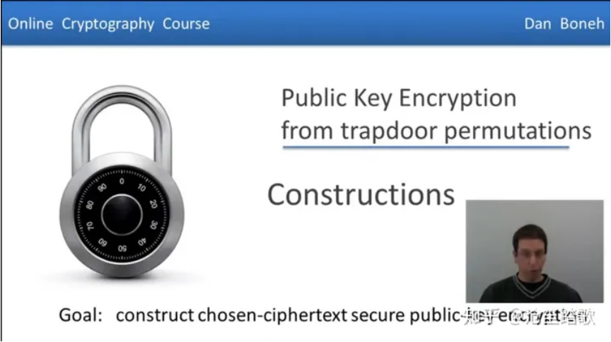

我们先定义一个广义的概念叫做陷门函数，什么是陷门函数？

陷门函数是一个函数，从集合X映射到集合Y，它定义为三个算法，它们是：一个通用的算法，函数f，和函数f的逆。那么这个通用算法，当你运行它时，它会生成一对密钥，一个公钥和私钥，这个公钥定义了一个从集合X映射到集合Y的特定函数。然后私钥定义了这个函数的逆，从集合Y映射到集合X。那么这里的想法是你可以使用公钥PK计算这个函数在任意点的值，你可以使用私钥SK来计算函数的逆。

逆是什么意思？更为精确的，如果我们看这个密钥生成算法G生成公钥、私钥对，如果我计算函数在点x的值，然后我计算所得点的逆，我应该获得原点x。大家应该想象出，有这么一个大集合X和大集合Y，然后这个函数会把X中的任一点映射到Y中的点，这一步可以使用公钥完成。那么X中的任一点可被映射到Y中的一个点。然后如果某人有私钥就可以用这个私钥SK做相反的方向。

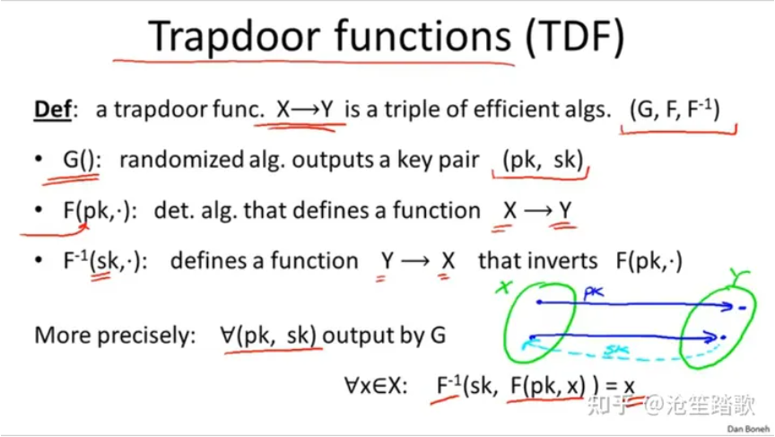

下面我们来定义安全的陷门函数的意思。那么我们说这个三元组（G,F,F^-1）是安全的，如果这个函数F(PK,.)是所谓的单向函数。

那么什么是单向函数？其想法是，这个函数可以在任一点计算，但求它的逆是困难的，如果没有私钥SK的话。那么我们来更为精确的定义，通常我们使用一个游戏来定义之。

在挑战者和攻击者之间定义这个游戏。游戏如下进行。挑战者生成一个公钥和私钥，他们会生成一个随机X，挑战者把公钥发给攻击者，它会计算函数在点x的值，然后把所得结果Y也发给攻击者，那么攻击者看到一个公钥，定义了这个函数是什么。然后攻击者看到这个函数在一个随机点x处的想，他的目标是求这个函数在这个点Y处的逆。那么他输出某个x'。

我们说过，这个陷门函数是安全的，如果攻击者求出在点y处的逆的概率是可以忽略的，换句话说，给定y，攻击者能够算出y的原像的概率事实上是可忽略的，如果这点对所有有效算法都成立，那么我们说这个陷门函数是安全的。那么再抽象点，这是个有趣的概念，你可以非常容易的从正向计算这个函数，但没人能从反方向计算这个函数，除非他们有这个陷门私钥SK，有了SK，使得他们突然间就能很容易地求这个函数的逆了。

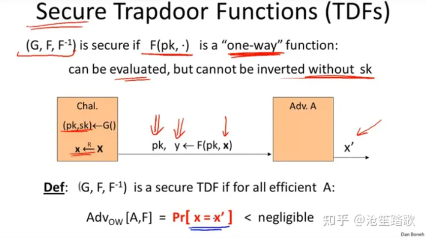

那么使用陷门函数的概念，不难构建出一个公钥加密系统。

这里我们有我们的陷门函数（G,F,F^-1），我们需要的另一个工具是一个对称加密机制，这里假设这个加密机制对主动攻击是安全的，那么特别的，需要提供认证加密。注意对称密钥系统取K中的密钥，陷门函数取X中的元素为输入，这是两个不同的集合，所以我们需要哈希函数，从X映射到K，换句话说，它把集合X中的元素映射成密钥用于对称加密系统。现在我们一旦有了这三个原件，我们就可以如下构建公钥加密系统。

公钥加密系统的密钥生成，与陷门函数的密钥生成是完全一样的。那么我们为陷门函数运行算法G，我们获得一个公钥和私钥，这些将是公钥加密系统的公钥和私钥。那么我们怎么加密解密呢？

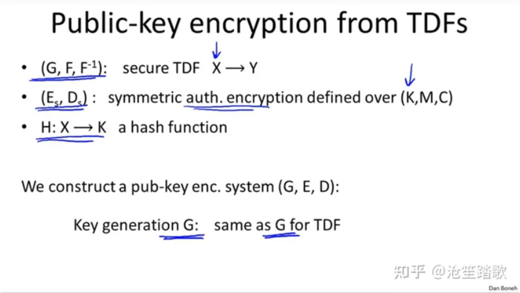

我们从加密开始，加密算法取一个公钥和明文为输入。它会生成一个集合X里的随机元素x，然后他会对随机元素x应用这个陷门函数，获得y，那么y是x在陷门函数下的像，然后它会生成一个对称密钥，通过取xde哈希值，那么这是对称加密系统的对称密钥，最终它加密明文m，使用刚刚生成的密钥，然后它输出它刚刚计算得到的值y，也就是x的像，与m在对称密码下的加密结果一并输入，那么这就是加密的工作流程。这个陷门函数只用于随机值x，而信息本身使用对称密钥系统加密的，使用根据我们随机选的x推出的密钥。

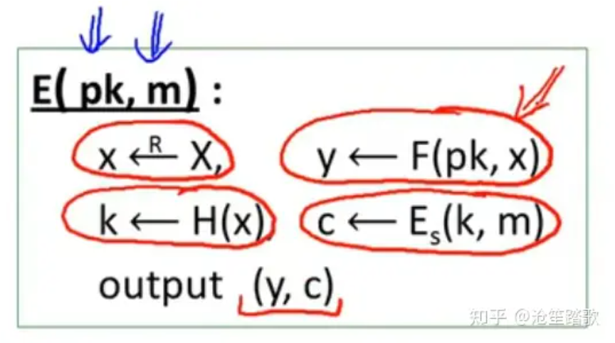

下面我们来看解密，解密算法取私钥和密文作为输入，密文本身包含两个部分，值y和c，首先我们应用陷门函数的逆变换，逆向陷门函数作用于值y，会返回给我们在随机加密是选择的随机x。那么我们如何从这个刚刚得到的x推导出对称的解密密钥K？这是个简单问题。我们再次对x取哈希值就能给我们与加密时得到的一样的密钥K。现在，我们有了这个对称加密密钥，我们就可以应用对称解密算法来解密密文c了。我们获得了最初的明文m，作为我们的解密输出。这就是公钥加密系统的工作流程。这个陷门函数只用于加密一个随机值x，而实际的明文信息是使用对称系统加密的。

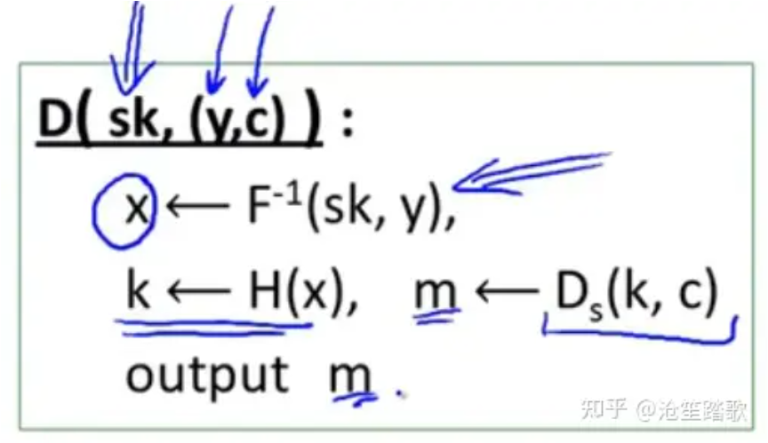

用图来看，我们有明文m，显然明文可以很长，那么我们这里的密文部分可以是很长的，它是使用对称系统加密的，再强调一下，对称系统的密钥是x的哈希，然后密文的开头就是我们选的随机数x的陷门函数值。而在解密过程中，我们首先解密密文开头，获得x，然后我们解密密文部分，使用对称系统，获得最初的明文m。

通常当给大家看一个像这样的系统时，大家显然想验证，解密的确是加密的逆。但为什么这个系统是安全的，事实上有一个漂亮的安全性定理告诉我们，如果开始的陷门函数是安全的，换句话说这是个单向函数，如果攻击者没有私钥的话，对称加密系统提供了认证加密，哈希函数是一个随机神谕，意思是它是个随机函数，从集合X映射到密钥空间K。那么随机神谕是某种理想化的模型，也是哈希函数应具备的性质。当然在实际中，当你要实现像一个这样的系统时，你就使用SHA-256或任何本课程里讨论过的其他哈希函数，那么在这三个条件下，我们刚刚讨论的系统是选择密文安全的，所以它是CCA安全的。这个ro表示安全性是建立在所谓的随机神谕模型上的。

> 如果陷门函数是安全的陷门函数，对称加密系统是安全的，能抵抗篡改，所以它提供了认证加密，而H某种意义上讲是个好哈希函数，它是一个随机函数

实际上有一个ISO标准，定义了这种公钥加密模式，ISO代表国际标准组织。

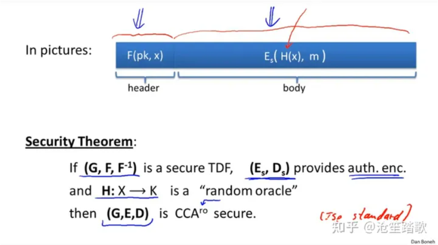

有一种错误使用陷门函数来构建的公钥加密系统。事实上这种方法可能是人们第一个想到的但是它是完全不安全的。

那么为什么不要用陷门函数来加密。

直接对明文m使用陷门函数，那么我们就是用陷门函数来加密明文m，然后使用F的逆函数来解密密文c，以还原明文m。那么事实上，解密是加密的逆过程，然而这时完全不安全的。

有很多的原因，最简单的方法来证明它不安全，在于这是一个确定的加密，可以注意到这里没有随机性被使用到，当我们加密一个明文m，由于算法是确定的，它不可能是语义安全的，但事实上，当我们将这个陷门函数具象化，使用特定的实现，例如RSA陷门函数，那么这种机制会有很多可能的攻击，所以永远不要使用它

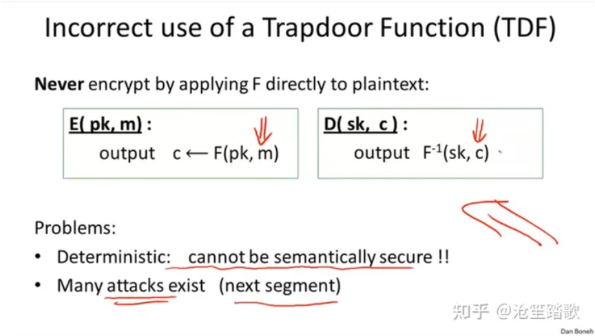

> 需要记住，永远不要对明文m直接使用陷门函数

## RSA陷门函数

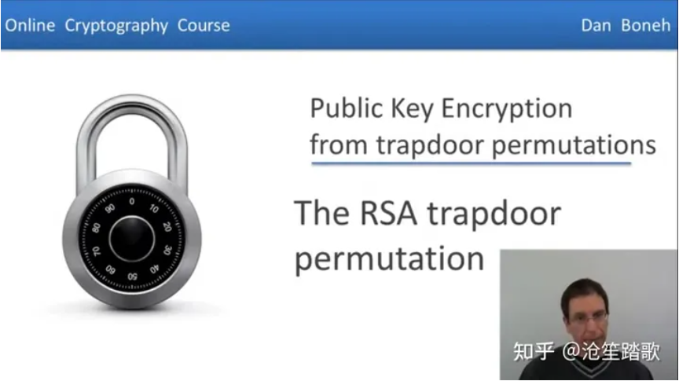

首先回顾一下，什么是陷门函数？

三个算法构成，密钥生成算法，陷门函数本身，以及陷门函数的逆

我们说陷门置换是安全的，如果由公钥定义的函数事实上是一个单向函数，意味着它是容易计算的，但如果没有陷门（私钥是陷门）是很难求逆的。

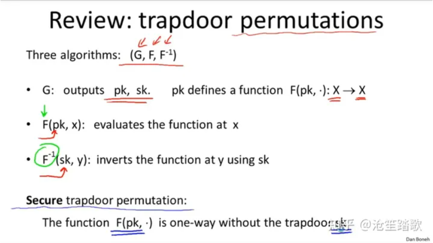

这里简单回顾一下一些我们需要的算数事实。特别是，我们看一些关于合数模的算数事实，这里我们有模N，N正好是两个质数的积，p和q，它们的大小差不多，因为它们的大小差不多是N的平方根。我们记Z_N表示从0到N-1的所有整数的集合。我们说过，在Z_N上我们可以做模N加法和乘法。我么记Z_N*表示Z_N上的乘法可逆元素。那么这些是全部的元素，它们都有模逆，我们说过，x是可逆的，当且仅当x与N互质，Z_N*中可逆元素的数目由函数 𝜑(𝑁) 表示，那么 𝜑(𝑁) 是Z_N*中可逆元素的数目。

当N是两个不同的质数的乘积时，那么事实上 𝜑(𝑁)=(𝑝−1)(𝑞−1) ，将其展开就等于(N-p-q-1)，因为p和q大约是N的平方根大小，p+q也大约是N的平方根大小，意味着 𝜑(𝑁) 大小大约是 𝑁−2𝑁 ，这里N将是一个大数，约600十进制位，那么一个600位数减去一个600位数的平方根，也就是大约300位，是很难影响这个数的大小的，意味着 𝜑(𝑁) 其实和N很接近，这一事实意味着如果我们选取模N中的随机元素，非常有可能这个元素也在Z_N*中，非常不可能选择一个Z_N中的随机元素得到的元素却不是可逆的。也就是说几乎所有的Z_N中的元素都是可逆的。

最后我们需要的是欧拉定理，这定理是说，对于Z_N*中的任意元素x，如果我计算x的 𝜑(𝑁) 次方，我会在Z_N中得到1，换句话说，我获得1模N。

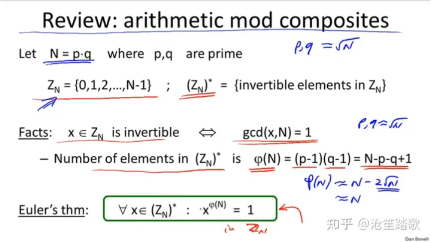

现在我们有了必要的背景知识，我们可以描述RSA陷门置换了。这是一个经典的密码学机制。RSA陷门置换在密码学应用中被广泛使用，例如SSL和TLS都使用了RSA，用于证书和密钥交换，有很多安全的电子邮件系统和安全的文件系统，使用了RSA，加密电子邮件和文件系统里的文件。这个系统里有很多其他应用，那么这是一个非常经典的密码学机制。

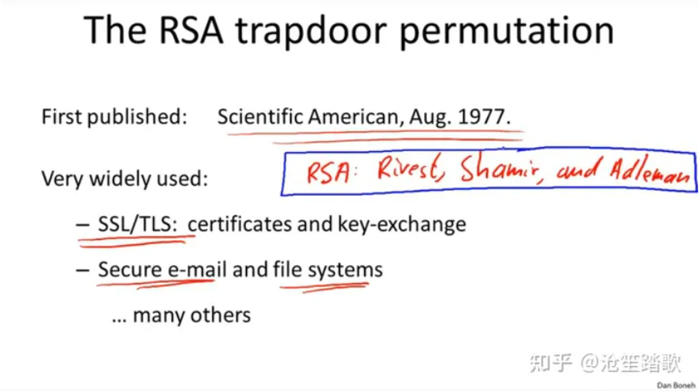

下面描述RSA陷门置换。首先必须描述这个密钥生成算法，函数f和逆函数f^-1，密钥生成算法如下工作，我们生成两个质数p和q，每个大约是1000位，约300十进制位，然后RSA模就是这两个质数的乘积，接下来我们选取两个指数e和d，满足e乘d等于1模 \varphi(N) 。这意味着e和d首先必须与 \varphi(N) 互质，其次，它们必须互为模 \varphi(N) 的逆。然后我们输出公钥位(N,e)，而私钥是(N,d)。

指数e优势被称为加密指数，而指数d有时被称为解密指数。

RSA函数本身的定义是很简单的。为求简便，将其定义成从Z_N*到Z_N*的函数。这个函数有输入x，我们只需取x，计算在Z_N中x的e次方，那么我们只需计算x^emod N就行了。解密时，给定输入y，计算y的d次方模N就行了。

我们可以快速验证函数f的逆，当我们计算y^d时会发生什么？假设y本身正好是RSA函数在某个值x处的值，这时 y^d就是RSA(x)^d，而x本身将变成 x^e mod N，因此，可以看到图中的等式，现在 x^{\varphi(N)} 根据欧拉定理，我们知道 \varphi(N)=1 ，最终得到结果x。所以我们证明了如果我取RSA函数的输出，然后计算它的d次方，我能得到x，这意味着计算d次方就是RSA的逆。

那么这就是RSA函数的全部描述。我们已经描述了密钥生成，陷门函数本身，以及陷门函数的逆。

下一个问题是，为什么这个函数是安全的？换句话说，为什么这个函数是单向的，如果我只有公钥没有私钥的话？

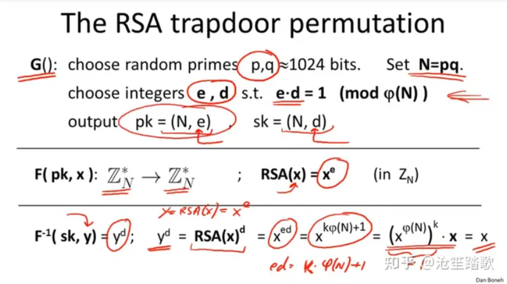

为了证明这个函数是单向的。我们表述这个RSA假设，告诉我们RSA函数是一个单向置换，形式化的，我们说对所有有效的算法A，如果我生成这两个质数p和q，随机的质数p和q，我把它们乘起来获得模N，然后我随机选择一个Z_N*中的y，现在我给了模N，指数（这里的指数e由公钥指定）和这个y给算法A，我会得到RSA在点y的逆的概率，即得到y^(1/e)，真正的逆，这个概率是可忽略的。那么这个假设叫做RSA假设。

这个假设是说，给定公钥，RSA是一个单向置换。因此，它是一个陷门置换，因为它有陷门（这里的陷门指的是私钥里的d），这个陷门使得凡是知道陷门的人，可以很容易的求逆。

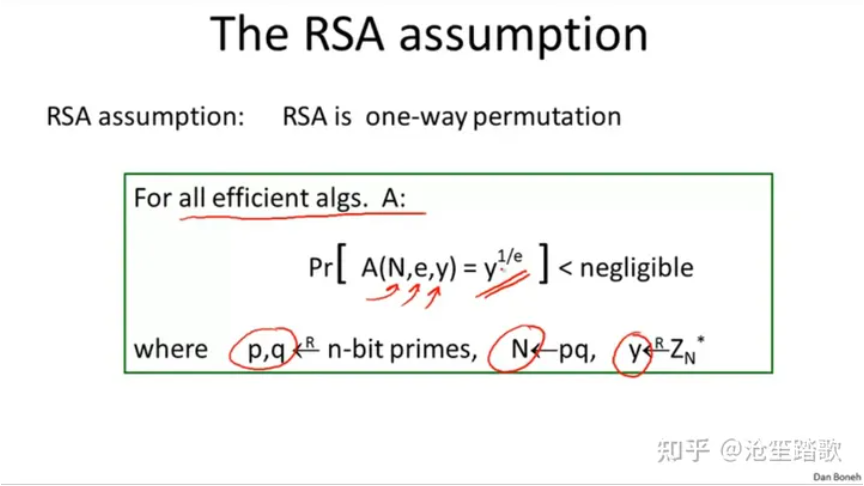

现在，我们有了一个安全的陷门置换，我们可以把这个陷门置换带入我们的公钥加密机制，获得我们的第一个真实的公钥加密系统，那么我们就把这个RSA陷门置换带入ISO标准机制。这个机制是基于一个必须提供认证加密的对称加密系统的，它还是基于一个哈希函数的。从RSA的角度看，这个哈希函数把Z_N里的元素映射到对称密钥系统的密钥。现在加密机制的工作方式是容易描述的。算法G就运行RSA的密钥生成算法，产生一个公钥和一个私钥，可以看到这个公钥包含了加密指数，私钥包含了解密指数。

加密的过程如下，我们随机选择一个Z_N中的元素x，我们对x应用RSA函数。我们先推导出一个对称密钥，通过对x取哈希，那么我们计算H(x)以获得密钥k，然后我们输出这个y和使用对称密钥k加密后的信息。在实际中，这个哈希函数H使用SHA-256实现，大家会使用SHA-256的输出，来生成对称密钥，然后使用这个对称密钥作为对称加密的助手。

我们会加密，然后解密，与之前章节里别无二致，首先我们使用密钥来求密文开头的逆，那么我们会计算y的RSA逆，这会给我们值x，那么我们对x应用哈希函数会得到密钥k。然后我们运行对称系统的解密算法来解密密文，会产生最初的明文m。

然后我们陈述上一节里的一个定理，是说如果RSA陷门置换是安全的，对称加密机制提供了认证加密，我们说过，H是随机神谕，H是某个从Z_N映射到密钥空间的随机函数。那么事实上这个系统是选择密文安全的，是一个很好的可使用的公钥系统，那么现在我们有了第一个好的可使用的公钥系统。

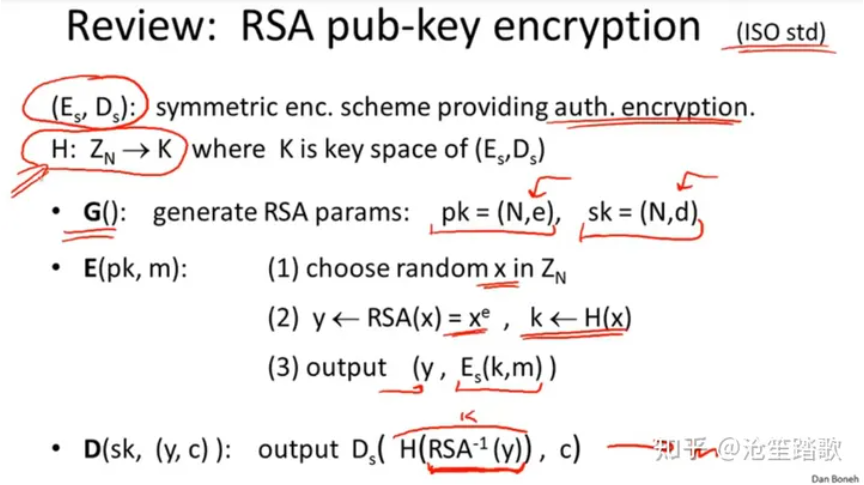

不要用RSA去加密。

这里把这个叫做教科书RSA，这是我们提到RSA加密时，第一个想到的方案，私钥和公钥与之前一样，但现在不是通过哈希函数来生成对称密钥，我们直接使用RSA来加密给定的明文m，然后我们直接使用解密指数来解密密文获得明文m。把这个叫做教科书RSA，因为很多教科书是这样描述RSA加密的，但这是完全错误的。这并不是RSA加密的工作过程，这时不安全的系统。特别的，这是一个确定的加密，因为它不可能是语义安全的。

事实上有很多攻击存在，这里想说清楚的是RSA是一个陷门置换，本身不是一个加密系统。必须用这个ISO标准为例来完善它，使之成为一个加密系统，而其本身仅为一个函数。

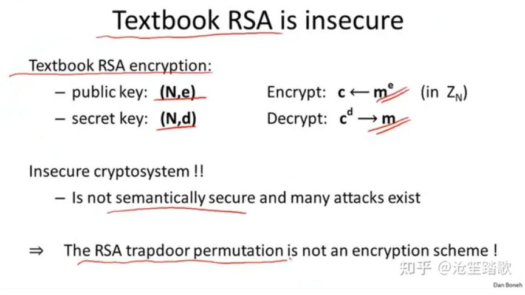

那么我们来看会发生什么错误？如果你试图使用教科书RSA，换句话说，如果你试图直接使用RSA来加密一个明文，我会给你一个网络世界中的攻击的例子，设想我们有一个网页服务器，这个服务器有RSA私钥，私钥记为(N,d)。这里我们有一个网页浏览器，浏览器试图与网页服务器建立起一个安全的会话，一个安全的SSL会话。那么SSL工作的方式是网页浏览器开始时发送这个客户端hello消息，我想和你建立一个安全会话，网页服务器回复一个服务端hello消息，其中包含了服务器的公钥，然后网页浏览器会生成一个随机数，这个随机数叫做预备主密钥k，它加密预备主密钥k，然后把结果以密文形式发送给网页服务器，服务器会解密，然后也会获得k，那么现在双方都有了共享密钥，他们可以使用它来安全会话。

如果我们直接使用RSA函数加密k会发生什么错误。换句话说，如果k直接加密成k^e mod N的话，为了论证方便，我们假设K是一个64位密钥，我们把k当作范围从0到2^64-1的一个整数。

首先，假设k正好能分解成几个差不多大小的数的乘积，那么我们可以把k写成k1乘k2，k1和k2是整数，比如说两个都小于2的34次方。那么实际上这有20%的概率会发生，那么5次中会有一次k可以被写成这样。但现在如果我们把这个k=k1*k2带入到定义密文的函数中，大家会发现，我们把k替换成k1乘k2，然后我们可以把k1移到留一遍，这样我们会得到这个方程，即灰色区域的方程。在这个方程中我们有两个变量，攻击者知道c，知道e，也知道N，这个方程里的两个变量是k1和k2，我们把它们分在方程的两边，因此我们现在可以利用这个方程进行中间相遇攻击了。

那么我们来进行中间相遇攻击。我们构建一张表，里面存放左边的所有可能值，c/(k1^e)的所有可能值，有2的34次方个，然后对右边所有的可能值，对 k2^e的所有可能值，我们检查这个值是否在我们第一步构建的表里，如果在，我们就找到了一个碰撞，我们就有了灰色区域的方程的一个解。那么我们一旦找到了一个元素具有形式 k2^e，这个元素在我们第一步构建的表里面，那么我们就已经解决了这个方程，并找到了k1和k2，当然我们一旦找到k1和k2，我们可以很容易的还原k，通过简单的相乘k1和k2，那么我们将k1乘k2，就能得到密钥k，我们就已经破解了这个加密系统。要花多少时间？暴力的搜索，我们可以在2的64次方的时间里破解它，通过简单的尝试所有可能的密钥，但可以看到，这个攻击花了2的34次方的时间做第一步，其实它花的时间略多于2的34次方，因为我们必须计算这些指数，它花了2的34次方的时间做第二步，同样的，用时略多于2的34次方因为要做指数运算。那么我们说整个算法用时2的40次方，这个事件比2的64次方的时间少的多。

那么这里大家有了一个例子，如果你直接使用RSA加密，换句话说直接计算k^e mod N，而不是通过ISO标准，那么大家会获得一个攻击，可以比穷举快的多。大家获得了一个用时2的40次方的攻击，远远快于2的64次方。那么这个可爱的例子揭示了如果直接使用RSA陷门置换来加密明文，那么如何来破解系统的。那么这里要记住的要点是，永远不要直接使用RSA去加密，必须通过一个加密机制来使用它，比如ISO的标准。

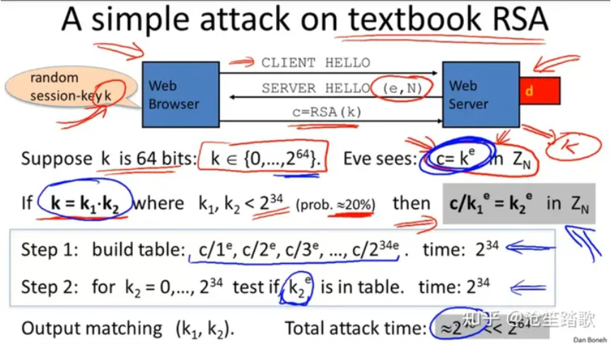

## 公钥密码学一号标准

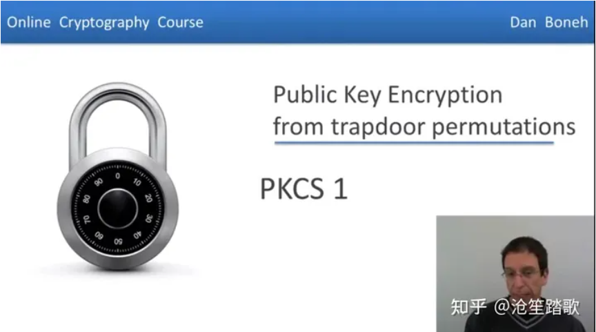

永远不要使用所谓的教科书RSA，因为这是不安全的，大家在应用RSA函数前必须始终对明文做些处理。我们上节看过了ISO的标准，我们生成了一个随机x，用RSA加密x，然后从这个x，我们推出一个对称加密密钥。不过这还不是RSA在实际中的应用，在实际中，事情不太一样，实际中，系统生成一个对称加密密钥，然后让RSA去加密这个给定的对称加密密钥，而不是生成对称密钥，作为RSA加密的一部分。那么在实际中，RSA系统有一个输入的对称密钥需要加密，例如这个可能是一个AES密钥，128位，然后这个密钥被加密，首先我们取这128位，我们它们扩展成整个模的大小。例如，这个模是2048位，然后我们应用RSA函数。

那么问题是，这是怎样预处理的？

我们应该如何把给我们的128位AES密钥扩展成2048位，然后在应用RSA呢？进一步的问题是我们如何论证得到的系统是安全的呢？

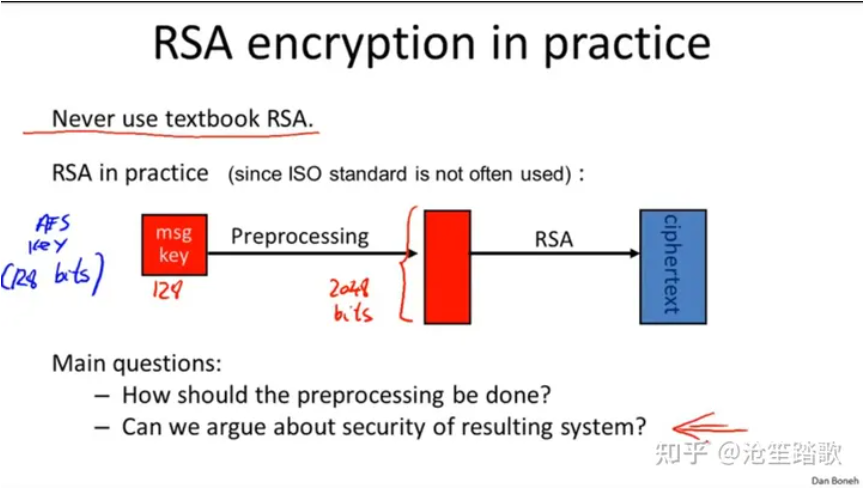

在实际中这是广泛应用的，即所谓的PKCS1 1.5公钥密码学标准，也就是PKCS的意思。这里展示这个机制是如何工作的，特别的我会给大家看所谓的PKCS1模式2。模式2表示加密，模式1表示签名，那么这里我们只看加密。PKCS1工作的过程如下，你取你的明文，比如说这里是128位AES密钥，把它放在你要产生的值的最低128位，接下来你在它后面附上16个1，即十六进制的FF，把它附在随机密码本的后面，这个密码本中任何地方都不含FF，这个密码本类似于1900位随机数，但这个随机数里面不含FF。最后在结果的最高位放上数02.这意味着这个明文已经被PKCS1模式2编码了。那么着整个值，我们刚刚创建的整个值就是一个2048位的字符串，作为RSA函数的输入去计算它的e次方模N，得到的就是PKCS1的密文。

现在当然，解密者要求RSA函数的逆，还原这个分组，他会看最高位，发现是02，意味着这时PKCS1格式的，它会移除这些02，它会移除所有的这些随机密码本，直到遇见FF，然后剩下的就是最初明文，然后用这个明文来解密密文的内容。

这个机制应用极广，例如HTTPS中就有用。现在有趣的是，这个PKSCS1 1.5是在上世纪80年代设计的，当时还没有安全性证明可以论证这个机制事实上是安全的。事实上这是一种很普遍的现象，在没有安全性证明的情况下，实际上系统会被破解，这里有一个非常优雅的攻击。

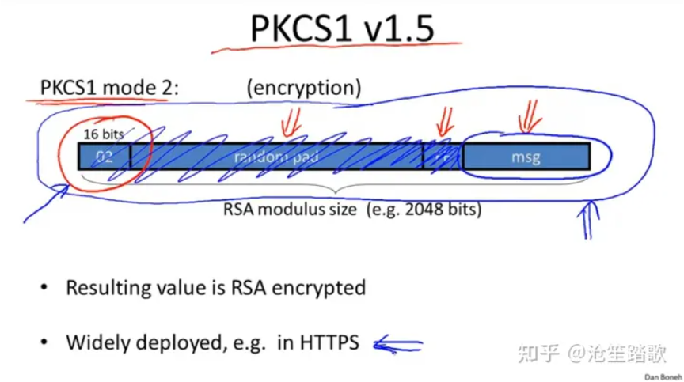

PKCS1，当它被使用在HTTPS中时，我们看这个攻击是怎样工作的，其想法是，假设攻击者截获了一个特定密文，右上角的c是PKCS1密文，那么要点是，它是用PKCS1编码的，然后结果作为RSA函数的输入，我们把这个密文叫做RSA函数的输出。攻击者想解密密文，下面展示攻击者会怎么做。

我们先简化SSL，比如说攻击者可以直接发送密文给网页服务器，服务器将试图使用它的私钥去解密密文，它怎么办呢？在解密之后，首先它问，密文的解密结果是否是PKCS1编码的？花奴话说，它会看最高几位并问最高两位是02吗？如果是，才继续正常解密，然后继续执行协议；如果这些最高位不是02就会生命一个错误。那么如果明文最高位是02就会如期执行协议，如果最高位不是02，就会返回一个错误，告诉攻击者你发送了一条无效的密文，现在令人惊奇的是，这一点让攻击者得以测试出，给定密文的最高16位是否是02.换句话说，攻击者可以提交他想提交给网页服务器的任何密文，网页服务器都会求RSA函数的逆，然后告诉攻击者逆的结果是否以02开头。那么某种意义上，这就给了攻击者一个神谕，使得他可以测试任意密文的逆是否以02开头。实际上这足以完全解密攻击者想解密的任何密文，一点点泄露的信息，因为RSA的特性让攻击者完全解密一个给定密文。

那么攻击者有一个他想解密的密文，他把密文直接交给网页服务器，询问它是否以02开头。接下来，攻击者选择一个随机值r，他要构建一个新密文c'，这会造成什么？如果我们把r带入RSA函数，我们只是与RSA明文相乘，PKCS1封装的明文m，我们用r去乘它，计算整项的e次方，那么这就是c乘(r^e)的效果，它把r与明文相乘，r是攻击者控制的值，然后攻击者会吧c'发送给网页服务器，服务器的回答是肯定的，以02揩油，或是否定的，不以02开头，那么现在我们是否可以把这个问题进行抽象，推广到更一般的情况，可以考虑以下情形，我知道这个数x，这个数是我想获得的PKCS1对m的编码，我考虑这个数x，然后我让你选择r，我会告诉你r*x mod n是否以02开头，职级上通过询问足够多的这样的问题，比如问数百万次你就可以还原x的全部了，只通过学习r*x是否以02开头。

实际上，这意味着攻击者可以抓取一个给定的密文，比如用户输入的信用卡号或密码，现在攻击者想解密密文，他会发送一百万条像这样的密文，对每条这样的密文，网页服务器会回复这个明文是否以02开头，在攻击的最后，攻击者给出密文c的解密结果。

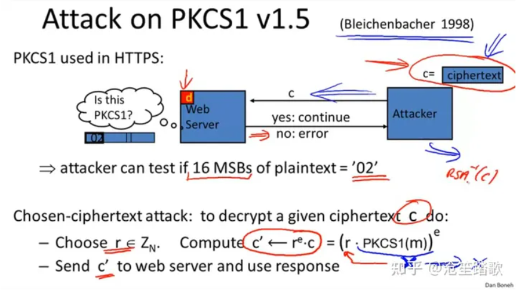

怎么能够只通过学习明文的最高位是否是02就能还原整个明文呢？那么这里给大家一个简单的例子，这个例子为Baby Bleichenbacher，只求表达这个攻击的基本想法。

那么设想攻击者可以发送密文c，网页服务器会用私钥解密，不过我们假设服务器不检查开头是否是02，而是看最高位是否为1，如果最高位是1，网页服务器会说：是，如果最高位不是1，网页服务器会返回“不”。为求进一步简化，我们假设RSA的模N是2的某次幂，即N=2^n。当然这不是一个有效的RSA模，RSA模是一个两指数的成绩。但为求简便，我们假定N是2的幂。那么现在大家发现通过给万业服务器发送密文c，攻击者只是学习明文x的最高位。服务器的行为完全泄漏了最高位是什么。现在攻击者可以把密文乘以 2^e，现在乘以 2^e就有去乘明文x的效果，就是把x乘以2，因为我们是工作在2的n次方模下，乘以2就意味着左移。那么现在当我们左移时，事实上我们学到了2x的最高位，也就等于学到了x的次高位，2x的最高位，我们左移了x，并取模N，那么现在，2x mod N的最高位也就是x的次高位。那么我们就学到了x的另一位。现在，我们重复着不，询问c=4^e，这对应于4x的e次方，询问4x会得到4x mod N的最高位。4对应着左移两位，意味着现在我们学到了x的第三高位。当我们一次次重复这些，对于不同的c的倍数，大家可以看出经过一些询问，大约1000到2000次询问，我们就还原了x。Bleichenbacher需要一百万次的原因在于他不是测试一位，他是在测试最高两位是否为02，这意味着他需要上百万次询问，而不是2000次，但那足以还原所有的明文了。

以上解释了为什么这个攻击是可能的，为什么关于RSA逆的最高位的一点点信息就足以解密RSA了。

至少可以说，PKCS1在网页服务器上曾如上述所实现，直到这种攻击被发现，它变得不安全了，因为攻击者可以解密他想要的密文，通过向网页服务器提交足够多的询问即可。

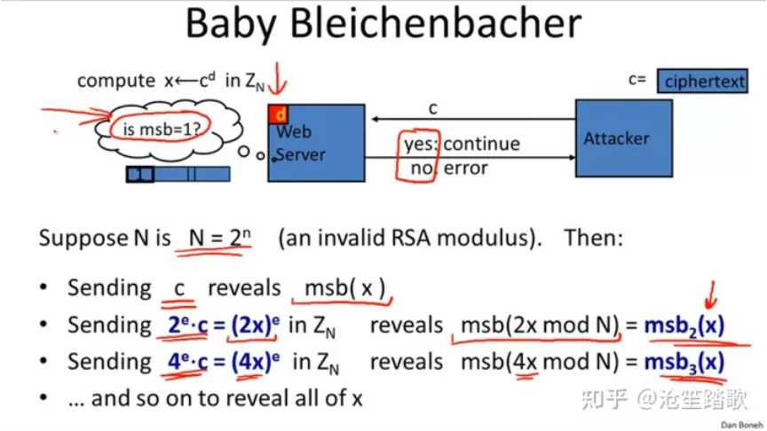

那么我们如何抵抗这一攻击呢？

SSL社区想通过对代码的最小改动就可以阻止这种攻击。如果大家看RFC，他们提出的方案如下。

这里有很多内容，但它们提出的大致上是说如果你应用RSA解密之后，你会获得一个明文，它并不是PKCS1编码的，换句话说，它不是以02开头的，你可以选取某个随机字符串r。只假定明文是一个随机字符串r，只当什么也没发生，当然稍后协议会失败。具体地说，如果PKCS1编码不正确，你会说预定主密钥是这个随机字符串，或只是随机接收的，我们继续协议，当然建立会话会失败，因为客户端和服务端最终达成的交换密钥不一致，这会导致会话终止。

我们实际上不告诉攻击者明文是否以02开头，我们只是假定明文是某个随机值。那么对于许多网页服务器来说，这只是一点点的代码改动，是容易布置的，事实上时至今日，大多数的网页服务器已经实现了这一版本的PKCS1。但是这带来了问题，PKCS1是否应该都被改变，使得我们得以证明选择密文安全性。

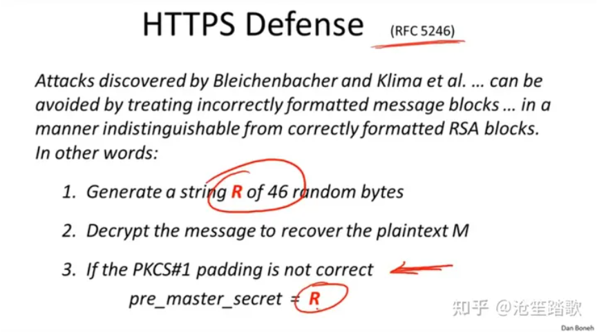

这让我们以一种不同的方法来进行使用RSA的加密，即所谓的优化非对称加密补齐OAEP。

事实上，这个PKCS标准被更新了，而PKCS版本2实际上支持OAEP，而OAEP是更好的使用RSA加密的方法。那么这里解释下OAEP是如何工作的。

取你想加密的明文信息，例如128位的AES密钥，然后首先在明文后面附上一小段密码本，在这里，你在前面附上01，然后再加一组0，根据标准来定要加多少0，假设这里有128位0.然后大家也选择一个随机值，使得这整个字符串与你的RSA模一样大，比如说2047位，现在在你应用RSA函数之前，首先取你选的随机数把它交给哈希函数，这个哈希函数产生一个值，这个值与你编码的左边一样大。你把输出求异或，把得到的结果交给另一个哈希函数，我们叫它G，你用一个随机值去异或，最后会得到两个值，把它们联结起来得到2047位长的字符串，这也就是你应用RSA函数的字符串。结果就是RSA加密。

现在有一个2001年证明的理论，证明了事实上如果你只假设RSA函数是陷门函数，是一个安全的陷门函数，但事实上这个模式使用RSA加密是选择密文安全的话，我们还必须假设函数H和G是某种理想的哈希函数才行，如我所说这些叫做随机神谕，我们假设H和G是随机函数，从它们的定义域映射到它们的值域。当然在实际当实现OAEP时，对于H和G，人们就使用SHA-256。

那为什么这叫做优化非对称加密补齐呢？为什么要说优化呢?

原因在于，如果你看密文，会注意到其密文是尽可能短的。密文与RSA输出一样长，没有附在密文后面的值。例如ISO标准中，即使你必须加密一个非常短的明文，你必须使用RSA加密x，然后在x后面附上使用对称加密系统加密的短消息。即使你必须加密128位AES密钥，根据ISO标准，你会获得一个RSA输出加上一段对称密钥，而在OAEP中，你只获得了RSA输出，没有其他东西，那么从某种意义上，这是有花的，密文长度是优化的。有趣的是，这个定理依赖于RSA的性质，如果你是用一个普通的陷门置换，那么这个定理不成立，其他的置换未必具备RSA的代数性质。

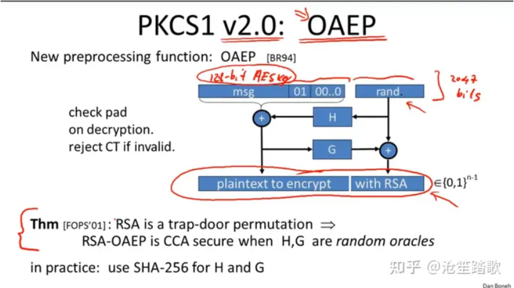

剩下的问题是，如果我们有一个普通陷门置换，如何正确使用OAEP呢？实际上，对OAEP有一个小修改可以使得结果更一般。这时Shoup于2001年给出的结果，证明了如果给我一个普通陷门置换f，实际上，如果不用OAEP里的固定补充，而是使用这个哈希函数W，它是你要加密的明文m和随机性r的哈希函数，然后在解密时，检测这个哈希函数的值是否正确，那么当你解密时，检查w(m,r)是否与明文中这个位置的内容一致，这种改进后的OAEP叫做OAEP+。事实上它是CCA安全的，对任意陷门置换都是选择密文安全的，不必依赖于RSA的特定性质。

还有一个结果叫做简单非对称加密补齐，SAEP+，就是说如果要依赖RSA的性质，那么在特殊情况下，当RSA的公钥指数等于3时，实际上你不需要第二阶段的加密工作，这里这个简单的补齐机制使用了函数w，就足以保证选择密文安全了。那么这些OAEP的变种但它们并没有被实际使用。这里只是提一下，让大家知道它们的存在。

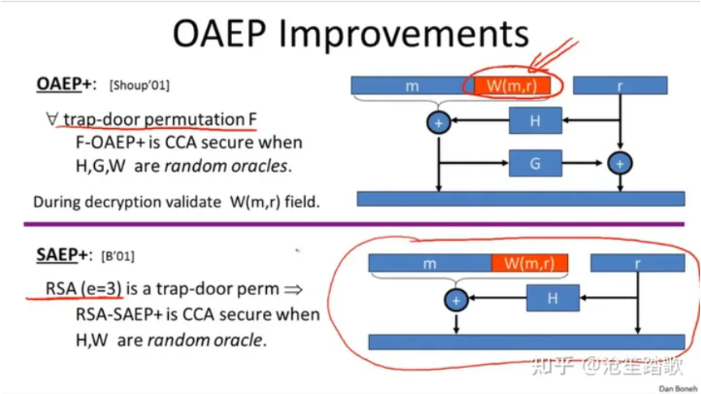

被使用的OAEP已被标准化了，尽管在实际中，RSA在公钥加密中的最一般的应用实际上就是这个被标准化的PKCS1，在HTTPS的RFC中。

为了确保大家理解清楚这个解密是如何工作的，问如何解密SAEP密文ct。这里你有密文ct，问题是下面三种方法中，哪种是正确的密文解密？

正确答案是第一个，我们来看为什么。有了密文我们首先需要应用RSA逆函数，作用于密文，我们会得到RSA明文，正好就是x和r，那么我们得到了这里的x和r，接下来我们需要使用函数h计算人的哈希值，然后把结果与x异或，这会给我们m和w(m,r)，最后我们需要确保补齐w(m,r)是正确的，这样我们检查w是否等于w(m,r)，如果是，我们输出m，如果不是，我们输出无效符号，表示密文无效，因此解密算法拒绝了它。

强调一下，解密中的这个补齐检查在我们看过的所有的机制中都是很重要的，例如OAEP+和SAEP+

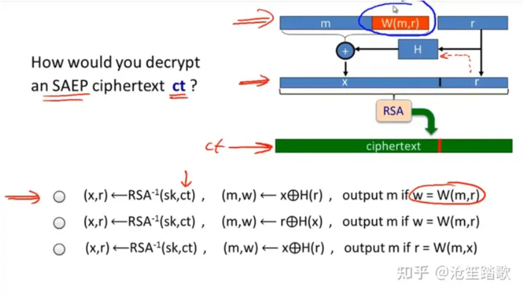

实际上实现OAEP可能是很困难的，为什么？

假设你写了一个OAEP解密程序，取密文为输入，首先对密文应用RSA逆函数，比如说你希望得到n位置输出，2047位，在2048位RSA模的情形下。如果你获得了某个比2^2047大的数，你就拒绝。我们说错误=1，然后离开，接下来我们检查补齐是否正确，如果补齐不正确，我们还是拒绝和离开。

这对于计时攻击来说是脆弱的，通过泄露时间信息，攻击者可以解出是什么导致了错误，是RSA解密后数太大的错误还是因为补齐太大的错误？如果攻击者通过计时可以区分这两种错误，那么与Bleichenbacher类似，实际上是可能完全解密任何你选择的密文的，一丁点的信息泄露都可以让攻击者完全解密任何他想要的密文。

这展示了即使你正确实现了OAEP的数学部分，你也可能会搞砸，使自己暴露于计时攻击中，这会使得你的实现是完全不安全的。通常的教训是，不要自己去实现密码学，特别是RSA，OAEP，就使用标准库即可

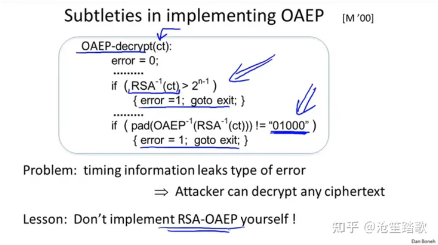

## RSA是一个单向函数吗

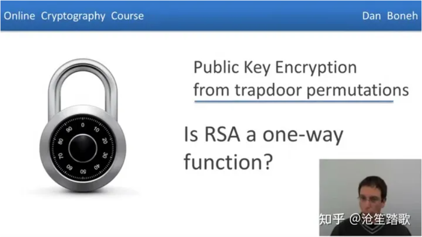

RSA真的是一个单向函数吗？换句话说，在不知道陷门的情况下，求RSA的逆真的有这么难吗？

如果有一个攻击者想求RSA的逆，攻击者有公钥即(N,e)，现在他有x^e，他的目标是还原x，问题是有了 x^e mod N，还原x的难度有多大？我们真正问的是计算合数模的e次方根有多难？如果这个问题实际上很难，那么RSA事实上就是一个单向函数，如果这个问题是容易的，那么RSA就会被破解了。

实际上，这个问题的目前的最好算法需要我们首先分解模N，然后一旦我们分解了模，容易计算模p的e次方根，容易计算模q的e次方根，然后很容易把它们组合起来，使用所谓的中国剩余定理，即可以还原模N的e次方根。我们一旦能够分解模，计算模N的e次方根就会很容易。但是分解模，就目前看来是一个非常困难的问题。

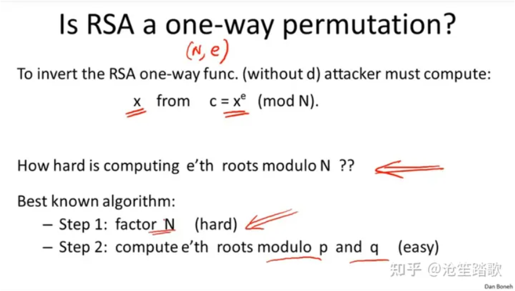

但是一个自然的问题是，为了计算模N的e次方根，我们真的能分解模N吗？就目前我们所知道的最好的计算模N的e次方根的算法是需要将N因子分解的，但谁知道呢？也许就有一条捷径可以让我们计算模N的e次方根而不用分解模。为了证明这是不可能的，我们必须证明一个规约。就是说我们必须证明，如果我给大家一个有效算法可以计算模N的e次方根，这个算法也可以被改造成一个计算因子分解的算法，这叫做一个规约，即有一个计算模N的e次方根的算法，我们就能获得一个分解合数的算法了，这会证明任何人都不能计算模N的e次方根以比分解模更快的速度。如果我们有这么一个结果，我们就可以证明破解RSA实际上与分解大合数一样难，但很不幸，目前这个证明我们还不知道，事实上这时公钥密码学里最古老的问题之一。

这里只给出一个具体的例子，假设我给你一个算法，可以计算模N的立方根，对任意Z_N中的x，这个算法会计算出x的模N立方根，我的问题是，你能证明，使用这样一个算法你能分解模N吗？即使整个证明我们还不知道，我们知道的是，例如e=2时，如果我给你一个计算模N平方根的算法那么事实上，这就蕴含着分解模的算法，那么计算平方根事实上与分解模一样困难。很不幸，如果你回想RSA的定义，要求 𝑒𝑑=1𝑚𝑜𝑑𝜑(𝑁) ，这意味着e与模 𝜑(𝑁) 必须是互质的，这里第一个方程是说，e是模 𝜑(𝑁) 可逆的，这意味着两者互质，但是如果大家记得 𝜑(𝑁)=(𝑝−1)(𝑞−1) ，由于p和q都是大质数，p-1和q-1总是偶数，因此 𝑔𝑐𝑑(2,𝜑(𝑁))=2 ，因为 𝜑(𝑁) 是偶数，因此公钥指数2与 𝜑(𝑁) 不互质，这意味着，即使我们有了一个从计算平方根到因子分解的规约，e=2也不能被拿来当作RSA质数（容易看出，欧式都不能称为RSA指数），那么真正合法的最小RSA指数等于3，但是等于3，问题就是计算立方根与因子分解一样难，这是个开放问题。

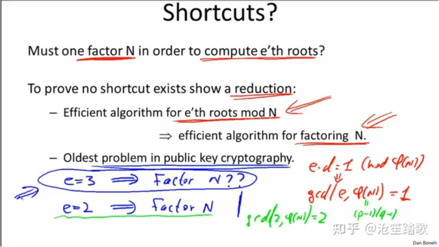

如果我给你一个有效算法，来计算模N的立方根，你能使用这个算法来分解模N吗？我会告诉大家有一些证据说明这样的归约可能并不存在，但这只是一个很弱的证据，这个证据是说，如果你给我一个非常特别的形式的规约，换句话说，如果你的规约是代数的，如果你有一个立方根神谕，你可以给我一个算法可以计算因子分解。这个规约本身就会蕴含着因子分解的算法，这就是说，如果因子分解是困难的，那么规约根本就不存在。但是，如我所说，这时非常弱的证据，因为需要规约是代数的，也许也会有其他类型的规约比如我们们有考虑过的类型。

很有趣的问题，如何使用一个立方根算法来分解模？我们目前只知道RSA是一个单向函数，事实上，破解RSA，计算e次方根，都要求因子分解模，我们都相信那是正确的，这就是目前的研究现状。

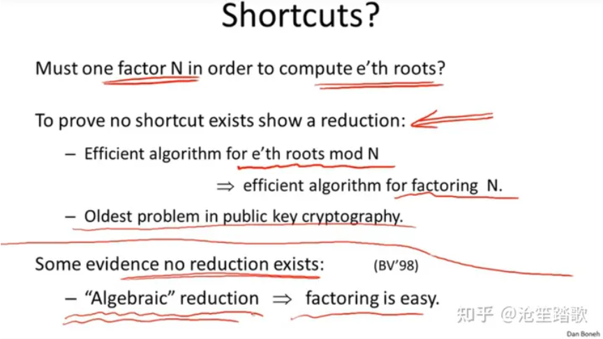

但是，现在有很多研究工作，试图提高RSA的性能或是RSA解密的性能。

这里展示一个试图提高RSA性能的错误例子，设想如果我想加速RSA解密，记得解密是通过计算密文的d次方。大家记得，指数算法的运行时间与d的长度大小呈线性关系，与log(d)成线性，那么大家可以回想一下，如果我想加速RSA解密，我为什么不使用一个小d呢？比如说，使用一个解密指数，大约是2的128次方，那么这已经足够大了，穷举d实际上是不可能的。但正常情况下，解密指数d约与模一般大，比如说2000位，通过使用仅为128位的d，我可以提高RSA解密速度20倍，我从2000位降到100位，那么计算指数的速度会快20倍，实际上这是一个糟糕的点子，根据接下来的思路来看MW有一个攻讦，证明了事实上一旦私钥指数d小于模的4次方，我们看，如果模大约是2048位，这意味着如果d小于2的512次方，那么RSA是完全不安全的，而且这是最坏的一种不安全，即给定一个公钥e，你可以很快还原出私钥d。所以有传言说，这个攻击可以针对最多512位，那么为什么我们不让这个模，比如说530位，那么这个攻击就不能用了。但是我们依然可以让RSA解密加速4倍，因为我们把质数从2000位降到比如说530位。

W的攻击有一个扩展，证实了如果d小于N^0.292，那么RSA也是不安全的，事实上，这个猜想是说，这对最多 N^0.5来说是正确的，即使d大约为 N^0.4999，RSA依然是不安全的，尽管这是个开放问题，已经14年没解决了，没人可以超过这个0.292。为什么0.292会是正确答案，没人能超过0.292呢？

那么为了准确，当我说RSA是不安全时，我的意思是，有了公钥(N,e)，你的目标是还原私钥d，0.292是怎么来的，实际上是 1−1/2 ，这为什么会是问题的正确答案呢？如果答案是N^0.5会更自然的多，但这依然是一个开放问题。

这里的教训是，任何人都不应该在d上强加任何结构以期提高RSA性能，事实上现在有很多这样的结果，证实了任何像这样的试图提高RSA性能的技巧最后都会带来灾难。这不是正确的提高RSA性能的方法。

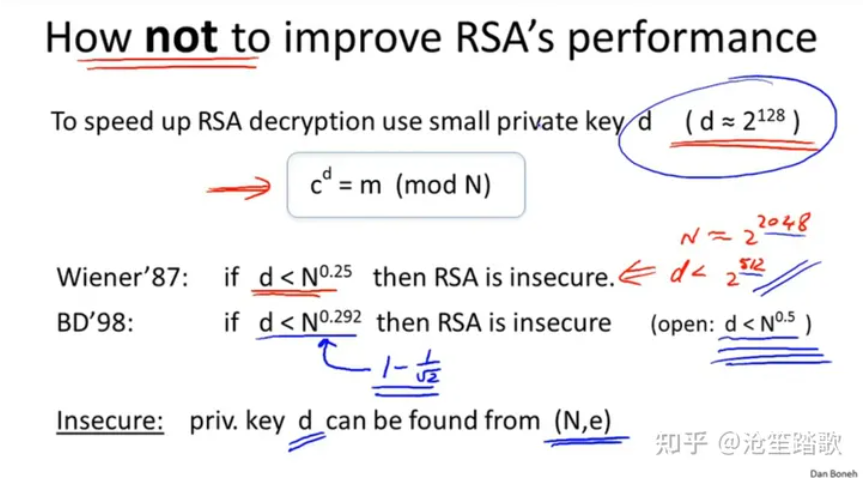

W的攻击是一个很犀利的攻击，它展示了如果私钥太少，小于N的四次方根的话，那么我们可以轻松地完全还原d。

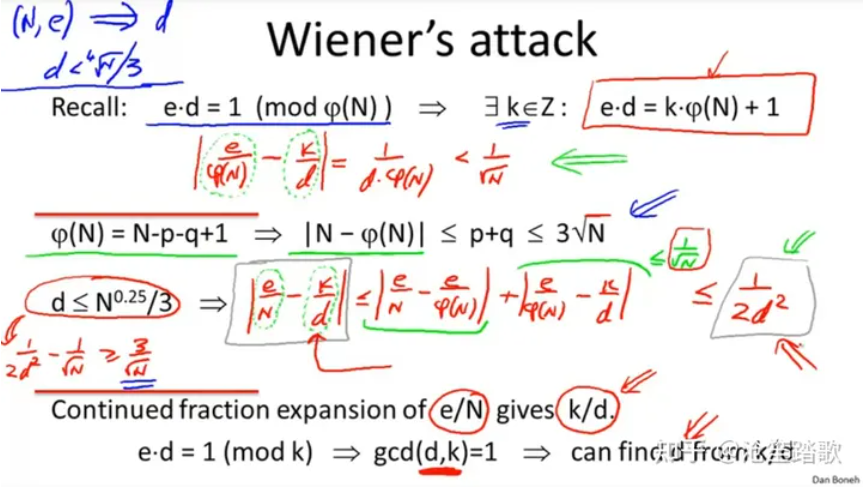

## RSA应用

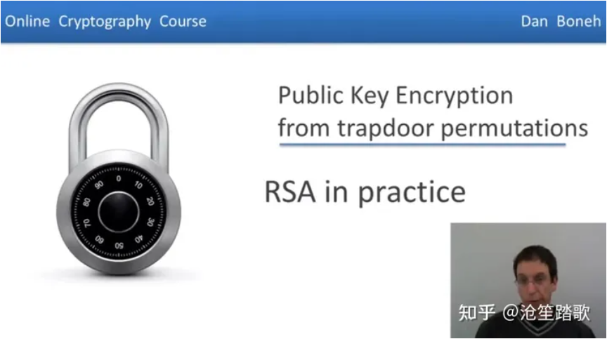

首先，如果大家想加速RSA加密，那么使用较小的公钥e是没有问题的，可以不使用随机的额，而是选择一个小e，事实上最小的可能值是e=3，我们来看为什么？e=1是一个不好的想法，因为e=1的逆不难去求，e=2不是一个有效的RSA指数，因为记得在RSA的定义中，e必须与 𝜑(𝑁) 互质， 𝜑(𝑁)=(𝑝−1)(𝑞−1) 是一个偶数，如果p和q都是奇数，但如果e是偶数，如果e=2，e就不与 𝜑(𝑁) 互质，那么e=2也不是有效的，那么e=3是第一个最小的可以使用的值，然后我们必须确保事实上，p=2 mod 3，q=2 mod 3，这样(p-1)(q-1)就不会被3整除，那么事实上这是一个可使用的很好的公钥指数，不过推荐的值是2^16+1，即65537，即使这个推荐的e值是个好点子，计算 x^3 mod N，你需要3步乘法，而计算x^65537 mod N，使用重复平方算法，需要17步乘法，你重复平方16次，然后再乘一次x，那么只要17次乘法，你就可以计算出这个指数，那么这比使用一个随机e要好的多了，随机e需要约2000次乘法，那么这就让我们得到了RSA的非对称性，事实上加密是很快的，加密只需要17次乘法，但是解密要慢的多，需要约2000次乘法。

有一个标准的加速RSA解密的技巧，叫做RSA-CRT，叫做带中国剩余的RSA，这个方法可以让RSA解密加速4倍，但不管如何这依然比加密慢得多，RSA的加密和解密的速度比，差不多从10到30，那么加密速度可以是解密的30倍，取决于模的大小。有趣的是，这是一个RSA的特殊性质，加密比解密快的多。另一种公钥系统，比如说ElGmal加密就没有这个性质，它的加密和解密用时差不多一样

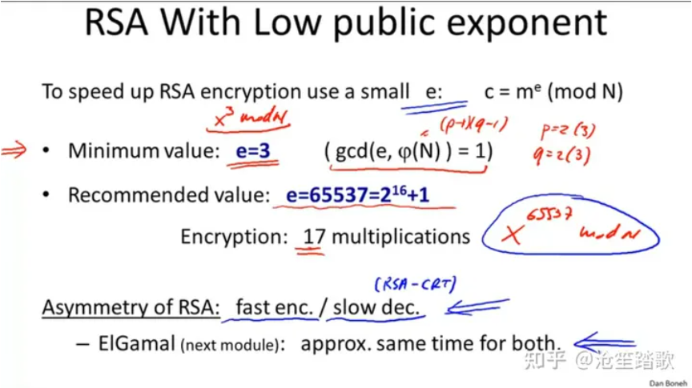

我们之前已经讨论了RSA的密钥长度，这里展示一下这些数，如果你是用128位AES密钥，你应该使用一个3000位的模尽管大家都用2048位模。如果你使用一个长AES密钥，比如256位，那么RSA模将会更大

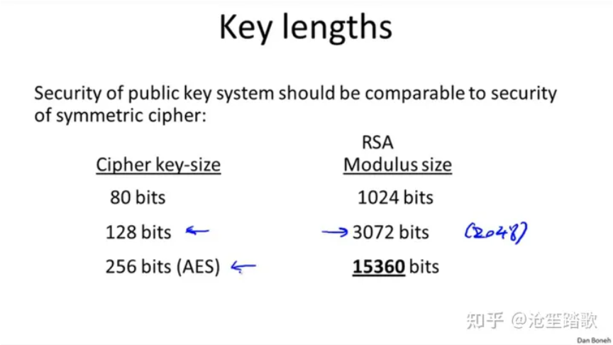

现在提一下众多的针对RSA实现的攻击，这些攻击已经针对特定的RSA的数学上正确的实现成功展示了。但是这些实现对特定的旁道攻击是脆弱的，这使得这实现是完全不安全的。

第一个，展示了一个计时攻击，你只需要测量RSA解密的时间，通过简单的测量耗时，你可以揭露密钥指数d，那么这是说如果你实现了RSA解密，你最好确保解密时间与这些参数无关。

第二个，展示了如果你有一个智能卡，上面实现了RSA解密，你可以测量这张卡在做RSA解密时的功耗，通过观察功耗峰谷，你可以读出d的各位，一次读一位，当智能卡在运行重复平方算法时，那么使用一个功耗分析的攻击，是容易获得密钥各位的，除非智能卡能抵抗这些功耗攻击。

最后另一种叫做错误攻击展示了RSA对解密错误是脆弱的，特别的，如果处处与某些原因，RSA解密时发生了某个错误，一个错误将完全泄露密钥了。所以这个攻击事实上是很重要的，就是说，一个错误将完全泄露你的密钥。因此许多密码学库都会检查RSA解密的结果，在返回结果给调用者之前，检查的方法是取这个指数的输出，计算它的e次方，检查是否又回到了c mod N，如果是这样说明这个解密是正确的。现在可以这么做的原因是，e比d小的多，因此检查比计算d次方要花少的多的时间。不过即使检查比实际解密快十倍，这依然引入了10%的开销。所以有时这一功能实际上被关闭了。不过检查RSA输出的计算是否正确，的确是一个好办法。

那么所有这些攻击再次说明了，如果你自己实现了一个RSA，它是数学上正确的，它能工作，但是针对实现，依然会有这些潜在的攻击，因此你不应该自己去实现RSA，始终使用标准密码库，始终使用已有的实现。

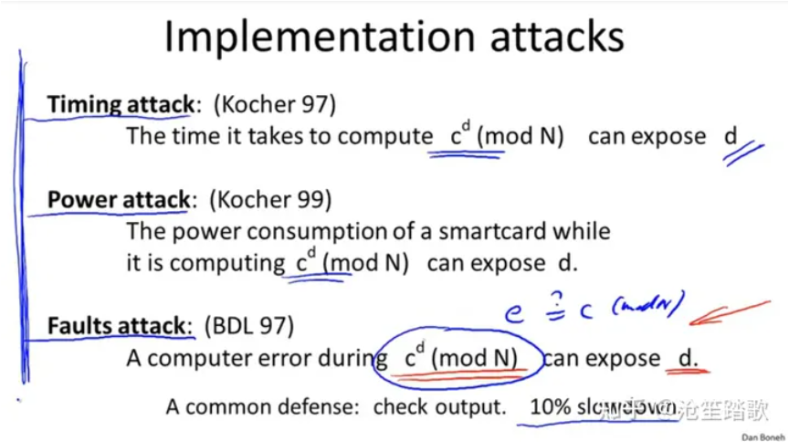

这里展示一个这些攻击的例子。特别的会给大家展示RSA上的错误攻击，是针对带中国剩余的RSA的

事实上，RSA解密经常是如下实现的，解密密文c mod p，然后解密密文c mod q，然后结合两者得到模N的解密，这个组合是通过中国剩余定理做到的。一旦你有了模p和模q的解密的结果，把它组合起来获得模N下的解密，实际上这给出了一个4倍的加速，比起直接使用mod N指数的实现来说。

那么我们看为什么这对错误是脆弱的，假设当你的解密算法库在计算模q解密时，出于某些原因，处理器犯了一个错误，实际上这不是一个正确的xq，得到的是错误的xq，那么我们叫这个为xq hat，不过当它计算模p的解密时，没有错误发生，那么这些错误很少发生。我们只假设计算一个质数模是，发生了一个错误，计算另一个质数模时，没有发生错误。如果我们计算模p是正确的，而计算模q是错误的，那也就是说，当我们组合这两个结果后，我们会得到一个输出，我叫它x'，这个输出模p是正确的，但模q是错误的，如果我们计算这两个方程的e次方，我们会获得下面这两个关系。如果我计算c^d的e次方，e和d，记得它们互为逆元，因此，如果我计算 c^d的e次方，两个指数相消，我就还原了c，所以就知道 x'^e=c。但模q时，就有错误了，因此如果我看这个差， x'^e-c，我们知道它模p是0，而模q非0，那么现在如果计算这个值与N的gcd，能得到什么？这里的两可以被p整除，而不可以被q整除，所以当计算gcd是，就会得到p。那么现在只是获得了N的因子分解，一旦获得了N的因子分解，就可以计算 𝜑(𝑁) 了，有了 𝜑(𝑁) 就可以根据公钥，来计算解密指数了，那么现在已经根据公钥还原了私钥源起一个解密时发生的错误，这就是为什么当你解密RSA时，对结果进行检查是个好想法，特别是当你使用带中国剩余的RSA解密时。

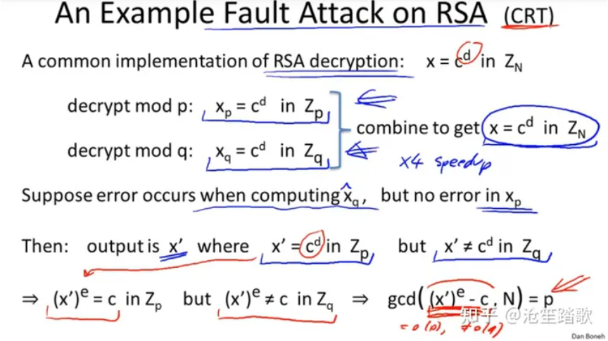

最近的发现证实了RSA密钥生成算法可能是有问题的，当它的熵不够时（熵不够意味着随机性不强），这里会发生错误。那么OpenSSL生成RSA密钥的方法如下。

开始时，先给这个伪随机数发生器以种子，然后使用伪随机数发生器生成的随机字符串来生成第一个质数p，他还会继续给伪随机数发生器种子，然后从伪随机数发生器生成q，最后输出p和q的乘积。

假设这个操作是在某个路由器或防火墙上实现了，假设密钥生成正好是在防火墙启动后。那么防火墙启动了，在启动的同时，伪随机数发生器还没有多少熵，因此防火墙生成的质数p来自于一个低熵的集合，这意味着这个p的可能取值不多，不过，在生成p之后，生成质数实际上花了不少时间，有几个毫秒，那么之后防火墙生成的密钥会有更多熵，在我们添加了更多的熵之后，质数q从更多熵的空间里生成，因次对这个防火墙来说是唯一的。现在问题是，许多不同的防火墙，如果它们生成一个RSA密钥，这样的活，他们中的许多最后会使用同样的质数p，但q不同，这就是说，如果我们看两个不同的防火墙上的两个RSA模N1，N2，如果我们计算N1和N2的gsd，他们有着不同的q，但是p一样，我们最后会得到一个N的因子分解，还包括N1和N2，然后我们就可以解出N1和N2的私钥了。那么这已经在实际中被观察了，两组都查看了整个网络，还原了所有的用于众多网页服务器的公钥，他们计算了大量的gcd，使用了某些算法上的技巧，他们可以计算大量的公钥对N1和N2的gcd，他们发现了有很多的这些密钥都有公因子，那么他们就可以分解这些模了。

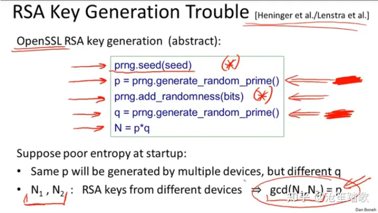

那么在这个试验中，他们可以分解0.4%的SSL公钥，这是一个惊人的事实，这么多的网页服务器公钥都是脆弱的，只是因为它们使用了低熵的RSA密钥，这样他们就与其他公钥有了公因子，计算两者的gcd会得到它的因子分解。那么这里的教训是当生成密钥时，无论是RSA密钥还是ElGamal密钥，还是对称密钥，重要的是你的发生器的种子是合理选取的，所以不要在机器刚刚启动时就生成密钥。必须确保发生器的取种需要充分的时间来获得足够的熵，然后才能开始生成密钥。那么这是一个很好的例子，一个坏的伪随机数发生器可以把你的RSA公钥搞砸

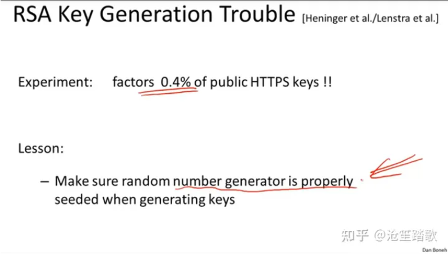

进一步的阅读。

第一篇论文讨论了选择密文安全对公钥密码非常重要，以至于如果Bleichenbacher攻击不够有说服力，还有许多其他攻击。

第二篇讨论了许多RSA系统上的不同的攻击

第三篇OAEP

第四篇密钥长度分析，讨论了应该如何为你的公钥系统选取合适密钥长度，即使你是在使用对称密钥系统

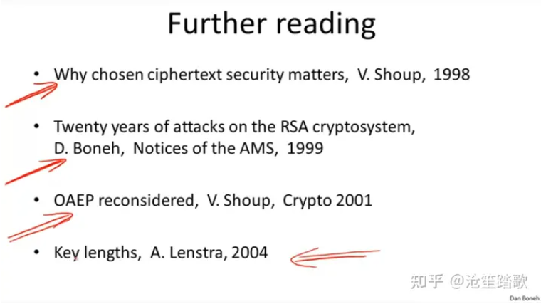