# 圣桑 : 天鹅

### 密码学和香农

《保密系统的通信原理》的论文拉开了密码学从技术进化到科学的序幕 

### 完善保密性

#### 对称加密方案 

对于任何一个对称加密方案（E, D）都要求：给定任意明文m∈M和任意密钥k∈K，都有m=D(k, E(k, m))

#### 完善保密性定义

​      （完善保密性的等价定义）**对于任意给定的密文c∈C，都存在一个常数N，使得对于∀m∈M，都有 |{k ∈ K : E(k, m) = c}| = N**。 

​		一次一密具有完善保密性，即使攻击者具有无限计算资源也无法从密文获得明文的任何信息

一个对称加密方案满足完善保密性，那么密文不会泄露明文的“**任何信息**” 

1. 完善保密性考虑的是唯密文攻击，也即攻击者手里只有窃听到的密文。 
2. “任何信息”指的是明文内容的信息。明文长度、明文是什么时候发送的等信息不包含在内，这些东西即使不破译密码，也可以通过其他手段获知，所以不在密码安全性的考虑范畴之内。 

​    因此，定义中附加了一个限制条件：“|m0|=|m1|”。这个类似绝对值的符号表示消息长度（这个符号以后会经常出现），也即m0和m1的长度要相等。

###  一次一密

 严格定义如下：（E, D）是加/解密算法，设M=C=K={0,1}^n，m∈M，k∈K

​	E(k, m)：c = m⊕k 

​	D(k, c)： m = c⊕k

一次一密具有完善保密性

### 香农定理

#### 一次一密不实用 

- 密钥数量至少要和明文数量一样多 
- 一次一密的密钥不能重复使用
- 一次一密所使用的密钥必须是随机的

#### 香农定理的证明

​	 **香农定理：设（E, D）是定义在（K, M, C）上的对称加密体制，如果它是完善保密的，则 |K|≥|M|。** 

 证明：我们用反证法。

​	假设|K|<|M|，我们需要证明（E, D）不是完善保密的。（忘记完善保密性定义的话，请参看上一节“完善保密性”）
为此我们需要证明存在两个明文m0和m1，以及一个密文c，使得 Pr [E(k, m0) = c] ≠Pr[E(k, m1) = c]，其中k∈K是随机的。

​	首先，我们随机选择明文m0∈M和密钥k0∈K，计算c=E(k0, m0)。

​	因为存在密钥 k0 能把 m0 加密成 c，以下公式成立

​		**Pr [E(k, m0) = c] >0**                                                         （1）

​	接着，我们定义集合S = {D(k, c) : k∈K}。

​	（即穷举密钥空间中的所有密钥，用它们分别解密c，所得明文的集合记为S。）

​	很明显，**|S| ≤ |K| < |M|**。

​	（每个密钥都对应S中的一个明文，但是有可能两个密钥解密出相同的明文，所以S集合可能小于等于密钥空间，因此有|S| ≤ |K|。）

​	既然|S|< |M|，我们就选择一个**不属于S的明文m1**，即m1∈M\S。

​	根据S的定义，很容易知道E(k, m1)≠c。否则，必有m1=D(k, c)，则m1∈S，这与m1∈M\S相矛盾。

​	因此，以下公式成立

​		**Pr[E(k, m1) = c]=0**                                                               （2）

​	由公式（1）和（2）易知Pr [E(k, m0) = c] ≠ Pr[E(k, m1) = c]。

​	由完善保密性的定义，（E, D）不是完善保密的。

​	得证。 

### 一次一密的改造计划

#### 缺点

#### 优点

简单, 计算快

#### 解决方法

​	设计一种加密方案，可以用短密钥加密长消息。它在面对实际的攻击者时（计算资源有限），没必要达到**完善保密性**，密文泄露一点儿明文的信息没关系，只要这些**信息对攻击者的帮助是可忽略**的就行。

- 降格安全性

- 改造

### 流密码

#### 原理

​	设计一种算法，我们称之为伪随机生成器（pseudo-random generator），简记为PRG，它能够利用短密钥产生长密钥，然后用这个长密钥再和明文异或，就可以得到密文了。 

​	这样既保留了一次一密加解密简单高效的优点，又克服了需要直接使用长密钥带来的不实用性，真是一举两得。 

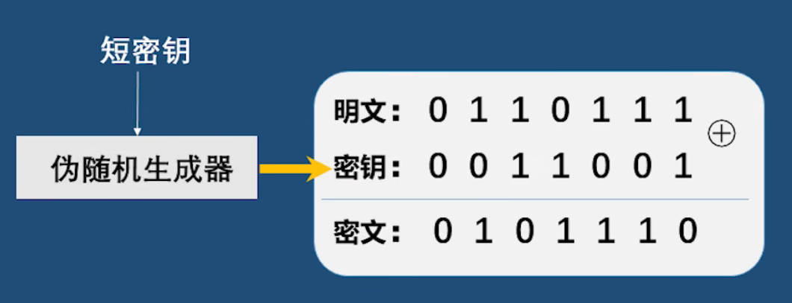

#### 设计

#####  PRG的定义

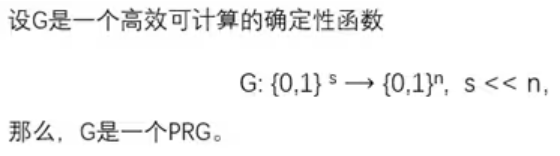

​	(1) PRG是**高效可计算**的，也即给定其输入，它可以很快地产生输出。
​	(2) PRG是**确定性函数**，也即对于相同的输入，它的输出都是一样的。
​	(3) PRG的输入长度s远远小于其输出长度n。其输入我们称之为 **种子**（seed），并称{0,1}^s 为种子空间。

##### 流密码的定义

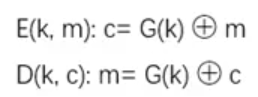

​	只要PRG的输出能以假乱真，也即能够和等长的随机序列不可区分，那么流密码加密出的密文也能以假乱真，也即和一次一密加密出的密文是不可区分的。

### PRG的安全性

​	流密码和PRG之间虽然关系极其紧密，但它俩的安全性完全不是一回事，千万不要搞混！

​	PRG的输出应该是伪随机的，因此PRG的安全性就要求其输出必须和等长的随机序列不可区分，以便以假乱真。

##### PRG的安全模型 

  首先设 **G: {0,1}^s → {0,1}^n** 是一个**PRG**。下面给出PRG的安全模型：

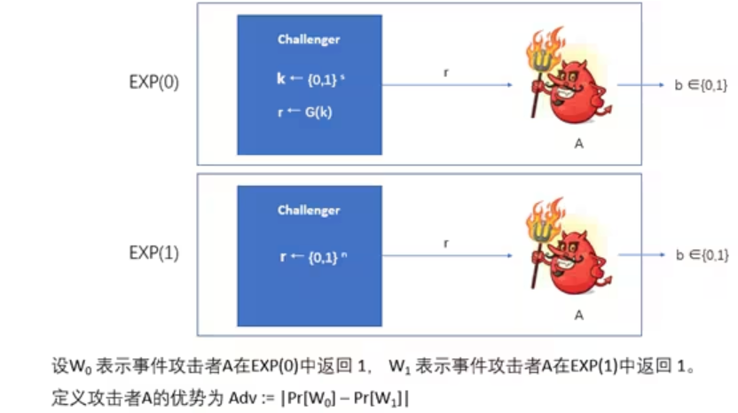

​	现在对安全模型详细解释一下：

​		设 A 是一个攻击者，用一个红色小怪物来表示。首先，构造两个“小黑屋”，也即黑盒子（black box），每个屋里各有一个挑战者（challenger）：

​		**一个挑战者执行G，他随机选择种子k，并将 G(k) 的执行结果 r 返回给 A。**

​		另一个挑战者随机选择r，并将之直接返回给 A。

​		然后，随机选择一个小黑屋，放在A面前，A并不知道自己面对的是哪一个屋： 

​		**如果A面对的是PRG那个屋，我们称之为实验EXP(0)。**

​		**如果A面对的是随机序列那个屋，我们称之为实验EXP(1)。**

​		A只能看到小黑屋返回的序列 r。 

​	 注意：如果两个屋返回的序列长度不相等，A就可以直接根据长度判断自己面对的是哪个屋，这样就不能刻画PRG的安全性了，因为A根本不需要理睬小黑屋返回的序列是什么嘛。所以，安全模型中要求EXP(1)也返回长度是n的随机序列，是非常合理的。

​	**A的任务就是根据 r 猜测自己到底是处于实验EXP(0)还是实验EXP(1)，并输出自己的猜测b。**

​	注意：**b=0表示A猜测自己处于EXP(0)，也即自己面前的屋里运行的是PRG；**

​	**b=1表示A猜测自己处于EXP(1)，也即自己面前的屋里是在随机选择序列。**

​	那么，**Adv := |Pr[W0] – Pr[W1]|**是什么意思呢？我们假设有一个攻击者，他在执行完上面的实验后，得到

​		Adv = |Pr[W0] – Pr[W1]|=0。

​	这说明，不管这个攻击者处于EXP(0)还是EXP(1)，他输出相同猜测结果（因为W0和W1都只关注攻击者返回1的情况）的概率是相等的。

​	很明显，这个攻击者根本搞不清楚自己处于哪个实验，因为得到相同猜测结果的概率是相等的嘛。

​	这个攻击者在区分两个实验这个问题上一点儿优势都没有，也即优势为零（|Pr[W0] – Pr[W1]|=0）。	这也是为什么 |Pr[W0] – Pr[W1]| 被称为优势（advantage）的原因。有的时候，某些攻击者的优势并不等于0，但只要优势（Adv = |Pr[W0] – Pr[W1]|）是可忽略的，那么攻击者虽然能从小黑屋的返回值中分析出一点儿EXP(0)和EXP(1)的差异，但这个差异实在是太小了，以至于可以忽略，所以在实际中他并不能区分开EXP(0)和EXP(1)。在这种情况下，我们仍认为G是安全的，它仍能以假乱真。

##### PRG的安全性

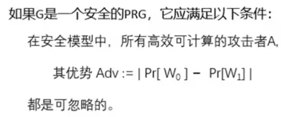

​	注意定义里的“所有”两个字。为什么必须是所有的？因为如果有个攻击者能够进行区分的话，G就不能以假乱真了，因为能被人识破嘛。这种区分方法如果被写成程序传到GitHub上，所有人就都能识破G了，那样的话，在实际中使用G的输出来代替随机序列就相当不安全。

### PRG的不可预测性

##### 现实意义 

​	如果G是可预测的，攻击者根据r[0, …, i-1]就可以获得r[i]的值。接着，他可以根据r[1,…, i]猜测出r[i+1]。如此下去，G(k)就全部暴露了，明文信息也就随之全部泄露。

#####  定义 

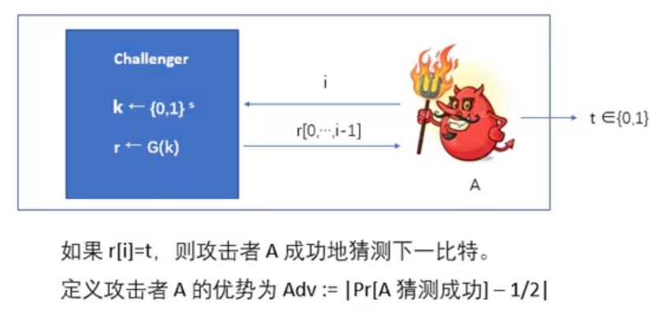

 首先，挑战者随机选择一个密钥 k，产生 G(k) 的输出，记为 r。

 然后，攻击者 A 选择一个i发送给挑战者，挑战者返回 G(k) 的前 i 个比特 r[0, …, i-1]。

 最后，A 根据已知的 i 个比特猜测下一个比特 r[i] 是 0 还是 1，其猜测记为 t。

如果 t=r[i]，A 猜测成功；反之，猜测失败。 

​		Adv := |Pr[A 猜测成功] – 1/2| 注意，r[i] 的取值只有两种可能性（0或1）。

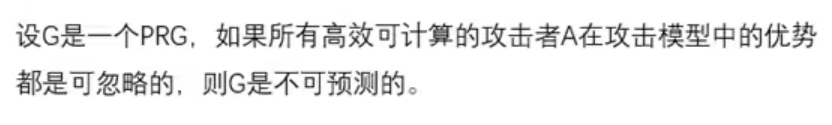

### 语义安全性(比完善安全性更为实际)

##### 加密方案的攻击类型 

- **唯密文**攻击：攻击者只知道一些**密文**。
- **已知明文**攻击（known-plaintext attack）：攻击者除了**知道一些密文以外**，还可以通过某些手段知道了这**些密文对应的明文**。
- **选择明文**攻击（chosen-plaintext attack, CPA）：攻击者自己选择一些明文，并可以通过某些手段**获得相应的密文**。
- **选择密文**攻击（chosen-ciphertext attack, CCA）：攻击者可以自己**选择一些密文**，并可以通过某些手段**获得相应的明文**。

##### 语义安全性 (抵抗选择明文攻击)(我们依旧处于流密码中)

###### 语义安全模型

  1.    挑战者从密钥空间 K 中随机选择一个密钥 k，并对攻击者 A 发送的两个明文中的一个进行加密。在实验 **EXP(0) 中，挑战者加密的是明文 m0，而在实验 EXP(1) 中加密的是 m1**。
  2.    **A 根据获得的密文 c 猜测自己是处于哪个实验中**，并输出自己的猜测，记为 b。

   3.    A 只能给**挑战者发送一次明文**，也即只允许 A 询问一次。换句话说，挑战者选择的**密钥只使用了一次**。（后面的课程还会介绍允许攻击者询问多次的情况）

##### 定义

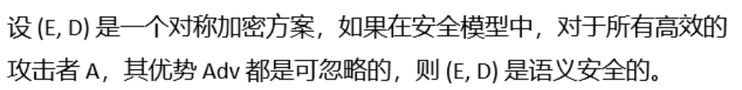

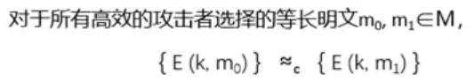

​	区分 m0 和 m1 的密文计算上不可行 

### 流密码具有语义安全性

##### 一次一密具有语义安全性

​	注意OPT不仅具有**完善保密性**而却具有**语义安全性**

​        证明一次一密具有语义安全性的方法很简单：把一次一密的加密算法套进**语义安全性的模型**里，然后证明任意高效攻击者A能区分EXP(0)和EXP(1)的优势都是可忽略的。

​	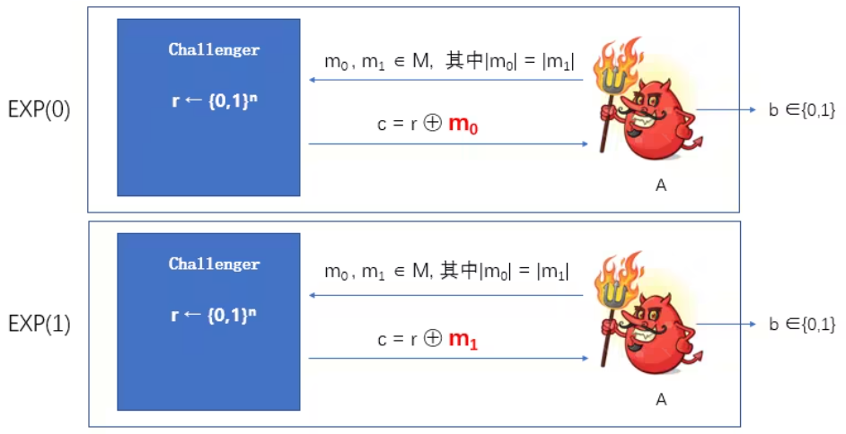

   一次一密的性质告诉我们，密文c不会泄露明文的任何信息，所以A没法猜出c到底对应m0还是m1，也就没法猜出自己面对的是EXP(0)还是EXP(1)。

   我们得出结论，A不论面对EXP(0)还是EXP(1)，他得出相同结果的概率是相等的，也即Pr[W0] = Pr[W1]。

   故而，Adv = |Pr[W0] - Pr[W1]| = 0。

   可以看出，A没有任何优势，因为Adv=0嘛。

   证毕！

##### 流密码具有语义安全性

 **定理：如果G: K ⟶ {0,1}^n是一个安全的PRG，由它构造的流密码便具有语义安全性，其中 K={0,1}^s** 

证明:(学会套模型)

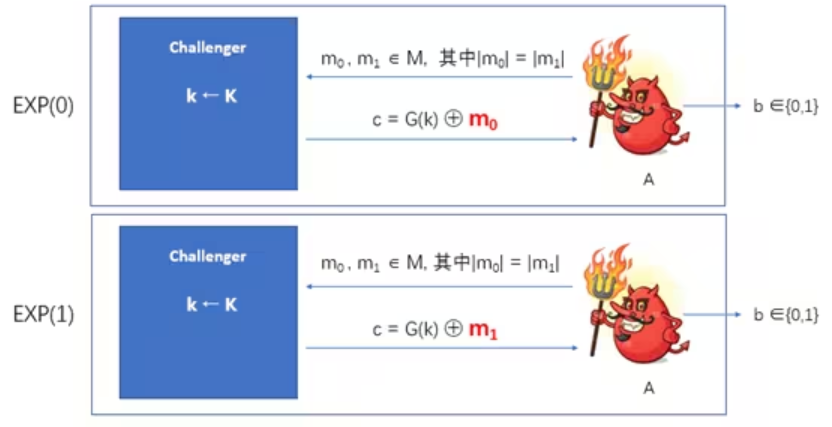

​	第零步, 设出EXP(0)

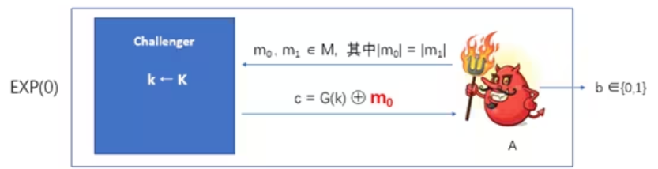

   第一步，把EXP(0)改造成下面的实验，记为EXP(0.1) 

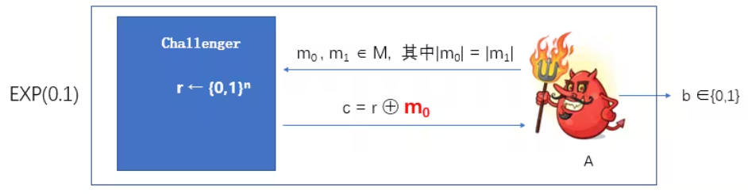

​     第二步，把EXP(0.1)改造成下面的实验，记为EXP(0.2)。 

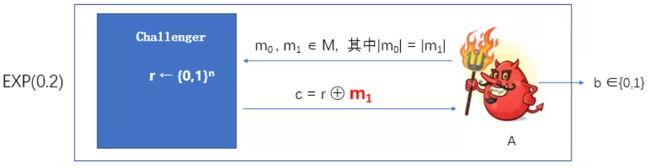

​	第三步, 设出EXP(1)

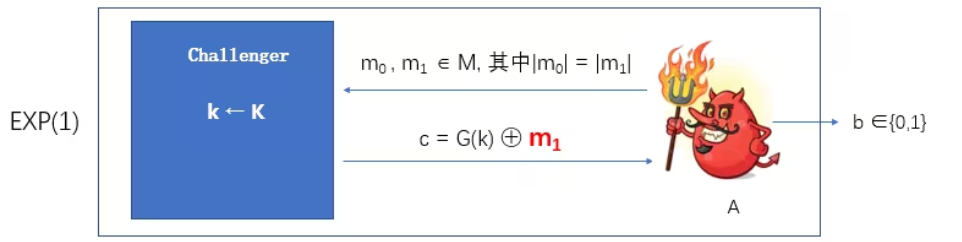

- EXP(0)和EXP(0.1)之间是计算上不可区分的, 否则G(k)与r可分, 违背G(k)为PRG安全的性质.
- EXP(0.1)和EXP(0.2)之间是计算上不可区分的, m0与m1可分违背OPT的语义安全性
- EXP(0.2)和EXP(1)之间是计算上不可区分的, 否则G(k)与r可分, 违背G(k)为PRG安全的性质.

 所以，任意高效攻击者区分EXP(0)和EXP(1)的优势都是可忽略的

### 流密码语义安全性证明的正式写法：反证法

略

###  流密码语义安全性**证明的正式写法：混合论证**

​    推论1：如果G是安全的PRG，则EXP(0)和EXP(0.1)是计算上不可区分的。

​    推论2：EXP(0.1)和EXP(0.2)是计算上不可区分的。

​    推论3：如果G是安全的PRG，则EXP(0.2)和EXP(1)是计算上不可区分的。

归纳总结攻击者区分EXP(0)和EXP(1)的优势，得出结论：对于任意概率多项式时间的攻击者，该优势是可忽略的。 

### 常用语义安全性模型

#### 最初的语义安全性模型

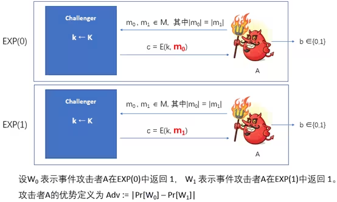

#### Left-or-Right Model

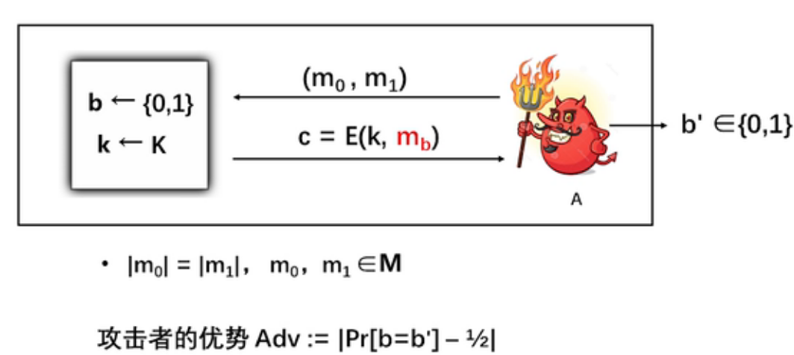

#### Real-or-Random Model

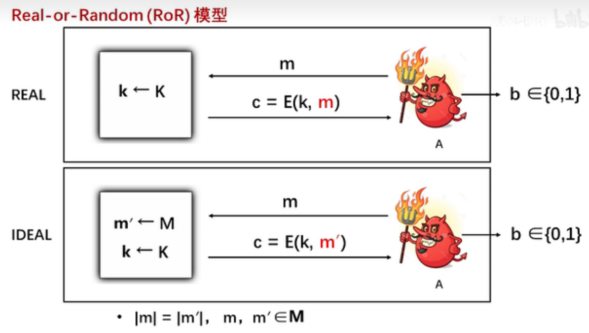

Adv := |Pr[W0] - Pr[W1]|

### PRG并行构造方法

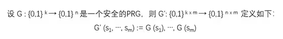

   G’ 的优点是很明显的。它可以并行执行，在多处理器系统下，执行速度非常快。

   缺点也是很明显的。不难看出，G’ 需要的种子长度是 G 的 m 倍，而种子的获取往往比较麻烦、费时。 

### PRG并行构造法的安全性

​        1.  首先构造一系列实验，实验中的挑战者们分别产生如下输出 

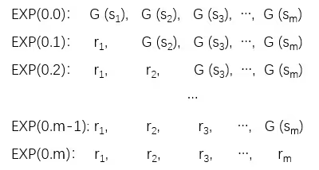

  假设 **A 是一个概率多项式时间的攻击者**。在每个实验中，A 都作为攻击者与相应的挑战者交互。

​    设 EXP(0) 和 EXP(1) 是关于 G’ 的实验。由 PRG 的安全模型可知，EXP(0.0) 即为EXP(0)，EXP(0.m) 即为 EXP(1)。 

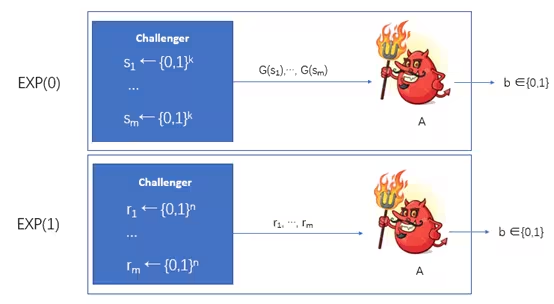

  设 **p_j 表示 A 在实验 EXP(0.j) 中返回 1 的概率**，则 p_0 表示 A 在 EXP(0) 中返回 1 的概率，p_m表示 A 在 EXP(1) 中返回 1 的概率。

  设 Adv_A 表示 A 关于 EXP(0) 和 EXP(1) 的优势，根据定义可知， Adv_A=|p0 – pm|。

2. 因为 G‘ 的安全性依赖于 G 的安全性，根据反证法，我们需要设计一个算法 B，它通过调用 **A 为子程序**，来区分关于 G 的实验 EXP’(0) 和 EXP’(1)。

   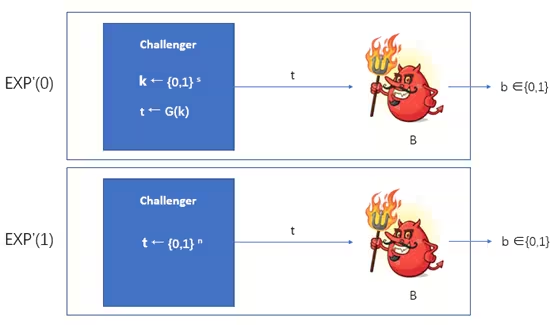

  在收到挑战者给出的t以后，B 调用 A 为子程序（B 扮演 EXP(0) 和 EXP(1) 中的挑战者）。

  B(t) 的执行过程如下： 

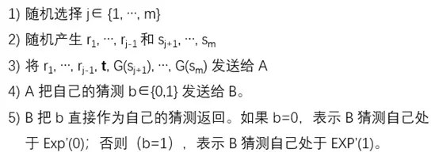

  注意：对于任意选择出的 j=1, …, m，**实验 EXP’(0) 其实就是 EXP(0.j-1)**（**t=G(k)时**），而EXP’(1) 就是 EXP(0.j)（**t 是随机序列时**）。（大家可以自行验证，这个不难）

  3. 设事件 W0 表示 B 处于实验 EXP’(0) 时返回 1，事件 W1 表示 B 处于实验 EXP’(1) 时返回 1。

  因此，

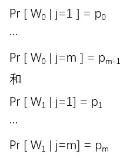

由全概率公式可知 

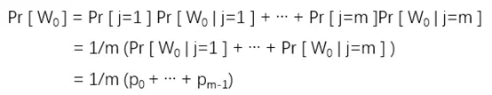

​    以及 

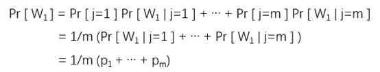

​       我们得到 

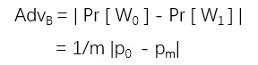

​        最后，我们有 

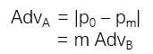

​    至此，我们把 A 的优势 Adv_A 和 B 的优势 Adv_B 联系到一起，这也正好体现 G’ 的安全性与 G 的安全性相关这一事实。

   既然 G 是安全的，Adv_B 必然是可忽略的，故而只要 m 是多项式的，Adv_A 也必然是可忽略的。

​    得证 ! 

### Blum-Micali串行构造法

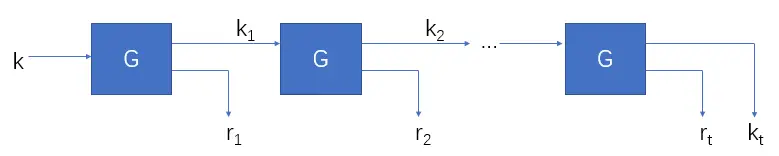

  相比于并行构造法，它的优点很明显，种子长度与G的一样，因此用户不需要收集很多种子，这样就节约了时间。缺点是，它只能串行执行，不过对一般的应用来说，这已经足够了。

   两者相较，Blum-Micali方法更加实用。 

### Blum-Micali串行构造法的安全性证明

**Adv_A = t * Adv_B**

略(和并行相似)

### 应用 : 截取PRG

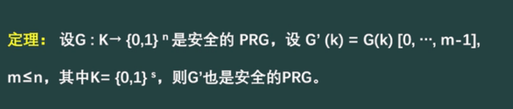

​         在任何需要随机序列的地方，你都可以用 PRG 产生所需长度的伪随机序列来代替。哪怕只取一个比特，也是完全没有问题的。

### 应用 : 三个重要问题

#### 二次密码本

   如果你用同一个密钥加密了两个不同的明文，那么你就遇到了二次密码本（two-time pad）问题。这个问题是使用流密码时最容易犯的错误。

   假设你用的密钥是 k，加密的两个明文分别是 m1 和 m2，则相应的密文分别是：

​							 **c1 = m1 ⊕ G(k)  和  c2 = m2 ⊕ G(k)**

   攻击者截获到 c1 和 c2 后可以将它俩异或，便能得到 **m1 ⊕ m2**。

   由于自然语言包含大量信息冗余，如果 m1 和 m2 是自然语言文本，则很容易通过 m1 ⊕ m2 推导出 m1 和 m2 的内容，导致信息泄露。

   由上我们得到流密码使用的第一条经验：每个密钥只能用于加密一条明文。也即，流密码的密钥不可以直接重用。 

#### 流密码具有可延展性 

​    截获到用流密码加密的明文后，虽然攻击者无法知道明文的内容，但他却可以通过修改密文来控制对明文的修改。

​    假设攻击者截获到一条你发送的密文 c = m ⊕ G(k)。他可以选择一条消息 t，并计算一条假密文 c’ = t ⊕ c。

​    很容易知道，c’ = t ⊕ c = t ⊕ m ⊕ G(k)。

​    攻击者把 c’ 发送给接收者，并谎称 c’ 是你发去的。

​    当接收者解密以后，便会得到假明文 m’ = t ⊕ m，而他却被蒙在鼓里。

​    易知，攻击者虽然不知道原始明文 m 的内容，但他知道接收者收到的假明文 m’ 和原始明文 m 之间存在某个特定的关系：**m’ ⊕ m = t**。

​    **可延展性（malleability）**指的就是**攻击者可以对明文进行可以预测的修改**。

​    在某些实际应用中，流密码的可延展性危害很大。

​    以上攻击之所以能成功，是因为流密码只提供**语义安全性**，却不能提供**完整性保护**。在后面的课程中，我们会介绍如何同时保护信息的机密性和完整性。

#### 如何选择种子 

​    流密码里使用的密钥其实就是 PRG 的种子。

​    如果种子选择的不好，攻击者根本不用费劲心思去分析 PRG 的设计细节，而只需要尝试重构出种子就可以了。

​    因此在**设计选择种子的算法**时，要特别注意，必须保证选择出的种子具有**不可预测性**，以防范攻击者的成功猜测。

### 正确使用流密码

 假设 Alice 和 Bob 要使用流密码进行通信。

​    需要注意的是，通信双方不能只共享一个密钥，而应该共享两个：一个用于 Alice 向 Bob发送消息，记为 KA，另一个用于 Bob 向 Alice 发送消息，记为 KB。

​    所以，每个密钥都是单向使用的。这是为了避免二次密码本问题。

​    在此仅考虑 Alice 向 Bob 发送消息的情况（Bob 向 Alice 发送消息是类似的）。

​    通常情况下，Alice 会不止一次向 Bob 发送消息，设这些消息为 m_1, …, m_n。

​    如果 Alice 直接加密这些消息，并把密文 m_1 ⊕ G(KA), …, m_n ⊕ G(KA) 发送给 Bob，势必会造成二次密码本问题。

   注意：PRG 的输出是一个非常非常非常长的串，所以在实际应用中，开发包里与 G(KA)相关的函数是不会把它所有的输出一次性全部产生出来的，而是以字节或字为单位逐个产生。

​    因此，加密时可以分两步做：

    1.  每当需要加密一条消息 m_i 时，就利用密钥 KA，调用 G 产生一个伪随机串 k_i。
    
        2.  再把 k_i 做为密钥，加密消息 m_i：m_i ⊕ G(k_i)。

​    整个过程如下图所示。

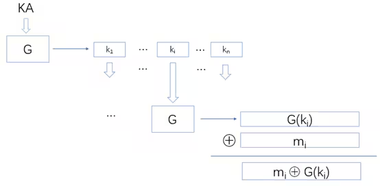

这相当于把 G(KA) 的输出切成一段一段的 k_1, …, k_n，每一段 k_i 都作为一个新的密钥做加密 m_i ⊕ G(k_i)。

### 流密码总结

略

### 流密码习题

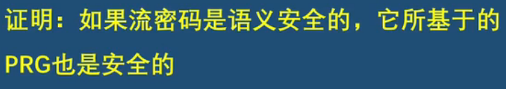

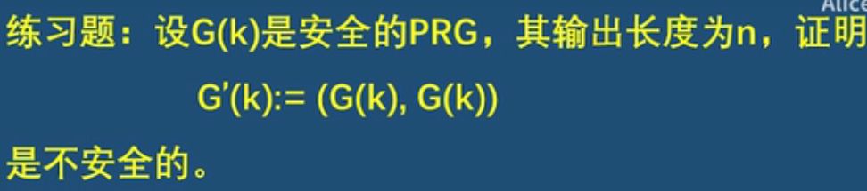

### 分组密码

​	它不仅能用于加密，还可以作为基本模块构造诸如流密码、Hash函数、消息认证码（MAC）等密码工具，可谓多才多艺。 

#### 定义

 	分组密码是一个确定性的加密体制，记为 (E, D)，其中 E 是加密算法，D 是相应的解密算法。

​    我们称 (E, D) 是定义在 (K, X) 上的分组密码，其中 K 为**密钥空间**，X 为**分组空间**。

我们称任意 x∈X 为一个分组。

​    需要注意的是，分组密码的明文空间和密文空间是**相同**的 (**有限**) 集合，即X。

​    分组密码可以将 X 中的一个分组（称为明文分组）进行加密，输出的密文也是 X 中的一个分组（称为密文分组）。

​     也即，对于任意 **k∈K 和 x∈X，都有 E (k, x) ∈X**。 

#### 分组密码可以描述为一个置换 

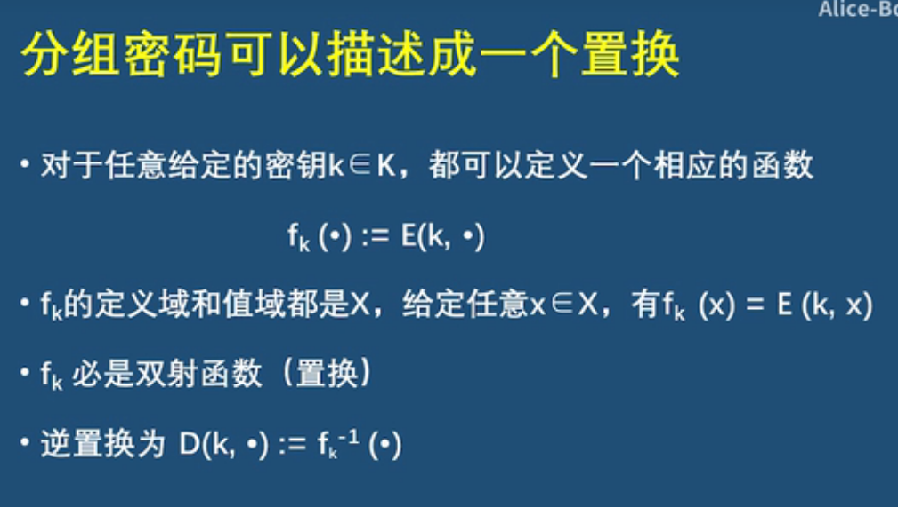

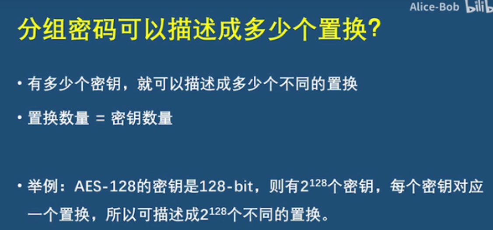

###  分组密码的安全性

比语义安全更强

#### 随即置换

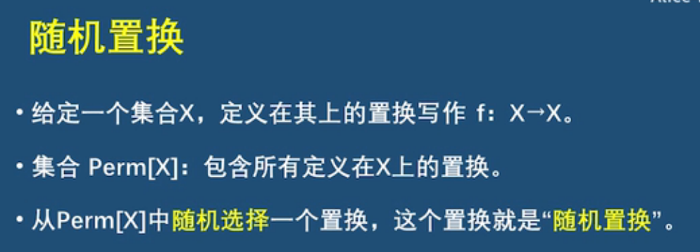

​       需要注意的是，所谓的“随机置换”强调的是这个置换是随机地被选择出来的。因此，“随机置换”这个概念和置换的输出是否是随机的没有关系。即使一个置换的输出不是随机的，但只要它被选出的时候是随机选择的，那么它就是“随机置换”。理解这一点非常重要！

#### 分组密码的安全性模型 

  设 W0 和 W1 分别表示 A 在实验 EXP(0) 和 EXP(1) 中输出1的事件。

   攻击者 A 的优势定义为 Adv := |Pr[W0] – Pr[W1]|。

#### 安全的分组密码

​	如果所有高效的攻击者的优势都是可忽略的，那么该分组密码是安全的。 

#### AES的例子 

   现在通过 AES-128 来更加直观地描述分组密码的安全概念。

   首先，我们来看一下集合 Perm[X] 里有多少个置换。因为 Perm[X] 里的每个置换都是定义在 X 上的，所以一共有 |X|! 个不同的置换。也即 |Perm[X]| = |X|!。

   AES-128 的明密文空间是 128 比特，所以 **|X|=2^128**，因此相应的 **|Perm[X]| = 2^128! ≈2^{2^135}**。

   另外，根据安全模型可知，每当从密钥空间里**选择一个密钥 k** 时，就可以**确定一个相应的置换 E (k, .)**。

​    AES-128 的密钥是 128 比特，所以其密钥空间里一共有 2^128 个不同的密钥，也就**最多可以确定 2^128 个不同的置换**。

   综上所述，如果把 E 替换成 AES-128，那么在安全模型中，**EXP(0) 里的挑战者实际是从至多 2^128 个不同的置换里随机选择出一个**；**EXP(1) 里的挑战者则是从更大的范围(2^{2^135}) 里随机选择出一个置换**。

​    **分组密码的安全性实际**就是要求：**给定一个置换，攻击者无法知道它是从大范围里随机选择的，还是从小范围里随机选择的，即使他能够通过“探测”的方法获得置换的一些输出也是徒劳。**

