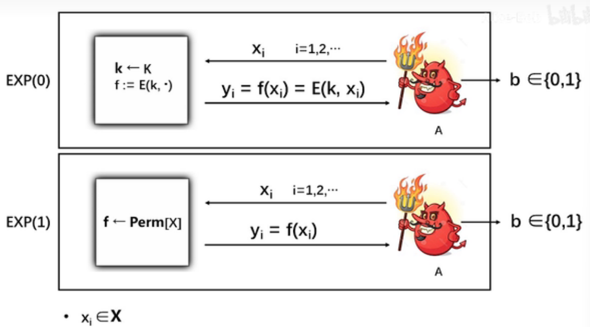

# 圣桑 : 天鹅

### 密码学和香农

《保密系统的通信原理》的论文拉开了密码学从技术进化到科学的序幕 

### 完善保密性

#### 对称加密方案 

对于任何一个对称加密方案（E, D）都要求：给定任意明文m∈M和任意密钥k∈K，都有m=D(k, E(k, m))

#### 完善保密性定义

​      （完善保密性的等价定义）**对于任意给定的密文c∈C，都存在一个常数N，使得对于∀m∈M，都有 |{k ∈ K : E(k, m) = c}| = N**。 

​		一次一密具有完善保密性，即使攻击者具有无限计算资源也无法从密文获得明文的任何信息

一个对称加密方案满足完善保密性，那么密文不会泄露明文的“**任何信息**” 

1. 完善保密性考虑的是唯密文攻击，也即攻击者手里只有窃听到的密文。 
2. “任何信息”指的是明文内容的信息。明文长度、明文是什么时候发送的等信息不包含在内，这些东西即使不破译密码，也可以通过其他手段获知，所以不在密码安全性的考虑范畴之内。 

​    因此，定义中附加了一个限制条件：“|m0|=|m1|”。这个类似绝对值的符号表示消息长度（这个符号以后会经常出现），也即m0和m1的长度要相等。

###  一次一密

 严格定义如下：（E, D）是加/解密算法，设M=C=K={0,1}^n，m∈M，k∈K

​	E(k, m)：c = m⊕k 

​	D(k, c)： m = c⊕k

一次一密具有完善保密性

### 香农定理

#### 一次一密不实用 

- 密钥数量至少要和明文数量一样多 
- 一次一密的密钥不能重复使用
- 一次一密所使用的密钥必须是随机的

#### 香农定理的证明

​	 **香农定理：设（E, D）是定义在（K, M, C）上的对称加密体制，如果它是完善保密的，则 |K|≥|M|。** 

 证明：我们用反证法。

​	假设|K|<|M|，我们需要证明（E, D）不是完善保密的。（忘记完善保密性定义的话，请参看上一节“完善保密性”）
为此我们需要证明存在两个明文m0和m1，以及一个密文c，使得 Pr [E(k, m0) = c] ≠Pr[E(k, m1) = c]，其中k∈K是随机的。

​	首先，我们随机选择明文m0∈M和密钥k0∈K，计算c=E(k0, m0)。

​	因为存在密钥 k0 能把 m0 加密成 c，以下公式成立

​		**Pr [E(k, m0) = c] >0**                                                         （1）

​	接着，我们定义集合S = {D(k, c) : k∈K}。

​	（即穷举密钥空间中的所有密钥，用它们分别解密c，所得明文的集合记为S。）

​	很明显，**|S| ≤ |K| < |M|**。

​	（每个密钥都对应S中的一个明文，但是有可能两个密钥解密出相同的明文，所以S集合可能小于等于密钥空间，因此有|S| ≤ |K|。）

​	既然|S|< |M|，我们就选择一个**不属于S的明文m1**，即m1∈M\S。

​	根据S的定义，很容易知道E(k, m1)≠c。否则，必有m1=D(k, c)，则m1∈S，这与m1∈M\S相矛盾。

​	因此，以下公式成立

​		**Pr[E(k, m1) = c]=0**                                                               （2）

​	由公式（1）和（2）易知Pr [E(k, m0) = c] ≠ Pr[E(k, m1) = c]。

​	由完善保密性的定义，（E, D）不是完善保密的。

​	得证。 

### 一次一密的改造计划

#### 缺点

#### 优点

简单, 计算快

#### 解决方法

​	设计一种加密方案，可以用短密钥加密长消息。它在面对实际的攻击者时（计算资源有限），没必要达到**完善保密性**，密文泄露一点儿明文的信息没关系，只要这些**信息对攻击者的帮助是可忽略**的就行。

- 降格安全性

- 改造

### 流密码

#### 原理

​	设计一种算法，我们称之为伪随机生成器（pseudo-random generator），简记为PRG，它能够利用短密钥产生长密钥，然后用这个长密钥再和明文异或，就可以得到密文了。 

​	这样既保留了一次一密加解密简单高效的优点，又克服了需要直接使用长密钥带来的不实用性，真是一举两得。 

#### 设计

#####  PRG的定义

​	(1) PRG是**高效可计算**的，也即给定其输入，它可以很快地产生输出。
​	(2) PRG是**确定性函数**，也即对于相同的输入，它的输出都是一样的。
​	(3) PRG的输入长度s远远小于其输出长度n。其输入我们称之为 **种子**（seed），并称{0,1}^s 为种子空间。

##### 流密码的定义

​	只要PRG的输出能以假乱真，也即能够和等长的随机序列不可区分，那么流密码加密出的密文也能以假乱真，也即和一次一密加密出的密文是不可区分的。

### PRG的安全性

​	流密码和PRG之间虽然关系极其紧密，但它俩的安全性完全不是一回事，千万不要搞混！

​	PRG的输出应该是伪随机的，因此PRG的安全性就要求其输出必须和等长的随机序列不可区分，以便以假乱真。

##### PRG的安全模型 

  首先设 **G: {0,1}^s → {0,1}^n** 是一个**PRG**。下面给出PRG的安全模型：

​	现在对安全模型详细解释一下：

​		设 A 是一个攻击者，用一个红色小怪物来表示。首先，构造两个“小黑屋”，也即黑盒子（black box），每个屋里各有一个挑战者（challenger）：

​		**一个挑战者执行G，他随机选择种子k，并将 G(k) 的执行结果 r 返回给 A。**

​		另一个挑战者随机选择r，并将之直接返回给 A。

​		然后，随机选择一个小黑屋，放在A面前，A并不知道自己面对的是哪一个屋： 

​		**如果A面对的是PRG那个屋，我们称之为实验EXP(0)。**

​		**如果A面对的是随机序列那个屋，我们称之为实验EXP(1)。**

​		A只能看到小黑屋返回的序列 r。 

​	 注意：如果两个屋返回的序列长度不相等，A就可以直接根据长度判断自己面对的是哪个屋，这样就不能刻画PRG的安全性了，因为A根本不需要理睬小黑屋返回的序列是什么嘛。所以，安全模型中要求EXP(1)也返回长度是n的随机序列，是非常合理的。

​	**A的任务就是根据 r 猜测自己到底是处于实验EXP(0)还是实验EXP(1)，并输出自己的猜测b。**

​	注意：**b=0表示A猜测自己处于EXP(0)，也即自己面前的屋里运行的是PRG；**

​	**b=1表示A猜测自己处于EXP(1)，也即自己面前的屋里是在随机选择序列。**

​	那么，**Adv := |Pr[W0] – Pr[W1]|**是什么意思呢？我们假设有一个攻击者，他在执行完上面的实验后，得到

​		Adv = |Pr[W0] – Pr[W1]|=0。

​	这说明，不管这个攻击者处于EXP(0)还是EXP(1)，他输出相同猜测结果（因为W0和W1都只关注攻击者返回1的情况）的概率是相等的。

​	很明显，这个攻击者根本搞不清楚自己处于哪个实验，因为得到相同猜测结果的概率是相等的嘛。

​	这个攻击者在区分两个实验这个问题上一点儿优势都没有，也即优势为零（|Pr[W0] – Pr[W1]|=0）。	这也是为什么 |Pr[W0] – Pr[W1]| 被称为优势（advantage）的原因。有的时候，某些攻击者的优势并不等于0，但只要优势（Adv = |Pr[W0] – Pr[W1]|）是可忽略的，那么攻击者虽然能从小黑屋的返回值中分析出一点儿EXP(0)和EXP(1)的差异，但这个差异实在是太小了，以至于可以忽略，所以在实际中他并不能区分开EXP(0)和EXP(1)。在这种情况下，我们仍认为G是安全的，它仍能以假乱真。

##### PRG的安全性

​	注意定义里的“所有”两个字。为什么必须是所有的？因为如果有个攻击者能够进行区分的话，G就不能以假乱真了，因为能被人识破嘛。这种区分方法如果被写成程序传到GitHub上，所有人就都能识破G了，那样的话，在实际中使用G的输出来代替随机序列就相当不安全。

### PRG的不可预测性

##### 现实意义 

​	如果G是可预测的，攻击者根据r[0, …, i-1]就可以获得r[i]的值。接着，他可以根据r[1,…, i]猜测出r[i+1]。如此下去，G(k)就全部暴露了，明文信息也就随之全部泄露。

#####  定义 

 首先，挑战者随机选择一个密钥 k，产生 G(k) 的输出，记为 r。

 然后，攻击者 A 选择一个i发送给挑战者，挑战者返回 G(k) 的前 i 个比特 r[0, …, i-1]。

 最后，A 根据已知的 i 个比特猜测下一个比特 r[i] 是 0 还是 1，其猜测记为 t。

如果 t=r[i]，A 猜测成功；反之，猜测失败。 

​		Adv := |Pr[A 猜测成功] – 1/2| 注意，r[i] 的取值只有两种可能性（0或1）。

### 语义安全性(比完善安全性更为实际)

##### 加密方案的攻击类型 

- **唯密文**攻击：攻击者只知道一些**密文**。
- **已知明文**攻击（known-plaintext attack）：攻击者除了**知道一些密文以外**，还可以通过某些手段知道了这**些密文对应的明文**。
- **选择明文**攻击（chosen-plaintext attack, CPA）：攻击者自己选择一些明文，并可以通过某些手段**获得相应的密文**。
- **选择密文**攻击（chosen-ciphertext attack, CCA）：攻击者可以自己**选择一些密文**，并可以通过某些手段**获得相应的明文**。

##### 语义安全性 (抵抗选择明文攻击)(我们依旧处于流密码中)

###### 语义安全模型

  1.    挑战者从密钥空间 K 中随机选择一个密钥 k，并对攻击者 A 发送的两个明文中的一个进行加密。在实验 **EXP(0) 中，挑战者加密的是明文 m0，而在实验 EXP(1) 中加密的是 m1**。
  2.    **A 根据获得的密文 c 猜测自己是处于哪个实验中**，并输出自己的猜测，记为 b。

   3.    A 只能给**挑战者发送一次明文**，也即只允许 A 询问一次。换句话说，挑战者选择的**密钥只使用了一次**。（后面的课程还会介绍允许攻击者询问多次的情况）

##### 定义

​	区分 m0 和 m1 的密文计算上不可行 

### 流密码具有语义安全性

##### 一次一密具有语义安全性

​	注意OPT不仅具有**完善保密性**而却具有**语义安全性**

​        证明一次一密具有语义安全性的方法很简单：把一次一密的加密算法套进**语义安全性的模型**里，然后证明任意高效攻击者A能区分EXP(0)和EXP(1)的优势都是可忽略的。

​	

   一次一密的性质告诉我们，密文c不会泄露明文的任何信息，所以A没法猜出c到底对应m0还是m1，也就没法猜出自己面对的是EXP(0)还是EXP(1)。

   我们得出结论，A不论面对EXP(0)还是EXP(1)，他得出相同结果的概率是相等的，也即Pr[W0] = Pr[W1]。

   故而，Adv = |Pr[W0] - Pr[W1]| = 0。

   可以看出，A没有任何优势，因为Adv=0嘛。

   证毕！

##### 流密码具有语义安全性

 **定理：如果G: K ⟶ {0,1}^n是一个安全的PRG，由它构造的流密码便具有语义安全性，其中 K={0,1}^s** 

证明:(学会套模型)

​	第零步, 设出EXP(0)

   第一步，把EXP(0)改造成下面的实验，记为EXP(0.1) 

​     第二步，把EXP(0.1)改造成下面的实验，记为EXP(0.2)。 

​	第三步, 设出EXP(1)

- EXP(0)和EXP(0.1)之间是计算上不可区分的, 否则G(k)与r可分, 违背G(k)为PRG安全的性质.
- EXP(0.1)和EXP(0.2)之间是计算上不可区分的, m0与m1可分违背OPT的语义安全性
- EXP(0.2)和EXP(1)之间是计算上不可区分的, 否则G(k)与r可分, 违背G(k)为PRG安全的性质.

 所以，任意高效攻击者区分EXP(0)和EXP(1)的优势都是可忽略的

### 流密码语义安全性证明的正式写法：反证法

EXP(0.2)与EXP(1)证明与EXP(0)与EXP(0.1)不可区分的证明同理.

###  流密码语义安全性**证明的正式写法：混合论证**

​    推论1：如果G是安全的PRG，则EXP(0)和EXP(0.1)是计算上不可区分的。

​    推论2：EXP(0.1)和EXP(0.2)是计算上不可区分的。

​    推论3：如果G是安全的PRG，则EXP(0.2)和EXP(1)是计算上不可区分的。

归纳总结攻击者区分EXP(0)和EXP(1)的优势，得出结论：对于任意概率多项式时间的攻击者，该优势是可忽略的。 

### 常用语义安全性模型

#### 最初的语义安全性模型

#### Left-or-Right Model

#### Real-or-Random Model

Adv := |Pr[W0] - Pr[W1]|

### PRG并行构造方法

   G’ 的优点是很明显的。它可以并行执行，在多处理器系统下，执行速度非常快。

   缺点也是很明显的。不难看出，G’ 需要的种子长度是 G 的 m 倍，而种子的获取往往比较麻烦、费时。 

### PRG并行构造法的安全性

#### 构造证明(蓝色恶魔万岁!)

​        1.  首先构造一系列实验，实验中的挑战者们分别产生如下输出 

  假设 **A 是一个概率多项式时间的攻击者**。在每个实验中，A 都作为攻击者与相应的挑战者交互。

​    设 EXP(0) 和 EXP(1) 是关于 G’ 的实验。由 PRG 的安全模型可知，EXP(0.0) 即为EXP(0)，EXP(0.m) 即为 EXP(1)。 

  设 **p_j 表示 A 在实验 EXP(0.j) 中返回 1 的概率**，则 p_0 表示 A 在 EXP(0) 中返回 1 的概率，p_m表示 A 在 EXP(1) 中返回 1 的概率。

  设 Adv_A 表示 A 关于 EXP(0) 和 EXP(1) 的优势，根据定义可知， Adv_A=|p0 – pm|。

2. 因为 G‘ 的安全性依赖于 G 的安全性，根据反证法，我们需要设计一个算法 B，它通过调用 **A 为子程序**，来区分关于 G 的实验 EXP’(0) 和 EXP’(1)。

   

  在收到挑战者给出的t以后，B 调用 A 为子程序（B 扮演 EXP(0) 和 EXP(1) 中的挑战者）。

  B(t) 的执行过程如下： 

  注意：对于任意选择出的 j=1, …, m，**实验 EXP’(0) 其实就是 EXP(0.j-1)**（**t=G(k)时**），而EXP’(1) 就是 EXP(0.j)（**t 是随机序列时**）。（大家可以自行验证，这个不难）

  3. 设事件 W0 表示 B 处于实验 EXP’(0) 时返回 1，事件 W1 表示 B 处于实验 EXP’(1) 时返回 1。

  因此，

由全概率公式可知 

​    以及 

​       我们得到 

​        最后，我们有 

​    至此，我们把 A 的优势 Adv_A 和 B 的优势 Adv_B 联系到一起，这也正好体现 G’ 的安全性与 G 的安全性相关这一事实。

   既然 G 是安全的，Adv_B 必然是可忽略的，故而只要 m 是多项式的，Adv_A 也必然是可忽略的。

​    得证 ! 

### Blum-Micali串行构造法

  相比于并行构造法，它的优点很明显，种子长度与G的一样，因此用户不需要收集很多种子，这样就节约了时间。缺点是，它只能串行执行，不过对一般的应用来说，这已经足够了。

   两者相较，Blum-Micali方法更加实用。 

### Blum-Micali串行构造法的安全性证明

**Adv_A = t * Adv_B**

略(和并行相似)

### 应用 : 截取PRG

​         在任何需要随机序列的地方，你都可以用 PRG 产生所需长度的伪随机序列来代替。哪怕只取一个比特，也是完全没有问题的。

### 应用 : 三个重要问题

#### 二次密码本

   如果你用同一个密钥加密了两个不同的明文，那么你就遇到了二次密码本（two-time pad）问题。这个问题是使用流密码时最容易犯的错误。

   假设你用的密钥是 k，加密的两个明文分别是 m1 和 m2，则相应的密文分别是：

​							 **c1 = m1 ⊕ G(k)  和  c2 = m2 ⊕ G(k)**

   攻击者截获到 c1 和 c2 后可以将它俩异或，便能得到 **m1 ⊕ m2**。

   由于自然语言包含大量信息冗余，如果 m1 和 m2 是自然语言文本，则很容易通过 m1 ⊕ m2 推导出 m1 和 m2 的内容，导致信息泄露。

   由上我们得到流密码使用的第一条经验：每个密钥只能用于加密一条明文。也即，流密码的密钥不可以直接重用。 

#### 流密码具有可延展性 

​    截获到用流密码加密的明文后，虽然攻击者无法知道明文的内容，但他却可以通过修改密文来控制对明文的修改。

​    假设攻击者截获到一条你发送的密文 c = m ⊕ G(k)。他可以选择一条消息 t，并计算一条假密文 c’ = t ⊕ c。

​    很容易知道，c’ = t ⊕ c = t ⊕ m ⊕ G(k)。

​    攻击者把 c’ 发送给接收者，并谎称 c’ 是你发去的。

​    当接收者解密以后，便会得到假明文 m’ = t ⊕ m，而他却被蒙在鼓里。

​    易知，攻击者虽然不知道原始明文 m 的内容，但他知道接收者收到的假明文 m’ 和原始明文 m 之间存在某个特定的关系：**m’ ⊕ m = t**。

​    **可延展性（malleability）**指的就是**攻击者可以对明文进行可以预测的修改**。

​    在某些实际应用中，流密码的可延展性危害很大。

​    以上攻击之所以能成功，是因为流密码只提供**语义安全性**，却不能提供**完整性保护**。在后面的课程中，我们会介绍如何同时保护信息的机密性和完整性。

#### 如何选择种子 

​    流密码里使用的密钥其实就是 PRG 的种子。

​    如果种子选择的不好，攻击者根本不用费劲心思去分析 PRG 的设计细节，而只需要尝试重构出种子就可以了。

​    因此在**设计选择种子的算法**时，要特别注意，必须保证选择出的种子具有**不可预测性**，以防范攻击者的成功猜测。

### 正确使用流密码

 假设 Alice 和 Bob 要使用流密码进行通信。

​    需要注意的是，通信双方不能只共享一个密钥，而应该共享两个：一个用于 Alice 向 Bob发送消息，记为 KA，另一个用于 Bob 向 Alice 发送消息，记为 KB。

​    所以，每个密钥都是单向使用的。这是为了避免二次密码本问题。

​    在此仅考虑 Alice 向 Bob 发送消息的情况（Bob 向 Alice 发送消息是类似的）。

​    通常情况下，Alice 会不止一次向 Bob 发送消息，设这些消息为 m_1, …, m_n。

​    如果 Alice 直接加密这些消息，并把密文 m_1 ⊕ G(KA), …, m_n ⊕ G(KA) 发送给 Bob，势必会造成二次密码本问题。

   注意：PRG 的输出是一个非常非常非常长的串，所以在实际应用中，开发包里与 G(KA)相关的函数是不会把它所有的输出一次性全部产生出来的，而是以字节或字为单位逐个产生。

​    因此，加密时可以分两步做：

    1.  每当需要加密一条消息 m_i 时，就利用密钥 KA，调用 G 产生一个伪随机串 k_i。
    
        2.  再把 k_i 做为密钥，加密消息 m_i：m_i ⊕ G(k_i)。

​    整个过程如下图所示。

这相当于把 G(KA) 的输出切成一段一段的 k_1, …, k_n，每一段 k_i 都作为一个新的密钥做加密 m_i ⊕ G(k_i)。

### 流密码总结

略

### 流密码习题

### 分组密码

​	它不仅能用于加密，还可以作为基本模块构造诸如流密码、Hash函数、消息认证码（MAC）等密码工具，可谓多才多艺。 

#### 定义

分组密码是一个确定性的加密体制，记为 (E, D)，其中 E 是加密算法，D 是相应的解密算法。

​    我们称 (E, D) 是定义在 (K, X) 上的分组密码，其中 K 为**密钥空间**，X 为**分组空间**。

我们称任意 x∈X 为一个分组。

​    需要注意的是，分组密码的明文空间和密文空间是**相同**的 (**有限**) 集合，即X。

​    分组密码可以将 X 中的一个分组（称为明文分组）进行加密，输出的密文也是 X 中的一个分组（称为密文分组）。

​     也即，对于任意 **k∈K 和 x∈X，都有 E (k, x) ∈X**。 

#### 分组密码可以描述为一个置换 

###  分组密码的安全性

比语义安全更强

#### 随即置换

​       需要注意的是，所谓的“随机置换”强调的是这个置换是随机地被选择出来的。因此，“随机置换”这个概念和置换的输出是否是随机的没有关系。即使一个置换的输出不是随机的，但只要它被选出的时候是随机选择的，那么它就是“随机置换”。理解这一点非常重要！

#### 分组密码的安全性模型 

  设 W0 和 W1 分别表示 A 在实验 EXP(0) 和 EXP(1) 中输出1的事件。

   攻击者 A 的优势定义为 Adv := |Pr[W0] – Pr[W1]|。

#### 安全的分组密码

​	如果所有高效的攻击者的优势都是可忽略的，那么该分组密码是安全的。 

#### AES的例子 

   现在通过 AES-128 来更加直观地描述分组密码的安全概念。

   首先，我们来看一下集合 Perm[X] 里有多少个置换。因为 Perm[X] 里的每个置换都是定义在 X 上的，所以一共有 |X|! 个不同的置换。也即 |Perm[X]| = |X|!。

   AES-128 的明密文空间是 128 比特，所以 **|X|=2^128**，因此相应的 **|Perm[X]| = 2^128! ≈2^{2^135}**。

   另外，根据安全模型可知，每当从密钥空间里**选择一个密钥 k** 时，就可以**确定一个相应的置换 E (k, .)**。

​    AES-128 的密钥是 128 比特，所以其密钥空间里一共有 2^128 个不同的密钥，也就**最多可以确定 2^128 个不同的置换**。

   综上所述，如果把 E 替换成 AES-128，那么在安全模型中，**EXP(0) 里的挑战者实际是从至多 2^128 个不同的置换里随机选择出一个**；**EXP(1) 里的挑战者则是从更大的范围(2^{2^135}) 里随机选择出一个置换**。

​    **分组密码的安全性实际**就是要求：**给定一个置换，攻击者无法知道它是从大范围里随机选择的，还是从小范围里随机选择的，即使他能够通过“探测”的方法获得置换的一些输出也是徒劳。**

### 分组密码安全性的暗示

   (1) 安全的分组密码必是不可预测的。

   (2) 攻击者无法从密文中恢复出密钥。

   (3) 密钥空间必然非常大 (超多项式的) 

**分组密码的不可预测性模型** 

​    在这个模型中，挑战者和攻击者是这样执行的：

​    (1) 挑战者随机选择一个密钥 k

​    (2) 攻击者可以给挑战者发送一系列明文 x_1,…,x_n。对攻击者发来的每一个明文 x_i，挑战者都返回相应的密文 E(k, x_i)。

​    (3) 最后，攻击者输出一个二元组 (x, y)。

​    如果 (x, y) 满足 **E(k, x) = y**，且 x ∉ {x_1,…,x_n}，则称攻击者成功地进行了预测。

​    如果对于**任意高效攻击者**，他们能**成功预测的概率都是可忽略的**，则称该**分组密码是不可预测的**。

#### 安全的分组密码必是不可预测的

​       **定理：如果一个分组密码是安全的，那么它一定是不可预测的。** 

  证明：**蓝色恶魔, 反证法万岁 : )**

​	**假设 (E, D) 是可预测的**，必存在一个高效攻击者 A，能以不可忽略的概率 p 在**“不可预测性模型”**下进行成功地预测。

   我们可以构造一个**算法 B**，它能利用A的预测能力，在**分组密码安全性模型**（设该模型中的挑战者是 C）中区分出自己到底处于哪个实验。

  算法 B 的执行过程如下：

​    (1) 调用攻击者 A，对于 A 询问的每个明文 x_i，B 都直接把 x_i 转发给 C。

​         B 将 C 返回的 y_i 直接返回给 A，作为对 A 询问的回答。（由安全性模型可知，B 处于实验 EXP(0) 时，y_i = E(k, x_i)； B 处于实验 EXP(1) 时，y_i = f(x_i)。）

​    (2) A 最终输出二元组 (x, **y**) 给 B 时，B 直接把 x 转发给 C；而 C 将返回相应的值 **y’**。（B 处于实验 EXP(0) 时，y’ = E(k, x)； B 处于实验 EXP(1) 时，y’ = f(x)。）

​    (3) 如果 **y= y’**，**B 输出 0** 表示猜测自己处于实验 EXP(0)，**否则返回 1** 表示猜测自己处于实验 EXP(1)。

  【概率分析】既然 A 能以不可忽略的概率 p 进行成功的预测，那么 Pr[E(k, x) = y]=p。

   B 处于实验 EXP(0) 时，y’ = E(k, x)。易知 Pr[y’=y]=p。B 返回 1 的概率是 1-p，即 Pr[W0]=1-p。

   B 处于实验 EXP(1) 时，y’= f(x)。记 Pr[y’=y]=e，易知 e 是可忽略的。B 返回 1 的概率是1-e，即 Pr[W1]=1-e。

   可知，|Pr[W0] – Pr[W1]|=|p-e| 是不可忽略的（因为 p 是不可忽略的，e 是可忽略的，二者之差必是不可忽略的）。

   所以 B 可以不可忽略的概率区分出自己处于哪个实验，故而该分组密码是不安全的，这与题设相矛盾。

   得证！

注意目前我们在分组密码中已经构建了: **分组密码安全模型-->分组密码不可预测模型**

####  攻击者无法从密文中恢复出密钥 

   因为如果存在某种方法能够从密文中恢复出密钥，那么攻击者在获得一些明文/密文之后，可以利用该方法获得相应的密钥 k。

   最后他随便选一个新的明文 x，用该密钥 k 计算 y = E(k, x)。

   很明显，**(x, y)** 是一个合法的二元组，因此**攻击者成功预测的概率是 1**，是**不可忽略**的。

   现在我们知道，如果存在某种方法能从密文中恢复出密钥，那么该分组密码必是可预测的。前面已经证明，一个分组密码是可预测的，那么它必是不安全的。综上可知，如果存在某种方法能从密文中恢复出密钥，那么该分组密码必是不安全的。

   得证！ 

####  密钥空间必然非常大 (是超多项式的) 

  在“不可预测性模型”下，攻击者随机选择一个密钥 k，而 k 恰好是挑战者选定的密钥的概率是 1/|K|。

   攻击者使用 k 产生 (x, y) 的话，(x, y) 是合法二元组的概率也是 **1/|K|**。

   如果密钥空间 |K| 不是超多项式的，那么 1/|K| 必是不可忽略的，也即此时攻击者能以不可忽略的概率产生一个合法的二元组，从而进行成功**预测**。

   因此，一个安全的分组密码意味着其密钥空间必然是超多项式的，也意味着对该分组密码进行穷举密钥攻击是不现实的。 

#### 总结

​	**分组密码安全模型-->分组密码不可预测模型-->(攻击者无法从密文中恢复出密钥,密钥空间必然非常大 <是超多项式的> )**

### 伪(记得咱们用的都是实用现实的伪的! )随机函数PRF

​	 PRF 与分组密码有着紧密的联系。由于两者在概念上十分接近，当我们设计了一个以PRF 为基本模块的密码体制后，我们可以在理论上使用 PRF 的安全模型证明其安全性，而在实际应用时，可以用安全的分组密码代替 PRF 而不失安全性。 

#### PRF的定义 

   PRF 是一个**确定性**的函数，记为 F。

   我们称 F 是定义在**（K, X, Y）**上的 PRF，其中 K 是密钥空间，X 是输入空间，Y 是输出空间。

​    它有两个输入，一个是密钥 k，另一个是数据块 x∈X（称作输入数据块）。它的输出**y=F(k, x)** ∈Y 也是一个数据块（称作输出数据块）。

​    对于 PRF，其安全性要求：给定一个**随机产生的密钥 k**，函数 F (k,.) 应该看上去“像”是一个定义在 X 到 Y 上的**随机函数**。

#### 随机函数

​    给定集合 X 和 Y，考虑定义在 X 到 Y 上的函数 f：X→Y。

​    首先把所有定义在 X 到 Y 上的函数集中起来，形成一个集合。这个集合里的每个元素都是一个类似 f 这样的函数，它们的**定义域都是 X，值域是 Y**。

​    这个集合记为 **Funs[X, Y]**，它就是**定义在 X 到 Y 上的所有函数的集合**。

​    很明显，这个集合里一共有 **|Y|^|X|** 个函数，非常大！

​    现在，从 Funs[X, Y] 中随机选择一个函数。这个函数就是“随机函数”。

​    需要注意的是，所谓的“随机函数”强调的是这个函数是**随机地被选择出来**的。因此，“随机函数”这个概念和函数的**输出是否是随机**的没有关系。即使一个函数的输出不是随机的，但只要它被选出的时候是随机选择的，那么它就是“随机函数”。理解这一点非常重要！（这和前面章节介绍过的“随机置换”的概念类似)

#### PRF的安全模型 

​    有了随机函数的概念，定义 PRF 的**安全性**就很容易了。

​    我们仍然定义一个安全模型。在 PRF 的安全模型中，同样考虑两个挑战者，每个挑战者都控制着一个函数 f，只不过不同的挑战者选择f时候的方法不同：

​    一个挑战者**随机选择一个密钥 k**，令 **f := F (k, .)**；

​    另一个挑战者控制的f则是一个**随机函数 (从 Funs[X, Y] 中随机选择一个函数并令之为 f)**。

​    攻击者 A 不知道自己面对的挑战者到底是哪一个，但他可以通过“探测”的方法来帮助判断。A 的最终目标就是要**猜出自己面对的到底是哪一个挑战者**。

​    探测的方法是这样的：A 可以向挑战者发送一个元素 x_i∈X，挑战者将相应的 y_i:= f(x_i) 返回给 A。

​    A 可以进行这样的探测很多次。

​    当然，A 可以根据前一次探测得到的y_i来产生下一次探测时使用的x_{i+1}，以根据它们之间的关系来判断到底挑战者是哪一个，也即面前的挑战者控制的函数到底是哪一种类型：使用随机密钥的 PRF，还是随机函数。

​    PRF 的安全性要求，攻击者不能区分开二者。也即，一个**安全的 PRF 应该和随机函数是计算上不可区分的**。

   设 W0 和 W1 分别表示 A 在实验 EXP(0) 和 EXP(1) 中输出 1 的事件。

   攻击者 A 的优势定义为 **Adv := |Pr[W0] – Pr[W1]|**。

   **定义 (安全的 PRF)**：**如果所有高效的攻击者的优势都是可忽略的，那么该 PRF 是安全的。**

#### 伪随机置换（PRP） 

​    一个分组密码其实也可以被称之为伪随机置换（PRP），因为分组密码和PRF的定义及安全模型是非常类似的，分组密码的安全性要求其与随机置换在计算上不可区分。

​    通过定义可以知道，PRF 和 PRP（分组密码）之间最主要的区别就是，**PRP 是有逆函数**的，而 PRF 未必有逆函数。

#### PRP与PRF的关系

​	PRP (分组密码) 和 PRF 是两个完全不同却有着紧密联系的概念。

​    根据定义，PRP 是 PRF 的一个**子集**，任何一个 PRP 本质上也是一个 PRF。

​    但是，**一个 PRP 是安全的，但它未必是安全的 PRF**。

​    那么问题来了，满足什么条件，一个安全的 PRP 才是安全的 PRF 呢？

​    设 (E, D) 是一个定义在 (K, X) 上安全的 PRP，且 N:= |X|。

​	**引理（PRF Switching Lemma）**设 (E, D) 是一个定义在 (K, X) 上安全的 PRP，且 N:= |X|。设攻击者 A 最多询问挑战者 Q 次 (Q 是多项式的)，那么

​           **| Adv_PRP (A) – Adv_PRF (A) | ≤ Q^2 / 2N**

​    其中，Adv_PRP (A) 表示攻击者 A 在 PRP 安全模型下的优势，Adv_PRF (A) 表示攻击者 A 在 PRF 安全模型下的优势。

​    如果一个 PRP 是安全的，根据 PRP 的安全性定义，**Adv_PRP (A) 必然是可忽略的**。另外，如果分组空间大小 (N) 是超多项式的，且 Q 是多项式的，**Q^2 / 2N 就是一个可忽略的值**。根据引理中的公式可知，由于Adv_PRP (A) 是可忽略的，Adv_PRF (A)与它的差异又不超过一个可忽略的值 (Q^2 / 2N)，那么**Adv_PRF (A) 必然也是可忽略的**，从而可知该 **PRP 同时也是一个安全的 PRF**。

   **推论：设 (E, D) 是一个定义在 (K, X) 上安全的 PRP，且 N:= |X|是超多项式的。(E, D) 是安全的 PRP，当且仅当它是安全的 PRF。**

​    该推论告诉我们，如果分组空间大小是超多项式的，对于任意多项式时间的攻击者 (最多对挑战者进行多项式次数的询问)，一个安全的 PRP 同时也是一个安全的 PRF。

​    因此，**基于 PRF 的密码体制如果被证明是安全的**，在实现该体制时就可以使用**安全的分组密码 (比如 AES 等) 来代替 PRF**。(分组密码是伪随机置换安全->伪随机函数安全->安全)

​    当然，诸如 AES 之类的分组密码的安全性仍然是未知的。但到目前为止，还没找到有效的方法攻破它们，所以在实际应用中都默认它们是安全的 PRP。（注：AES 的分组长度是128，所以分组空间大小是2^128，在目前的计算水平下，一般认为2^128是超多项式的。）

### 利用PRF构造PRG

 设 F 是一个定义在 (K, X, Y) 上的 **PRF**，并设 x_1, …, x_n 是 X 中两两不同的元素。

​    我们可以构造一个 PRG，记为 G。它的**种子空间是 K**，**输出空间是 Y^n**。G 的构造如下：

​    **G(k) := (F(k, x_1), …, F(k, x_n))**

 	利用反证法很容易证明其安全性。(一般都是设置蓝色幽灵, 作为蓝色幽灵的攻击者为否定假设存在, 由此推到蓝色幽灵作为攻击者成功而推出矛盾由此证明蓝色幽灵与红色幽灵间的)

​    设 A 是一个攻击 PRG 的攻击者。利用 A 可以构造一个攻击 PRF 的算法 B，它与挑战者C 之间在 PRF 的安全模型下运行。算法 B 调用 A 为子程序，它俩之间在 PRG 的安全模型下运行，B 作为其中的挑战者，A 作为攻击者。

​    首先，B 随机选择 x_1, …, x_n，并将它们依次发送给 C。C 则依次返回相应的 y_1, …, y_n。很明显，如果 B 面对的是 EXP(0)，则 C 返回的是 y_1 = (F, x_1), …, y_n = (F, x_n)；否则C 返回的是 y_1 = f(x_1), …, y_n = f(x_n)，其中 f 是随机函数。

然后，B 将 (y_1, …, y_n) 发送给 A。

​    最后，**不论 A 输出的猜测是 0 还是 1，B 都直接将之输出作为自己的猜测**。

​    很明显，如果 A 输出 0，说明它猜测自己的挑战者 (也即 B) 返回的 (y_1, …, y_n) 是用 G产生的，根据 G 的构造可知，B 应输出 0 以表示 C 使用的是 F；如果 A 输出 1，说明它猜测自己的挑战者返回的 (y_1, …, y_n) 是随机产生的，B 应输出 1 以表示 C 使用的是随机函数。

​    可见 **B 成功的概率与 A 的相**等，所以**如果 A 能在多项式时间内以不可忽略的优势区分 G的输出和随机序列，则 B 也能在多项式时间内以不可忽略的优势区分 F 和随机函数**。  

### **基于PRG构造PRF**(随机发生器构造随机函数, 流密码构造分组密码)

#### **构造方法**(但是要初始值和选择值啊, 就是如此, 因为我们要构造伪随机函数, 即分组密码密钥与被加密主体)

​    设 G 是一个定义在 **(S, S^2)** 上的 **PRG**，也即 **G 的输出长度是其种子长度的两倍**。(是两倍哦!)

​    为简单起见，设 **G (s) := (G0 (s), G1(s))**，其中G0 (s) 表示G (s) 的前半部分输出，G1(s)表示 G (s) 的后半部分输出。

​    基于 G 可以构造一个 **PRF**，记为 F。它的**密钥空间是 S** (和 G 的种子空间相同)、输入空间是 {0, 1}^n、**输出空间也是 S**。

​    对于任意密钥 k∈S 和输入 **x = (x_1, …, x_n) ∈{0, 1}^n**，F 的构造如下：

#### 例子 

​    举个简单的例子：

​    假设输入 x=110，则 x_1=1，x_2=1，x_3=0。

​    要计算 F(k, x)，可依次使用 x_1、x_2 和 x_3 执行如下迭代步骤：

​    (1)  x_1=**1**：计算 t_1 = G1(k)；

​    (2)  x_2=**1**：计算 t_2 = G1(t_1) := G1(G1(k))；

​    (3)  x_3=**0**：计算 t_3 = G0(t_2) := G0(G1(G1(k)))。

​    由上易知，进行第 i 轮迭代时，如果 x_i=0，则选用 G0 计算上一轮输出；如果 x_i=1，则选用 G1。

   第一轮的输入是密钥 k，最后一轮输出就是 F(k, x) 。

#### **完全二叉树描述**

 这种构造被称为树型构造，这是因为它可以用完全二叉树来描述。

上图是一个 3 层完全二叉树的例子（“层”指的是叶子结点到根结点的路径长度）。

   下面就对树中的边和结点分别做标记：

​	**1. 边的标记**

​    每个结点连接左孩子的边用 0 标记，连接右孩子的边用 1 标记，这样进行标记的完全二叉树称为求值树 (evaluation tree)。

   很明显，树中任意结点到根结点的路径都可以用唯一的比特串表示，任何一个长度不超过3 的比特串也都可以对应于树中的唯一结点。

​	**2.结点的标记**

   根据 F 的构造，按以下规则给每个结点做标记：

   (1) **根结点**：用密钥 k 标记；

   (2) **根结点的孩子结点**：以父结点（也即根结点）的标记 k 为输入，左孩子用 G0(k) 标记（因为连接左孩子的边标记的是 0），右孩子用 G1(k) 标记（因为连接右孩子的边标记的是 1）；

   (3) 其他结点：标记方法与 (2) 的相同，都是以父结点的标记为输入，调用 G0 或 G1 计算而来（与父结点连接的边标记的是 0 就调用 G0，否则就调用 G1）。

   OK！根据上面的标记方法，前面 x=110 的例子用求值树可以描述成下图：

​    图中蓝色结点对应根结点（标记为 k），红色部分是树中对应 x 的路径。

​    所以，对于任意密钥 k 和输入 x，**F(k, x)** 对应的便是 x 所表示的**路径上的叶子结点的标记**。

### **CPA安全性**

 	实际应用中，人们总是希望能够**重复使用密钥**，即使用一个密钥加密多个消息也不会存在安全问题。

  	然而，不论流密码，还是分组密码，它们都**不能直接重复使用密钥**。

​    因为它们都是**确定性**的算法。在密钥不变的情况下，**相同的明文总是被加密成相同的密文**。**密钥被重复使用时，在看到两个相同的密文后，攻击者很容易就知道它俩包含的明文铁定是相同的，这就泄露了明文信息**。

​    因此，一个对称加密方案被证明是**语义安全的**，**并不代表在密钥被重复使用时也是安全的**。这是因为**语义安全性模型具有局限性**：**只考虑了攻击者询问一次挑战者的情况，而没有考虑多次询问的情况**。

​	为此，有必要提出一个**新的安全性定义**，**以讨论多次询问挑战者时的安全性问题**，由此引出**“选择明文攻击下的语义安全性”**(**CPA安全性**, semantic security against **chosen plaintext attacks**) 的概念。

​	顾名思义，在CPA安全性中，攻击者可以发动**选择明文攻击**，攻击目的是**破坏语义安全性**，也**即区分挑战者返回的密文包含的到底是哪个明文**。

​    CPA安全性的定义与语义安全性的定义是非常类似的，都是选择明文攻击下的概念。不同的地方是，CPA安全性的模型里**允许攻击者多次询问挑战者**。

​    相应的模型如下：

需要注意的是，实验EXP(0)的挑战者每次收到攻击者发过来的询问后，总是加密m0的那个明文；而EXP(1)的总是加密m1的那个明文。

​    有了安全模型，就可以正式定义CPA安全性了。

#### CPA安全性定义

​    **定义（CPA安全性）：设（E, D）是定义在 (K, M, C) 上的对称加密方案，如果在上述安全模型中，对于所有高效的攻击者 A，其优势 Adv 都是可忽略的，则（E, D）是CPA安全的。**

​    有了CPA安全性的定义，下一期就可以讨论在使用对称密码方案时，如何使得密钥可以重复使用又不失安全性的问题了。

###  **分组密码的工作模式**

 	分组密码只能处理固定长度的明文分组 (比如 AES 只能处理 128-bit 的明文)，而实际应用中，要加密的消息往往多于一个明文分组。如何利用分组密码保证消息整体的安全性呢？

​	由此引出了一个全新的话题：**分组密码的工作模式 (Mode of operation)**。它与密钥重复使用问题相关。

#### **ECB模式**

​	把消息分成一段一段的，每段都是一个明文分组的大小，用分组密码依次加密这些分组，得到的密文分组合起来就是最终的密文。

​	明文分组 m1 与 m2 相同时，相应的密文分组 c1 和 c2 也相同，这就泄露了消息的信息。

​	虽然分组密码能保护单个明文分组的机密性，但是上面这种加密方法不能保证**消息整体的安全性**。

​	这种依次加密每个明文分组的方法叫作“电子密码本” (ECB, Electronic Code Book) 模式。

#### **ECB模式不是语义安全的**

​	可以证明，ECB 模式甚至不是语义安全的，更别说达到 CPA 安全了。

​    在语义安全性模型下，很容易找到一个多项式时间的攻击方法以区分两个实验。

​    攻击者 A 产生两个明文 m0 和 m1，每个都有两个明文分组。m0 的两个分组相同，都是m[0]；m1 的两个分组不同，记为 m’[0] 和 m’[1]。

​    A 把 m0 和 m1 发送给挑战者。两个实验的挑战者按照 ECB 模式分别加密 m0 和 m1，并把相应的密文返回给 A。

​	由于明文有两个分组，密文也有两个分组，记为 c[0] 和 c[1]。

​    如前说述，由于 m0 的两个分组相同，那么在 EXP(0) 中，A 得到的密文分组满足c[0]=c[1]；而在 EXP(1) 中，A 得到的密文分组满足 c[0] ≠c[1]。

​    根据 c[0] 和 c[1] 是否相等，A 就能百分之百地知道自己处于哪个实验。也即，当它俩相等时，A 输出 0 表示自己处于 EXP(0)；不相等时，A 输出1表示自己处于 EXP(1)。

​    A的优势是多少呢？

​    在 EXP(0) 中，A 绝不会输出 1，所以 Pr[W0]=0；而在 EXP(1) 中，A 一定会输出 1，所以 Pr[W1]=1。

​    所以，**Adv=|Pr[W0] – Pr[W1]| = |0-1|=1** 是不可忽略的。

### **如何达到CPA安全性**

前面所学的加密体制都不能达到CPA安全性，因为它们都是确定性的加密方法。

那么，如何达到CPA安全性，使得密钥被重复使用时，不会泄露明文的信息呢？

有两种方法可以解决这个问题：加密时引入随机数或引入nonce。

#### **加密时引入随机数**

​    引入**随机数**后，使得密文的取值不仅依赖于密钥和明文，还依赖于这个随机数。这样，给定相同的明文，由于加密时使用了不同的随机数，密文也就不一样了。基于这种方法的加密体制叫作随机化的加密体制。

#### **加密时引入nonce**

​    **nonce是一个数值或比特串**，在密钥不变的情况下，每个nonce只允许使用一次。

​    引入nonce后，密文的取值不仅依赖于密钥和明文，还依赖于这个nonce。这样，给定相同的明文，由于加密时使用了不同的nonce，密文也就不一样了。

​    如何选择nonce呢？有两种方法：

​    (1) nonce可以取为**随机数**。

​    (2) nonce可以取为**计数器**。计数器就是一个在使用时依次增大的数值。比如，加密第一个明文时设nonce为0，加密第二个明文时设nonce为1，加密第三个明文时设nonce为2，依此类推。每加密一个明文就让nonce的值加1，这样就保证nonce不会被重复使用。密钥更新后，nonce的值可以重新设置成0。

#### **注意事项**

​    不管是引入随机数，还是引入nonce，要想使这两种方法起作用，就必须保证随机数和nonce的取值空间足够大，使得任一随机数和nonce被重复选到的概率可以忽略不计。

​    在后文会使用这两种方法构造**CBC模式**和CTR模式，使得这两种工作模式能达到CPA安全性。

### CBC模式

​    CBC模式（cipher block **chaining** mode，**密码分组链模式**）是最经典的分组密码工作模式之一，可以证明它能**达到CPA安全性**。

​    设 **E** 是一个定义在 (K, X) 上的**PRP**，其中 **X={0,1}^n**，即**分组长度为 n**。**D是相应的逆置换**。

​    以 (E, D) 为基本模块，利用CBC模式可以构造一个新的对称加密体制，它可以处理**长度超过n的明文**。

​    CBC模式的加密和解密过程如下图所示：

​    需要注意的是，为了能够成功解密，必须把 **IV(初始向量)** 也发送给解密者。为描述方便，把 IV 写成 c[0]，发送时作为密文的第一个分组。

​    加密每个明文时需要选择不同的 IV，因此给定相同的明文，由于选用的 IV 不同，对应的密文也会不一样，这也是为什么CBC模式能达到 CPA 安全性的原因。当然，如何选择 IV 是个技术活，选的不好也无法达到 CPA 安全性。

​    解密时，可以对每个密文分组分别用 D 解密，然后再将解密结果与上一个密文分组进行异或，就得到对应的明文分组了，而密文分组 c[1] 的解密结果则需要与 c[0]（也即 IV）进行异或。

​    关于CBC模式有以下几点说明：

​    (1) **密文会比明文长**，因为通常需要把 IV 发送给解密者。

​    (2) **加密需要串行执行**，这是因为在没有获得上一个明文分组对应的密文分组前，下一个明文分组是无法被加密的。

​    (3) **解密可以并行执行**。这是因为，虽然解密每个密文分组时需要与前一个密文分组进行异或，但是所有密文分组在解密时都是已经知道的了。

​	(4) CBC模式需要使用**PRP**而非PRF，这是因为加密时要使用E，解密时使用其**逆置换D**。（后文介绍CTR模式时，大家会看到，CTR模式只需要PRF，因为加解密不需要逆置换。）

###  CBC : 填充

 分组密码只能加密固定长度的分组，而实际应用中，消息长度往往是不固定的。

   用 CBC 模式加密，将消息按照分组长度分段时，会出现以下两种情况：

   (1) 最后一段恰好一个分组（消息长度正好分组长度的整数倍）

   (2) 最后一段不足一个分组（消息长度不是分组长度的整数倍）

   第一种情况下，直接加密没问题。但是第二种情况就不行了，需要在加密前先对最后一段填充 (padding)，以使其长度达到一个分组才行。

>    例如：AES 只能加密 16 字节 (128-bit) 的明文。在加密 26 字节的消息时，需要将消息分成两段，第一段 16 字节，第二段 10 字节。很明显，第二段不能直接用 AES 加密。因此，加密前要先在第二段后面填充六个字节的信息，以使第二段也达到 16 字节。

   那么问题来了，怎么填充呢？

   填充的方法有很多，但不管哪种，都必须满足一个条件：填充方法必须是可逆的，以便在解密时将填充的部分去除掉。

**一、**  **常用的填充方法**

​    假设消息的最后一段需要填充6字节。

​    **加密：**填充时，先追加五字节的任意信息，再追加一个数字 “5” 作为最后一个字节（它的作用是告诉解密者，在它前面追加了多少字节的信息。）

​    **解密：**因为最后一个明文分组的最后一个字节是数字 “5”，解密者就知道加密时追加了五字节的信息。解密者把明文最后的 6 个字节（五字节的任意信息和最后一个字节的数字 “5”）去掉就可以了。

​    不过，如果遇到第一种情况而不填充，那么解密者就不知道哪个消息填充过，哪个消息没填充，解密会产生混乱。

​    为避免这个问题，加密时如果遇到第一种情况，要额外追加一个分组（该分组称为dummy block）。整个分组里的信息都是填充的，填充方法与上面讲的相同。此时密文会比明文多出一个分组。

> ​     例如：用 AES 加密 32 字节的消息，正好两个分组，那就需要额外追加一个分组，它的前十五字节可以是任意信息，而最后一个字节填数字 “15” 以表示其前面追加了十五个字节的信息。

​    这样，不管哪种情况，解密过程都是一样的了，都是通过最后一个分组的最后一个字节以判断到底填充了多少字节。

​    当然，追加的信息可以是随机的，也可以是不随机的。

​    标准 PKCS#7 建议，需要填充 m 字节时，每个字节（包括追加的信息和最后一个字节）都填成数字 “m”。因此，填充后的明文末尾会出现有规律的数字：01、02 02、03 03 03 ……

​    低版本的 TLS 采用的方法是，需要填充 m 字节时，最后一个字节填数字 “m-1” 以表示其前面需要填充 m-1 个字节，而这 m-1 个字节的每个字节也都填数字 “m-1”。因此，填充后的明文末尾会出现有规律的数字：00、01 01、02 02 02 ……（注：TLS 1.3 不再使用 CBC 模式，所以也就没有这种填充了）

​    利用这类有规律的填充，可以实现一种简单的检查机制：解密后可以通过检查填充是否异常来判断密文在传输中是否发生过变化。

**二、密文窃取（ciphertext stealing）填充方法**

​    前面介绍的填充方法有个问题：加密前总是需要填充，导致密文比明文长。

​    使用下面介绍的密文窃取方法，可以有效避免这个问题。

​    **加密：**遇到第一种情况，不做任何填充，直接加密；遇到第二种情况，比较麻烦，奉上个实例图以便说明：

​    设分组为 n 字节，需要填充 m 字节时，每个字节都填数字 “0”，然后加密。

​    由上图可知，加密 m[3] 前，先填充一串 ”0”（m[3] 后的蓝色部分），再和 c[2] 进行异或。

​    将 c[2] 看成两部分：前 n-m 字节记为 c’[2]，后 m 字节记为 B（c’[2] 后的蓝色部分）。

​    很明显，加密前两个蓝色部分相互异或，其结果正等于 B。因此，c[3] 既包含了 m[3] 的信息，也包含了 B 的信息。

​    最终密文只包含图中白色部分，也即 c[0]、c[1]、c’[2] 和 c[3]（B不包含在密文中）。

​    **解密：**解密时有两点需要解决：如何判断是否填充过，以及如何恢复完整的 c[2]。

​    其实，根据密文长度就可以知道是否填充过。

​    先将密文按照分组长度分段。密文是分组的整数倍时（未填充），直接解密；密文不是分组的整数倍时（填充过），令倒数第二段是 n-m 字节（对应于图中 c’[2]），其他段都是完整的分组长度。

​    如何恢复完整的 c[2] 呢？

​    由于 B 的信息包含在 c[3] 中，可解密 c[3]，取出解密结果的最后 m 字节（它就是 B），将之串联到倒数第二段的后面，即形成完整的 c[2]，再解密即可。

​    由上可见，这种方法巧妙地利用了最后两个密文分组。不过这也说明，如果消息不超过一个分组，就不能利用密文窃取方法了。

​    综上所述，有以下结论：

​    (1) 消息长度超过一个分组时，可利用密文窃取方法，使得密文与明文等长（此处不考虑IV）。

​    (2) 消息长度不超过一个分组时，则无法使用该方法，加密前仍需填充。

### CBC : IV的选择

​    根据 IV 选择方式的不同，CBC 模式又可分为两种：CBC$、CBCC。

​    (1) CBC$：IV 是个随机数（即引入随机数方式，$ 表示“随机”）

​    (2) CBCC：IV 是个计数器（即引入 nonce 方式，计数器本质就是个 nonce，最后一个“C” 表示“计数器”）

​    这还没完，得分析分析它俩的安全性。

​    这里面水很深，一般人把握不住！

​    总的来说，CBC$ 也好，CBCC 也罢，IV 都必须具有不可预测性，否则不安全。

**一、****IV** **是可预测的，就不安全**

   为什么 IV 是可预测的就不安全呢？我们可以构造一个攻击方法，在 CPA 模型下攻破 CBC模式。

   假设 IV 是可预测的，必然存在某种方法，使得攻击者 A 能根据已知 IV 推测出挑战者下一次加密时使用的 IV。

​    A 的攻击如下：

1) 选择单分组明文 m，发送 (m0, m1) := (m, m) 给挑战者。挑战者返回相应密文 c := (c[0], c[1])。

2) 易知 c[0]=IV，根据 IV 可推测出挑战者下一次会使用的初始向量，记为 IV’。

​      选择单分组明文 m’ （IV’⊕m’≠IV⊕m），发送 (m0, m1) := (IV’⊕IV⊕m, m’) 给挑战者。挑战者返回相应密文 c’:=(c’[0], c’[1])。

3) 如果 c[1]=c’[1]，输出 0；否则输出 1。   

​    如果 A 处于EXP(0)，挑战者每次都加密 m0，则 c[1]= E(k, IV⊕m) =c’[1]；如果处于EXP(1)，挑战者每次都加密 m1，则 c[1] = E(k, IV⊕m) ≠ E(k, IV’⊕m’)= c'[1]。

​    A 区分两个实验的优势与推测 IV 的方法有关。只要推测成功的概率是不可忽略的，A 的优势也必然是不可忽略的。

​    我们看，这个攻击为什么能成功呢？这是因为，如果攻击者能预测出IV’，而加密的消息又是他选择的，那么他就可以通过选择合适的消息，来控制IV’ 和m的异或值。通过控制第一个分组的异或值就可以来区分两个实验了。

​    综上所述，可得以下结论：

​    (1) CBC$：产生随机数的方法必须具有不可预测性。实际应用中，通常用 PRG 产生 IV。当然 PRG 必须是安全的，像 RC4 这种就别用了。

​    (2) CBCC：计数器会按固定步长变化，本身就是可预测的，直接使用计数器显然不安全。所以，得想办法让它具有不可预测性，具体的方法是：先用另一个密钥 k’ 加密 IV（即计数器），再将加密后的结果与第一个明文分组异或。

​    这种改造后的 CBCC 称作 CBC-ESSIV (encrypted salt-sector IV)，用于 dm-crypt 这类磁盘加密工具中（加密一个扇区时，用扇区号作为计数器）。

​    注意：加密计数器的密钥和加密明文的密钥必须不相同，否则仍不安全。

**二、基于nonce的CPA安全性**

   为什么 CBC-ESSIV 中两个密钥相同就不安全呢？

   这与一个新概念有关：基于nonce的加密（nonce-based encryption）。

   定义（基于nonce的加密）：（E, D）是一个定义在 (K, M, C, N) 上的基于 nonce 的对称加密方案（N 是 nonce 空间），则对于所有的 m∈M，k∈K，n∈N，有 c = E(k, m, n) 和 m = D(k, c, n)。

​    （CBC-ESSIV 和 CBCC 都属于基于 nonce 的加密，因为计数器就是一种 nonce。）

​    由定义可知，nonce 是作为加解密算法的参数来使用的，这就给了攻击者可乘之机，实际应用中，攻击者能通过某些手段操控 nonce，并欺骗加密者使用攻击者选择的 nonce 加密。

​    在 nonce 被攻击者操控的情况下，如何衡量安全性呢？

​    “基于 nonce 的CPA安全性”（nonce-based CPA security）的概念应运而生。

​    它的安全模型与 CPA 安全模型类似，如下图所示（为节约空间，只画了一个图）：

​    由上图可见，与 CPA 安全模型最大的区别是，攻击者 A 每次询问时，不仅发送两个明文，还同时发送一个 nonce（记为 n_i），挑战者会使用这个 nonce 加密明文，用以模拟攻击者操控 nonce 的情况。需要注意的是，每次发送的 nonce 必须不一样。也就是说，基于nonce 的加密的安全性是在 “密钥不变时 nonce不被重用” 这个情况下讨论的。

​    有了安全模型，就可以正式定义基于 nonce 的 CPA 安全性了。

​    定义（基于nonce的CPA安全性）：设（E, D）是一个基于 nonce 的对称加密方案，如果在安全模型中，对于所有高效的攻击者 A，其优势 Adv 都是可忽略的，则（E, D）是 CPA安全的。

**三、CBC-ESSIV的安全性**

   下面就来证明，如果两个密钥相同，CBC-ESSIV 就不安全。

​    我们可以构造一个攻击方法，在基于 nonce 的 CPA 模型下攻破 CBC-ESSIV。

​    A 的攻击如下：

1) 选择两个双分组明文 m:=m[1]m[2]、m’ :=m’[1]m’[2] 和任意 IV，发送 (m0, m1, n) := (m, m’, IV) 给挑战者。挑战者返回相应密文 c := (c[0], c[1], c[2])。易知c[0]=IV。

2) 选择单分组明文 u，发送 (m0, m1, n) := (c[2]⊕c[1]⊕m[2], u, IV’) 给挑战者，其中IV’:=c[1]⊕m[2]。

​    挑战者返回相应密文 c’ := (c’[0], c’[1])。易知 c’[0]= IV’。

  （图中设 N= E(k, IV’) = E(k, c[1]⊕m[2])=c[2]）

3) 如果 c[2]=c’[1]，A 输出 0；否则输出 1。  

​    两次询问分别使用了不同的 nonce（即 IV 和 IV’），符合模型要求，攻击有效。

​    如果 A 处于 EXP(0)，挑战者每次都加密 m0，则

​       c[2] = E(k, c[1]⊕m[2])

​          = E(k, c[2]⊕c[2]⊕c[1]⊕m[2])

​          = E(k, N⊕c[2]⊕c[1]⊕m[2]

​          = c’[1]；

​    如果处于EXP(1)，挑战者每次都加密m1，则

​            c[2]= E(k, c[1]⊕m’[2]) ≠E(k, c[2]⊕u) = E(k, N⊕u) =c’[1]。

​    易知A能百分之百地区分两个实验。

​    当然上面只是证明了使用两个相同密钥时 CBC-ESSIV 不是 CPA 安全的；

​    那么，使用两个不同密钥时 CBC-ESSIV 就一定是安全的吗？

​    答案是肯定的，这个可以证明，因证明过于繁琐，在此忽略。

​    大家只要知道，使用两个不同密钥时 CBC-ESSIV 是CPA安全的，即使攻击者能控制计数器，也无法攻破它。

### CTR模式

​    CTR模式（counter mode，计数器模式）也是最经典的分组密码工作模式之一，可以证明它能达到 CPA 安全性。

​    设 F 是一个定义在 (K, X, Y) 上的 PRF，其中 X={0,…,N-1}, Y={0,1}^n。

​    以 F 为基本模块，利用 CTR 模式可以构造一个新的对称加密体制，它可以处理长度超过n 的明文。

​    CTR模式的加密过程如下图所示：

​    加密时，首先选择一个 **IV∈X**。将 **IV 作为计数器**，先计算 **F(k, IV)**，再计算 F(k, IV) 与第一个明文分组 m[1] 的异或，**所得便为密文分组 c[1]**；然后依次计算 F(k, IV+1)、F(k, IV+2)等，并按前述方法与此后的所有明文分组分别异或，便得对应的密文分组。

​    需要注意的是，为了能够成功解密，必须把 IV 也发送给解密者。为描述方便，把 IV 写成 c[0]，发送时作为密文的第一个分组。

​    解密过程与加密类似，只不过在计算出 F(k, IV)、F(k, IV+1) 等密钥流之后与密文分组异或，从而得到相应的明文分组。

​    从加解密过程可以看出，CTR 模式用的是流密码的思想，F(k, IV)、F(k, IV+1) 等充当密钥流。

​    CTR 模式的**加解密过程可以并行执行**，吞吐量仅受可并行数量的限制；CTR 模式不需要填充，如果 m[L] 长度不足一个分组，可在异或之前先将 F(k, IV+L-1) 截断，而不失安全性（因为截断不影响PRF输出的伪随机性）。

​    加密每个明文时需要选择不同的 IV，因此给定相同的明文，由于选用的 IV 不同，对应的密文也会不一样，这也是为什么 CTR 模式能达到 CPA 安全性的原因。当然，如何选择 IV 是个技术活，选的不好也无法达到 CPA 安全性。
