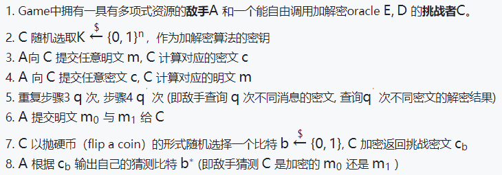
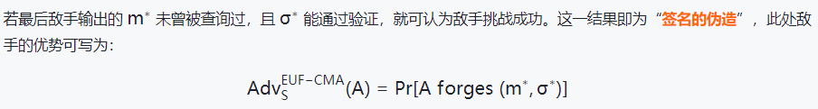

# [密码学之安全模型总结 ](https://www.cnblogs.com/max1z/p/15992505.html)

本文将系统性地总结密码学中常见的安全模型定义。在阅读本文前，可以了解如下预备知识：

- 现代密码学是一门怎样的学科？
- 数据的机密性、完整性与实体的抗否性是什么意思？
- 完美安全和语义安全的含义是什么？

数据的**机密性**、**完整性**和实体的**抗否性**是一个信息安全系统所要保障的主要目标，也是一个密码算法所应满足的基本指标。而在现代密码学与可证明安全的语义下，机密性等含义有着更加严格和完善的定义。

例如，如果描述一个加密算法实现了数据机密性，那么就需要证明这个算法输出的密文与那些随机字符串看起来是不可区分的, 由此敌手就不能从密文中获得任何有关明文和密钥的信息。本文就将围绕着安全系统的这几个主要目标，总结下密码学标准定义中的若干安全模型。

# 不可区分性

纵观整个安全性定义的发展，数据机密性是人们一直以来的核心诉求。从香农的完美安全（Perfect Secrecy）到语义安全（Semantic Security），人们都希望一个加密算法的输出应足够随机，以使得其不会泄露关于明文和密钥的任何信息。

为了规范这些“感觉”，前人提出了“**不可区分性**” （Indistinguishibilty， IND）这一概念来描述算法的机密性。然而，一个算法达成不可区分性时所处于的**安全模型**可能是不同的。因此，我们在讨论一个加密算法的**不可区分性强度**时**，**需要明确其面对的安全模型。下面我们就介绍几种在加密算法中常见的IND安全模型。

> 注意📌：在密码理论领域的论文中，安全模型通常对应的是Game、Experiment、Image、Procedure等概念。为与论文的表述保持一致，本文会使用Game这个词来指代安全模型。

## IND-CPA

不多废话，下图就是IND-CPA的示意图。

IND为不可区分，而CPA的含义是Chosen Plaintext Attack。那么IND-CPA所表示的含义为，在敌手能**自行选择明文，并查询对应密文**这一模型中，我们的加密算法是否还能实现密文不可区分。在这一Game中，敌手可以查询任意一条明文消息对应的密文， 这需要我们开放自己算法的加密功能给敌手，即敌手拥有“access to the encryption oracle”的能力。

而结合到上图，IND-CPA这一Game的步骤如下：

可以看出，IND-CPA实际上是想表达“如果密文足够随机的话，密文是不会泄露任何关于明文信息”这一深层含义。对于IND-CPA的敌手 A，要赢得这个Game的概率为：

## IND-CCA

与CPA类似，CCA的含义为Chosen Ciphertext Attack，即选择密文攻击。那么在IND-CCA模型中，敌手的能力将是允许访问解密算法的Oracle D，即敌手可以自行构造密文并提交给 C，C 执行解密算法返回解密结果。而最终敌手的目标与IND-CPA还是相同的，即攻破加密的**不可区分性**，其示意图如下所示

综上，IND-CCA这一Game的步骤如下

在此模型中，由于敌手没有密钥, 因此它很难生成合法的密文。因此，A�每次提交的密文大概率会解密出一些无意义的结果，但开放解密Oracle的目的在于，让敌手能在拥有并篡改密文的条件下，依然做到对算法明文的保护。因为一个加密算法如果仅能支持CPA安全性，那么中间人敌手可能会**截获密文**并对其进行针对性的**篡改**，从而使这种篡改也被施加到了**解密后的明文**中，进而敌手能通过篡改后的明文来攻破加密的不可区分性。

因此，我们希望一个算法还能实现对其输出密文的保护，使得敌手无法通过修改密文来观测解密算法的行为，IND-CCA就是由这一需求应运而生的。类似地，IND-CCA中敌手的优势可写作：

## IND-CCA2

与上面的IND-CCA相比，IND-CCA2只多了一个步骤，如下所示。

其步骤总结如下：

可以看到在第8步时， CCA2允许敌手在提交了自己的挑战明文后，依然能进行若干次解密查询。与CCA（或说CCA1）相比，CCA2令敌手通过最开始的若干次解密查询进行学习与观察后，即使收到了挑战密文 cb，还能继续进行学习。

这个能力让敌手可根据 cb继续去构造和猜测，而且CCA2中 C 提供的 Oracle 相当于**永久开放**给敌手[1]，而CCA1在敌手最初查询后 Oracle 就不允许再访问了，因此CCA2这一定义是比CCA1更强的安全模型。

> 小结📝：目前我们已介绍了三种安全模型IND-CPA、IND-CCA、IND-CCA2，这其中的敌手目的都是为了区分  m_b 对应的密文。三者的安全要求逐渐提高，IND-CCA2也是目前标准定义下对安全性要求最高的模型，当前学术界一般认为一个新的公钥加密算法都应达到IND-CCA2的要求。

## LOR-CPA

与IND-CPA相比，我们首先可以看到这个安全性定义的目标发生了变换，即从IND（不可区分性）变成了LOR（Left Or Right, 即左或右），但本质依旧不变。这一Game的具体示意图如下所示。

可以看到，在LOR-CPA中，那个随机的bit b 一开始就选择好了，即  C 每次加密的其实都是左边或右边的明文。基本步骤如下所示:

在这一安全模型中，敌手的目标是猜测C加密的是左右哪边的明文。因此，与IND-CPA相比，LOR-CPA这个Game本身其实是相当于IND-CPA的最后敌手应答挑战密文的那一次query。诚然在LOR-CPA中，敌手其实也可以重复多次进行 m0 与 m1的查询，但那一随机bit始终是固定的。

而在安全强度方面，LOR-CPA比IND-CPA是要稍弱一些的[2]，因为LOR-CPA并不包含有若干次的任意明文的询问学习过程，虽然它不像IND-CPA那般成为了衡量加密算法安全性的“至上公理”[3]，但还是值得我们去记住和分析的。

## ROR-CPA

此处的ROR意为Real or Random， 该Game的示意图如下所示。

在ROR-CPA中，挑战者要么加密敌手所提供的输入，或者加密一个和敌手输入等长的随机字符串。而敌手的目标是决定C加密的是真正的明文输入 (Real)， 还是一个随机的输入（random），这一Game的基本步骤如下所示：

ROR-CPA在安全性强度上是与LOR-CPA等价的。在介绍完ROR-CPA后，我们在**不可区分性**这一小节中的经典安全定义都总结完了，下面将会给大家介绍两个出现在很多实际Cyber Attack中的安全定义。

## Known Plaintext Attack

本文一上来就为大家介绍了IND-CPA这个经典模型，而很多教材会先为读者介绍两个模型，即 Known Plaintext Attack 与 Ciphertext Only Attack。而在理解了IND-CPA及上述安全模型后，这两个安全定义就非常好理解了。

KPA的中文是"已知明文攻击", 但其真正含义是敌手在可以获取一个加密算法的**明文及对应密文**之后，试图还原该算法的密钥。因此，KPA的安全定义更适用于一些主动的半侵入式攻击，即攻击者能实际获取并**运行承载有这个密码算法的设备**，比如智能卡，密码芯片等。

这样一来，敌手的目标就是希望通过不断调用这个设备里的密码算法，从而获取非常多的算法明密文对，进而尝试还原设备中的密钥，达到攻破甚至复制这一设备的最终目标。KPA这个安全定义常见于密码算法的能量侧信道分析中。

## Ciphertext Only Attack

同理，COA就表示唯密文攻击，即敌手仅能以中间人的状态截获一些算法的密文，他无法调用这个算法，即仅能通过眼前拿到的这一堆密文中，尝试得到与明文或者密钥有关的信息。

可以看到，唯密文攻击是几个定义中敌手能力最弱的了，敌手无法自行构造与选择要加密或解密的明密文，也无法自由地调用这个算法。KPA与COA这两种有些另类的安全模型通常会出现在一些系统安全的问题中，如一些网络攻击，物理攻击等。在密码理论领域中，前文介绍的几类模型是更为常用的。 

# 数据完整性

## INT-CTXT

谈到数据完整性，我们主要考虑的是消息（明文， PlainText）完整性或算法输出（密文，CiphtText）的完整性。因此，INT（Integrity）可以理解为，敌手无法伪造一段**密文**或某段合法密文对应的**明文**，使其在接收方看来是由发送方生成且传输过程中未受到任何篡改的。

因此，INT-CTXT这一Game的主要步骤为：

其示意图如下图所示:

这一安全模型中，敌手可以多次访问加密Oracle，而最终进行挑战时，需提交一个密文 c∗ ,其目的是使 c∗能正常通过解密算法得到一个明文 m∗。如果 m∗非空 （即真的完成了解密过程）且 c∗ 没有在查询阶段出现过，那么就称 A 赢得这个Game。此时大家就会想到，岂不是任何一个对称加解密算法都做不到INT-CTXT吗？

没错，一个**不加任何防护**的对称密码算法，如AES，就是不能做到INT-CTXT安全性，因为任何人可以随便拿一条数据输入到解密算法里，只要数据的格式是正确的，虽然解密输出的内容可能是一些杂乱的无意义字符，但依然是有效的明文。

因此，如果要达到INT-CTXT安全性，就必须对原有算法**输出的密文加以防护**，例如增加一消息认证算法（MAC）等。看到这里，可能很多读者会联想这一安全性与上文中IND-CCA的联系。其实，当一个算法同时具备IND-CPA与INT-CTXT安全性时，该算法就有潜力是IND-CCA安全的；这一结论通常被用于**认证加密算法**的安全性证明中。

## INT-PTXT

与密文完整性相对应，PTXT指的是明文的完整性，而这一Game的步骤与INT-CTXT完全相同。唯一的区别在于，INT-PTXT中的敌手 A 获胜的条件是：解密后的 m∗ 非空且 m∗ 没有在之前的查询过程中提交过。注意INT-CTXT要求的则是 c∗ 没有出现过。

通常, INT-CTXT中这一安全性是稍强于INT-PTXT的，即对于一个方案而言，如果是INT-CTXT安全的，那么也一定是INT-PTXT安全的。这也不难理解，因为在解密算法为**确定的**、**无碰撞**的条件下，如果一个明文 m∗ 没有提交过，那么加密后的密文必然也没有出现过；否则如果密文 c∗ 出现过的话，由加解密置换的唯一性可知  c∗对应的明文必然也出现过。因此一般情况下，我们希望能够证明某个算法是INT-CTXT安全的。

> 💡 在数据完整性中，有些读者可能会想到密码学哈希函数的三个安全性质: 单向性、弱碰撞性、强碰撞性；而本文主要聚焦一个密码算法数据完整性的通用模型，哈希函数可以作为一种实现上述数据完整性的工具。 

# 抗否性与身份认证

介绍完了数据完整性后，我们该介绍最后一部分常见的安全需求与安全模型了，即抗否性（Non-repudiation），或称抗抵赖性。这一需求是指某一方计算出的数据是与它身份绑定的，没有其他人能像这一方本人一样计算出一样的数据。因此，数字签名、身份认证等算法或协议需要对这一性质加以描述。下面将介绍几个最常见的安全模型。

## EUF-CMA

这一模型中的CMA指Chosen Message Attack，即选择消息攻击，本质上与CPA其实是一样的，只不过在数字签名等算法中，用消息一词要比明文更加贴切。CMA和CPA都是形容敌手能自由地向算法提交输入并获得的相应输出这一能力。

EUF则是指存在性不可伪造，即 Existential Unforgeability，指的是对于消息认证、数字签名等算法而言，当敌手通过查询获得了 q个签名后， 他无法再获得第 q+1 个签名。这一Game的示意图如下所示。

## SUF-CMA

在EUF-CMA中，E表示的是Existential，而此处的SUF的S则表示Strong，即强不可伪造性，这一Game的基本模型如下图所示。

与EUF-CMA相比，SUF-CMA唯一的不同之处在于敌手最终输出伪造的签名对 (m∗,σ∗)时，不仅要求 m∗ 是未曾查询过的，也要求签名 σ∗ 是未曾出现过的。因此，EUF-CMA这一Game中的敌手只需要寻找到 m 关于 σ 的一个**碰撞**即可，而在SUF-CMA中，敌手的任务并不是要找碰撞，而是要从根本上伪造出一个签名消息对。

EUF-CMA中的敌手最差也可以使用**生日攻击**去暴力地寻找碰撞，而SUF-CMA中的敌手则是应真正生成去另外一对 (m∗,σ∗)。因此，SUF-CMA是比EUF-CMA安全性更强的安全模型。这两个模型通常用于消息认证、数字签名算法的安全性定义上，以说明其签名的不可伪造性，从而使实体是不可抵赖。

## Impersonation

这一部分要说明的安全模型与本文前面所介绍的都有所不同，对于一个身份认证协议而言，impersonation表示敌手最终能假冒某个合法用户的身份通过认证。这一概念最开始是为了描述Fiat-Shamir Protocol 以及 Shnorr Identification Protocol的安全性。

然而，身份认证协议是多种多样的，这一安全模型也不像上面的 EUF-CMA 等具有统一的定义方式。不过，Impersonation的基本过程依然可以总结为“查询-挑战”两个阶段， 即敌手先根据协议开放的某个Oracle进行查询，之后生成认证数据“试图”通过协议的检查，完成身份的认证。

> 小结📝: 到此为止，几个经典的安全模型均介绍完毕。下面本文将介绍量子计算机模型下的安全模型，与这些经典安全模型相比，它们的交互方式与计算方法均有所不同。 