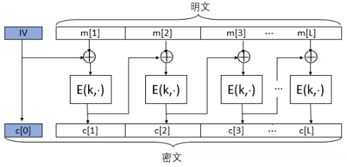

# 圣桑 : 天鹅

### 密码学和香农

《保密系统的通信原理》的论文拉开了密码学从技术进化到科学的序幕 

### 完善保密性

#### 对称加密方案 

对于任何一个对称加密方案（E, D）都要求：给定任意明文m∈M和任意密钥k∈K，都有m=D(k, E(k, m))

#### 完善保密性定义

​      （完善保密性的等价定义）**对于任意给定的密文c∈C，都存在一个常数N，使得对于∀m∈M，都有 |{k ∈ K : E(k, m) = c}| = N**。 

​		一次一密具有完善保密性，即使攻击者具有无限计算资源也无法从密文获得明文的任何信息

一个对称加密方案满足完善保密性，那么密文不会泄露明文的“**任何信息**” 

1. 完善保密性考虑的是唯密文攻击，也即攻击者手里只有窃听到的密文。 
2. “任何信息”指的是明文内容的信息。明文长度、明文是什么时候发送的等信息不包含在内，这些东西即使不破译密码，也可以通过其他手段获知，所以不在密码安全性的考虑范畴之内。 

​    因此，定义中附加了一个限制条件：“|m0|=|m1|”。这个类似绝对值的符号表示消息长度（这个符号以后会经常出现），也即m0和m1的长度要相等。

###  一次一密

 严格定义如下：（E, D）是加/解密算法，设M=C=K={0,1}^n，m∈M，k∈K

​	E(k, m)：c = m⊕k 

​	D(k, c)： m = c⊕k

一次一密具有完善保密性

### 香农定理

#### 一次一密不实用 

- 密钥数量至少要和明文数量一样多 
- 一次一密的密钥不能重复使用
- 一次一密所使用的密钥必须是随机的

#### 香农定理的证明

​	 **香农定理：设（E, D）是定义在（K, M, C）上的对称加密体制，如果它是完善保密的，则 |K|≥|M|。** 

 证明：我们用反证法。

​	假设|K|<|M|，我们需要证明（E, D）不是完善保密的。（忘记完善保密性定义的话，请参看上一节“完善保密性”）
为此我们需要证明存在两个明文m0和m1，以及一个密文c，使得 Pr [E(k, m0) = c] ≠Pr[E(k, m1) = c]，其中k∈K是随机的。

​	首先，我们随机选择明文m0∈M和密钥k0∈K，计算c=E(k0, m0)。

​	因为存在密钥 k0 能把 m0 加密成 c，以下公式成立

​		**Pr [E(k, m0) = c] >0**                                                         （1）

​	接着，我们定义集合S = {D(k, c) : k∈K}。

​	（即穷举密钥空间中的所有密钥，用它们分别解密c，所得明文的集合记为S。）

​	很明显，**|S| ≤ |K| < |M|**。

​	（每个密钥都对应S中的一个明文，但是有可能两个密钥解密出相同的明文，所以S集合可能小于等于密钥空间，因此有|S| ≤ |K|。）

​	既然|S|< |M|，我们就选择一个**不属于S的明文m1**，即m1∈M\S。

​	根据S的定义，很容易知道E(k, m1)≠c。否则，必有m1=D(k, c)，则m1∈S，这与m1∈M\S相矛盾。

​	因此，以下公式成立

​		**Pr[E(k, m1) = c]=0**                                                               （2）

​	由公式（1）和（2）易知Pr [E(k, m0) = c] ≠ Pr[E(k, m1) = c]。

​	由完善保密性的定义，（E, D）不是完善保密的。

​	得证。 

### 一次一密的改造计划

#### 缺点

#### 优点

简单, 计算快

#### 解决方法

​	设计一种加密方案，可以用短密钥加密长消息。它在面对实际的攻击者时（计算资源有限），没必要达到**完善保密性**，密文泄露一点儿明文的信息没关系，只要这些**信息对攻击者的帮助是可忽略**的就行。

- 降格安全性

- 改造

### 流密码

#### 原理

​	设计一种算法，我们称之为伪随机生成器（pseudo-random generator），简记为PRG，它能够利用短密钥产生长密钥，然后用这个长密钥再和明文异或，就可以得到密文了。 

​	这样既保留了一次一密加解密简单高效的优点，又克服了需要直接使用长密钥带来的不实用性，真是一举两得。 

#### 设计

#####  PRG的定义

​	(1) PRG是**高效可计算**的，也即给定其输入，它可以很快地产生输出。
​	(2) PRG是**确定性函数**，也即对于相同的输入，它的输出都是一样的。
​	(3) PRG的输入长度s远远小于其输出长度n。其输入我们称之为 **种子**（seed），并称{0,1}^s 为种子空间。

##### 流密码的定义

​	只要PRG的输出能以假乱真，也即能够和等长的随机序列不可区分，那么流密码加密出的密文也能以假乱真，也即和一次一密加密出的密文是不可区分的。

### PRG的安全性

​	流密码和PRG之间虽然关系极其紧密，但它俩的安全性完全不是一回事，千万不要搞混！

​	PRG的输出应该是伪随机的，因此PRG的安全性就要求其输出必须和等长的随机序列不可区分，以便以假乱真。

##### PRG的安全模型 

  首先设 **G: {0,1}^s → {0,1}^n** 是一个**PRG**。下面给出PRG的安全模型：

​	现在对安全模型详细解释一下：

​		设 A 是一个攻击者，用一个红色小怪物来表示。首先，构造两个“小黑屋”，也即黑盒子（black box），每个屋里各有一个挑战者（challenger）：

​		**一个挑战者执行G，他随机选择种子k，并将 G(k) 的执行结果 r 返回给 A。**

​		另一个挑战者随机选择r，并将之直接返回给 A。

​		然后，随机选择一个小黑屋，放在A面前，A并不知道自己面对的是哪一个屋： 

​		**如果A面对的是PRG那个屋，我们称之为实验EXP(0)。**

​		**如果A面对的是随机序列那个屋，我们称之为实验EXP(1)。**

​		A只能看到小黑屋返回的序列 r。 

​	 注意：如果两个屋返回的序列长度不相等，A就可以直接根据长度判断自己面对的是哪个屋，这样就不能刻画PRG的安全性了，因为A根本不需要理睬小黑屋返回的序列是什么嘛。所以，安全模型中要求EXP(1)也返回长度是n的随机序列，是非常合理的。

​	**A的任务就是根据 r 猜测自己到底是处于实验EXP(0)还是实验EXP(1)，并输出自己的猜测b。**

​	注意：**b=0表示A猜测自己处于EXP(0)，也即自己面前的屋里运行的是PRG；**

​	**b=1表示A猜测自己处于EXP(1)，也即自己面前的屋里是在随机选择序列。**

​	那么，**Adv := |Pr[W0] – Pr[W1]|**是什么意思呢？我们假设有一个攻击者，他在执行完上面的实验后，得到

​		Adv = |Pr[W0] – Pr[W1]|=0。

​	这说明，不管这个攻击者处于EXP(0)还是EXP(1)，他输出相同猜测结果（因为W0和W1都只关注攻击者返回1的情况）的概率是相等的。

​	很明显，这个攻击者根本搞不清楚自己处于哪个实验，因为得到相同猜测结果的概率是相等的嘛。

​	这个攻击者在区分两个实验这个问题上一点儿优势都没有，也即优势为零（|Pr[W0] – Pr[W1]|=0）。	这也是为什么 |Pr[W0] – Pr[W1]| 被称为优势（advantage）的原因。有的时候，某些攻击者的优势并不等于0，但只要优势（Adv = |Pr[W0] – Pr[W1]|）是可忽略的，那么攻击者虽然能从小黑屋的返回值中分析出一点儿EXP(0)和EXP(1)的差异，但这个差异实在是太小了，以至于可以忽略，所以在实际中他并不能区分开EXP(0)和EXP(1)。在这种情况下，我们仍认为G是安全的，它仍能以假乱真。

##### PRG的安全性

​	注意定义里的“所有”两个字。为什么必须是所有的？因为如果有个攻击者能够进行区分的话，G就不能以假乱真了，因为能被人识破嘛。这种区分方法如果被写成程序传到GitHub上，所有人就都能识破G了，那样的话，在实际中使用G的输出来代替随机序列就相当不安全。

### PRG的不可预测性

##### 现实意义 

​	如果G是可预测的，攻击者根据r[0, …, i-1]就可以获得r[i]的值。接着，他可以根据r[1,…, i]猜测出r[i+1]。如此下去，G(k)就全部暴露了，明文信息也就随之全部泄露。

#####  定义 

 首先，挑战者随机选择一个密钥 k，产生 G(k) 的输出，记为 r。

 然后，攻击者 A 选择一个i发送给挑战者，挑战者返回 G(k) 的前 i 个比特 r[0, …, i-1]。

 最后，A 根据已知的 i 个比特猜测下一个比特 r[i] 是 0 还是 1，其猜测记为 t。

如果 t=r[i]，A 猜测成功；反之，猜测失败。 

​		Adv := |Pr[A 猜测成功] – 1/2| 注意，r[i] 的取值只有两种可能性（0或1）。

### 语义安全性(比完善安全性更为实际)

##### 加密方案的攻击类型 

- **唯密文**攻击：攻击者只知道一些**密文**。
- **已知明文**攻击（known-plaintext attack）：攻击者除了**知道一些密文以外**，还可以通过某些手段知道了这**些密文对应的明文**。
- **选择明文**攻击（chosen-plaintext attack, CPA）：攻击者自己选择一些明文，并可以通过某些手段**获得相应的密文**。
- **选择密文**攻击（chosen-ciphertext attack, CCA）：攻击者可以自己**选择一些密文**，并可以通过某些手段**获得相应的明文**。

##### 语义安全性 (抵抗选择明文攻击)(我们依旧处于流密码中)

###### 语义安全模型

    1.    挑战者从密钥空间 K 中随机选择一个密钥 k，并对攻击者 A 发送的两个明文中的一个进行加密。在实验 **EXP(0) 中，挑战者加密的是明文 m0，而在实验 EXP(1) 中加密的是 m1**。
    2.    **A 根据获得的密文 c 猜测自己是处于哪个实验中**，并输出自己的猜测，记为 b。
    
     3.    A 只能给**挑战者发送一次明文**，也即只允许 A 询问一次。换句话说，挑战者选择的**密钥只使用了一次**。（后面的课程还会介绍允许攻击者询问多次的情况）

##### 定义

​	区分 m0 和 m1 的密文计算上不可行 

### 流密码具有语义安全性

##### 一次一密具有语义安全性

​	注意OPT不仅具有**完善保密性**而却具有**语义安全性**

​        证明一次一密具有语义安全性的方法很简单：把一次一密的加密算法套进**语义安全性的模型**里，然后证明任意高效攻击者A能区分EXP(0)和EXP(1)的优势都是可忽略的。

​	

   一次一密的性质告诉我们，密文c不会泄露明文的任何信息，所以A没法猜出c到底对应m0还是m1，也就没法猜出自己面对的是EXP(0)还是EXP(1)。

   我们得出结论，A不论面对EXP(0)还是EXP(1)，他得出相同结果的概率是相等的，也即Pr[W0] = Pr[W1]。

   故而，Adv = |Pr[W0] - Pr[W1]| = 0。

   可以看出，A没有任何优势，因为Adv=0嘛。

   证毕！

##### 流密码具有语义安全性

 **定理：如果G: K ⟶ {0,1}^n是一个安全的PRG，由它构造的流密码便具有语义安全性，其中 K={0,1}^s** 

证明:(学会套模型)

​	第零步, 设出EXP(0)

   第一步，把EXP(0)改造成下面的实验，记为EXP(0.1) 

​     第二步，把EXP(0.1)改造成下面的实验，记为EXP(0.2)。 

​	第三步, 设出EXP(1)

- EXP(0)和EXP(0.1)之间是计算上不可区分的, 否则G(k)与r可分, 违背G(k)为PRG安全的性质.
- EXP(0.1)和EXP(0.2)之间是计算上不可区分的, m0与m1可分违背OPT的语义安全性
- EXP(0.2)和EXP(1)之间是计算上不可区分的, 否则G(k)与r可分, 违背G(k)为PRG安全的性质.

 所以，任意高效攻击者区分EXP(0)和EXP(1)的优势都是可忽略的

### 流密码语义安全性证明的正式写法：反证法

EXP(0.2)与EXP(1)证明与EXP(0)与EXP(0.1)不可区分的证明同理.

###  流密码语义安全性**证明的正式写法：混合论证**

​    推论1：如果G是安全的PRG，则EXP(0)和EXP(0.1)是计算上不可区分的。

​    推论2：EXP(0.1)和EXP(0.2)是计算上不可区分的。

​    推论3：如果G是安全的PRG，则EXP(0.2)和EXP(1)是计算上不可区分的。

归纳总结攻击者区分EXP(0)和EXP(1)的优势，得出结论：对于任意概率多项式时间的攻击者，该优势是可忽略的。 

### 常用语义安全性模型

#### 最初的语义安全性模型

#### Left-or-Right Model

#### Real-or-Random Model

Adv := |Pr[W0] - Pr[W1]|

### PRG并行构造方法

   G’ 的优点是很明显的。它可以并行执行，在多处理器系统下，执行速度非常快。

   缺点也是很明显的。不难看出，G’ 需要的种子长度是 G 的 m 倍，而种子的获取往往比较麻烦、费时。 

### PRG并行构造法的安全性

#### 构造证明(蓝色恶魔万岁!)

​        1.  首先构造一系列实验，实验中的挑战者们分别产生如下输出 

  假设 **A 是一个概率多项式时间的攻击者**。在每个实验中，A 都作为攻击者与相应的挑战者交互。

​    设 EXP(0) 和 EXP(1) 是关于 G’ 的实验。由 PRG 的安全模型可知，EXP(0.0) 即为EXP(0)，EXP(0.m) 即为 EXP(1)。 

  设 **p_j 表示 A 在实验 EXP(0.j) 中返回 1 的概率**，则 p_0 表示 A 在 EXP(0) 中返回 1 的概率，p_m表示 A 在 EXP(1) 中返回 1 的概率。

  设 Adv_A 表示 A 关于 EXP(0) 和 EXP(1) 的优势，根据定义可知， Adv_A=|p0 – pm|。

2. 因为 G‘ 的安全性依赖于 G 的安全性，根据反证法，我们需要设计一个算法 B，它通过调用 **A 为子程序**，来区分关于 G 的实验 EXP’(0) 和 EXP’(1)。

   

  在收到挑战者给出的t以后，B 调用 A 为子程序（B 扮演 EXP(0) 和 EXP(1) 中的挑战者）。

  B(t) 的执行过程如下： 

  注意：对于任意选择出的 j=1, …, m，**实验 EXP’(0) 其实就是 EXP(0.j-1)**（**t=G(k)时**），而EXP’(1) 就是 EXP(0.j)（**t 是随机序列时**）。（大家可以自行验证，这个不难）

    3. 设事件 W0 表示 B 处于实验 EXP’(0) 时返回 1，事件 W1 表示 B 处于实验 EXP’(1) 时返回 1。

  因此，

由全概率公式可知 

​    以及 

​       我们得到 

​        最后，我们有 

​    至此，我们把 A 的优势 Adv_A 和 B 的优势 Adv_B 联系到一起，这也正好体现 G’ 的安全性与 G 的安全性相关这一事实。

   既然 G 是安全的，Adv_B 必然是可忽略的，故而只要 m 是多项式的，Adv_A 也必然是可忽略的。

​    得证 ! 

### Blum-Micali串行构造法

  相比于并行构造法，它的优点很明显，种子长度与G的一样，因此用户不需要收集很多种子，这样就节约了时间。缺点是，它只能串行执行，不过对一般的应用来说，这已经足够了。

   两者相较，Blum-Micali方法更加实用。 

### Blum-Micali串行构造法的安全性证明

**Adv_A = t * Adv_B**

略(和并行相似)

### 应用 : 截取PRG

​         在任何需要随机序列的地方，你都可以用 PRG 产生所需长度的伪随机序列来代替。哪怕只取一个比特，也是完全没有问题的。

### 应用 : 三个重要问题

#### 二次密码本

   如果你用同一个密钥加密了两个不同的明文，那么你就遇到了二次密码本（two-time pad）问题。这个问题是使用流密码时最容易犯的错误。

   假设你用的密钥是 k，加密的两个明文分别是 m1 和 m2，则相应的密文分别是：

​							 **c1 = m1 ⊕ G(k)  和  c2 = m2 ⊕ G(k)**

   攻击者截获到 c1 和 c2 后可以将它俩异或，便能得到 **m1 ⊕ m2**。

   由于自然语言包含大量信息冗余，如果 m1 和 m2 是自然语言文本，则很容易通过 m1 ⊕ m2 推导出 m1 和 m2 的内容，导致信息泄露。

   由上我们得到流密码使用的第一条经验：每个密钥只能用于加密一条明文。也即，流密码的密钥不可以直接重用。 

#### 流密码具有可延展性 

​    截获到用流密码加密的明文后，虽然攻击者无法知道明文的内容，但他却可以通过修改密文来控制对明文的修改。

​    假设攻击者截获到一条你发送的密文 c = m ⊕ G(k)。他可以选择一条消息 t，并计算一条假密文 c’ = t ⊕ c。

​    很容易知道，c’ = t ⊕ c = t ⊕ m ⊕ G(k)。

​    攻击者把 c’ 发送给接收者，并谎称 c’ 是你发去的。

​    当接收者解密以后，便会得到假明文 m’ = t ⊕ m，而他却被蒙在鼓里。

​    易知，攻击者虽然不知道原始明文 m 的内容，但他知道接收者收到的假明文 m’ 和原始明文 m 之间存在某个特定的关系：**m’ ⊕ m = t**。

​    **可延展性（malleability）**指的就是**攻击者可以对明文进行可以预测的修改**。

​    在某些实际应用中，流密码的可延展性危害很大。

​    以上攻击之所以能成功，是因为流密码只提供**语义安全性**，却不能提供**完整性保护**。在后面的课程中，我们会介绍如何同时保护信息的机密性和完整性。

#### 如何选择种子 

​    流密码里使用的密钥其实就是 PRG 的种子。

​    如果种子选择的不好，攻击者根本不用费劲心思去分析 PRG 的设计细节，而只需要尝试重构出种子就可以了。

​    因此在**设计选择种子的算法**时，要特别注意，必须保证选择出的种子具有**不可预测性**，以防范攻击者的成功猜测。

### 正确使用流密码

 假设 Alice 和 Bob 要使用流密码进行通信。

​    需要注意的是，通信双方不能只共享一个密钥，而应该共享两个：一个用于 Alice 向 Bob发送消息，记为 KA，另一个用于 Bob 向 Alice 发送消息，记为 KB。

​    所以，每个密钥都是单向使用的。这是为了避免二次密码本问题。

​    在此仅考虑 Alice 向 Bob 发送消息的情况（Bob 向 Alice 发送消息是类似的）。

​    通常情况下，Alice 会不止一次向 Bob 发送消息，设这些消息为 m_1, …, m_n。

​    如果 Alice 直接加密这些消息，并把密文 m_1 ⊕ G(KA), …, m_n ⊕ G(KA) 发送给 Bob，势必会造成二次密码本问题。

   注意：PRG 的输出是一个非常非常非常长的串，所以在实际应用中，开发包里与 G(KA)相关的函数是不会把它所有的输出一次性全部产生出来的，而是以字节或字为单位逐个产生。

​    因此，加密时可以分两步做：

    1.  每当需要加密一条消息 m_i 时，就利用密钥 KA，调用 G 产生一个伪随机串 k_i。
    
        2.  再把 k_i 做为密钥，加密消息 m_i：m_i ⊕ G(k_i)。

​    整个过程如下图所示。

这相当于把 G(KA) 的输出切成一段一段的 k_1, …, k_n，每一段 k_i 都作为一个新的密钥做加密 m_i ⊕ G(k_i)。

### 流密码总结

略

### 流密码习题

### 分组密码

​	它不仅能用于加密，还可以作为基本模块构造诸如流密码、Hash函数、消息认证码（MAC）等密码工具，可谓多才多艺。 

#### 定义

分组密码是一个确定性的加密体制，记为 (E, D)，其中 E 是加密算法，D 是相应的解密算法。

​    我们称 (E, D) 是定义在 (K, X) 上的分组密码，其中 K 为**密钥空间**，X 为**分组空间**。

我们称任意 x∈X 为一个分组。

​    需要注意的是，分组密码的明文空间和密文空间是**相同**的 (**有限**) 集合，即X。

​    分组密码可以将 X 中的一个分组（称为明文分组）进行加密，输出的密文也是 X 中的一个分组（称为密文分组）。

​     也即，对于任意 **k∈K 和 x∈X，都有 E (k, x) ∈X**。 

#### 分组密码可以描述为一个置换 

###  分组密码的安全性

比语义安全更强

#### 随即置换

​       需要注意的是，所谓的“随机置换”强调的是这个置换是随机地被选择出来的。因此，“随机置换”这个概念和置换的输出是否是随机的没有关系。即使一个置换的输出不是随机的，但只要它被选出的时候是随机选择的，那么它就是“随机置换”。理解这一点非常重要！

#### 分组密码的安全性模型 

  设 W0 和 W1 分别表示 A 在实验 EXP(0) 和 EXP(1) 中输出1的事件。

   攻击者 A 的优势定义为 Adv := |Pr[W0] – Pr[W1]|。

#### 安全的分组密码

​	如果所有高效的攻击者的优势都是可忽略的，那么该分组密码是安全的。 

#### AES的例子 

   现在通过 AES-128 来更加直观地描述分组密码的安全概念。

   首先，我们来看一下集合 Perm[X] 里有多少个置换。因为 Perm[X] 里的每个置换都是定义在 X 上的，所以一共有 |X|! 个不同的置换。也即 |Perm[X]| = |X|!。

   AES-128 的明密文空间是 128 比特，所以 **|X|=2^128**，因此相应的 **|Perm[X]| = 2^128! ≈2^{2^135}**。

   另外，根据安全模型可知，每当从密钥空间里**选择一个密钥 k** 时，就可以**确定一个相应的置换 E (k, .)**。

​    AES-128 的密钥是 128 比特，所以其密钥空间里一共有 2^128 个不同的密钥，也就**最多可以确定 2^128 个不同的置换**。

   综上所述，如果把 E 替换成 AES-128，那么在安全模型中，**EXP(0) 里的挑战者实际是从至多 2^128 个不同的置换里随机选择出一个**；**EXP(1) 里的挑战者则是从更大的范围(2^{2^135}) 里随机选择出一个置换**。

​    **分组密码的安全性实际**就是要求：**给定一个置换，攻击者无法知道它是从大范围里随机选择的，还是从小范围里随机选择的，即使他能够通过“探测”的方法获得置换的一些输出也是徒劳。**

### 分组密码安全性的暗示

   (1) 安全的分组密码必是不可预测的。

   (2) 攻击者无法从密文中恢复出密钥。

   (3) 密钥空间必然非常大 (超多项式的) 

**分组密码的不可预测性模型** 

​    在这个模型中，挑战者和攻击者是这样执行的：

​    (1) 挑战者随机选择一个密钥 k

​    (2) 攻击者可以给挑战者发送一系列明文 x_1,…,x_n。对攻击者发来的每一个明文 x_i，挑战者都返回相应的密文 E(k, x_i)。

​    (3) 最后，攻击者输出一个二元组 (x, y)。

​    如果 (x, y) 满足 **E(k, x) = y**，且 x ∉ {x_1,…,x_n}，则称攻击者成功地进行了预测。

​    如果对于**任意高效攻击者**，他们能**成功预测的概率都是可忽略的**，则称该**分组密码是不可预测的**。

#### 安全的分组密码必是不可预测的

​       **定理：如果一个分组密码是安全的，那么它一定是不可预测的。** 

  证明：**蓝色恶魔, 反证法万岁 : )**

​	**假设 (E, D) 是可预测的**，必存在一个高效攻击者 A，能以不可忽略的概率 p 在**“不可预测性模型”**下进行成功地预测。

   我们可以构造一个**算法 B**，它能利用A的预测能力，在**分组密码安全性模型**（设该模型中的挑战者是 C）中区分出自己到底处于哪个实验。

  算法 B 的执行过程如下：

​    (1) 调用攻击者 A，对于 A 询问的每个明文 x_i，B 都直接把 x_i 转发给 C。

​         B 将 C 返回的 y_i 直接返回给 A，作为对 A 询问的回答。（由安全性模型可知，B 处于实验 EXP(0) 时，y_i = E(k, x_i)； B 处于实验 EXP(1) 时，y_i = f(x_i)。）

​    (2) A 最终输出二元组 (x, **y**) 给 B 时，B 直接把 x 转发给 C；而 C 将返回相应的值 **y’**。（B 处于实验 EXP(0) 时，y’ = E(k, x)； B 处于实验 EXP(1) 时，y’ = f(x)。）

​    (3) 如果 **y= y’**，**B 输出 0** 表示猜测自己处于实验 EXP(0)，**否则返回 1** 表示猜测自己处于实验 EXP(1)。

  【概率分析】既然 A 能以不可忽略的概率 p 进行成功的预测，那么 Pr[E(k, x) = y]=p。

   B 处于实验 EXP(0) 时，y’ = E(k, x)。易知 Pr[y’=y]=p。B 返回 1 的概率是 1-p，即 Pr[W0]=1-p。

   B 处于实验 EXP(1) 时，y’= f(x)。记 Pr[y’=y]=e，易知 e 是可忽略的。B 返回 1 的概率是1-e，即 Pr[W1]=1-e。

   可知，|Pr[W0] – Pr[W1]|=|p-e| 是不可忽略的（因为 p 是不可忽略的，e 是可忽略的，二者之差必是不可忽略的）。

   所以 B 可以不可忽略的概率区分出自己处于哪个实验，故而该分组密码是不安全的，这与题设相矛盾。

   得证！

注意目前我们在分组密码中已经构建了: **分组密码安全模型-->分组密码不可预测模型**

####  攻击者无法从密文中恢复出密钥 

   因为如果存在某种方法能够从密文中恢复出密钥，那么攻击者在获得一些明文/密文之后，可以利用该方法获得相应的密钥 k。

   最后他随便选一个新的明文 x，用该密钥 k 计算 y = E(k, x)。

   很明显，**(x, y)** 是一个合法的二元组，因此**攻击者成功预测的概率是 1**，是**不可忽略**的。

   现在我们知道，如果存在某种方法能从密文中恢复出密钥，那么该分组密码必是可预测的。前面已经证明，一个分组密码是可预测的，那么它必是不安全的。综上可知，如果存在某种方法能从密文中恢复出密钥，那么该分组密码必是不安全的。

   得证！ 

####  密钥空间必然非常大 (是超多项式的) 

  在“不可预测性模型”下，攻击者随机选择一个密钥 k，而 k 恰好是挑战者选定的密钥的概率是 1/|K|。

   攻击者使用 k 产生 (x, y) 的话，(x, y) 是合法二元组的概率也是 **1/|K|**。

   如果密钥空间 |K| 不是超多项式的，那么 1/|K| 必是不可忽略的，也即此时攻击者能以不可忽略的概率产生一个合法的二元组，从而进行成功**预测**。

   因此，一个安全的分组密码意味着其密钥空间必然是超多项式的，也意味着对该分组密码进行穷举密钥攻击是不现实的。 

#### 总结

​	**分组密码安全模型-->分组密码不可预测模型-->(攻击者无法从密文中恢复出密钥,密钥空间必然非常大 <是超多项式的> )**

### 伪(记得咱们用的都是实用现实的伪的! )随机函数PRF

​	 PRF 与分组密码有着紧密的联系。由于两者在概念上十分接近，当我们设计了一个以PRF 为基本模块的密码体制后，我们可以在理论上使用 PRF 的安全模型证明其安全性，而在实际应用时，可以用安全的分组密码代替 PRF 而不失安全性。 

#### PRF的定义 

   PRF 是一个**确定性**的函数，记为 F。

   我们称 F 是定义在**（K, X, Y）**上的 PRF，其中 K 是密钥空间，X 是输入空间，Y 是输出空间。

​    它有两个输入，一个是密钥 k，另一个是数据块 x∈X（称作输入数据块）。它的输出**y=F(k, x)** ∈Y 也是一个数据块（称作输出数据块）。

​    对于 PRF，其安全性要求：给定一个**随机产生的密钥 k**，函数 F (k,.) 应该看上去“像”是一个定义在 X 到 Y 上的**随机函数**。

#### 随机函数

​    给定集合 X 和 Y，考虑定义在 X 到 Y 上的函数 f：X→Y。

​    首先把所有定义在 X 到 Y 上的函数集中起来，形成一个集合。这个集合里的每个元素都是一个类似 f 这样的函数，它们的**定义域都是 X，值域是 Y**。

​    这个集合记为 **Funs[X, Y]**，它就是**定义在 X 到 Y 上的所有函数的集合**。

​    很明显，这个集合里一共有 **|Y|^|X|** 个函数，非常大！

​    现在，从 Funs[X, Y] 中随机选择一个函数。这个函数就是“随机函数”。

​    需要注意的是，所谓的“随机函数”强调的是这个函数是**随机地被选择出来**的。因此，“随机函数”这个概念和函数的**输出是否是随机**的没有关系。即使一个函数的输出不是随机的，但只要它被选出的时候是随机选择的，那么它就是“随机函数”。理解这一点非常重要！（这和前面章节介绍过的“随机置换”的概念类似)

#### PRF的安全模型 

​    有了随机函数的概念，定义 PRF 的**安全性**就很容易了。

​    我们仍然定义一个安全模型。在 PRF 的安全模型中，同样考虑两个挑战者，每个挑战者都控制着一个函数 f，只不过不同的挑战者选择f时候的方法不同：

​    一个挑战者**随机选择一个密钥 k**，令 **f := F (k, .)**；

​    另一个挑战者控制的f则是一个**随机函数 (从 Funs[X, Y] 中随机选择一个函数并令之为 f)**。

​    攻击者 A 不知道自己面对的挑战者到底是哪一个，但他可以通过“探测”的方法来帮助判断。A 的最终目标就是要**猜出自己面对的到底是哪一个挑战者**。

​    探测的方法是这样的：A 可以向挑战者发送一个元素 x_i∈X，挑战者将相应的 y_i:= f(x_i) 返回给 A。

​    A 可以进行这样的探测很多次。

​    当然，A 可以根据前一次探测得到的y_i来产生下一次探测时使用的x_{i+1}，以根据它们之间的关系来判断到底挑战者是哪一个，也即面前的挑战者控制的函数到底是哪一种类型：使用随机密钥的 PRF，还是随机函数。

​    PRF 的安全性要求，攻击者不能区分开二者。也即，一个**安全的 PRF 应该和随机函数是计算上不可区分的**。

   设 W0 和 W1 分别表示 A 在实验 EXP(0) 和 EXP(1) 中输出 1 的事件。

   攻击者 A 的优势定义为 **Adv := |Pr[W0] – Pr[W1]|**。

   **定义 (安全的 PRF)**：**如果所有高效的攻击者的优势都是可忽略的，那么该 PRF 是安全的。**

#### 伪随机置换（PRP） 

​    一个分组密码其实也可以被称之为伪随机置换（PRP），因为分组密码和PRF的定义及安全模型是非常类似的，分组密码的安全性要求其与随机置换在计算上不可区分。

​    通过定义可以知道，PRF 和 PRP（分组密码）之间最主要的区别就是，**PRP 是有逆函数**的，而 PRF 未必有逆函数。

#### PRP与PRF的关系

​	PRP (分组密码) 和 PRF 是两个完全不同却有着紧密联系的概念。

​    根据定义，PRP 是 PRF 的一个**子集**，任何一个 PRP 本质上也是一个 PRF。

​    但是，**一个 PRP 是安全的，但它未必是安全的 PRF**。

​    那么问题来了，满足什么条件，一个安全的 PRP 才是安全的 PRF 呢？

​    设 (E, D) 是一个定义在 (K, X) 上安全的 PRP，且 N:= |X|。

​	**引理（PRF Switching Lemma）**设 (E, D) 是一个定义在 (K, X) 上安全的 PRP，且 N:= |X|。设攻击者 A 最多询问挑战者 Q 次 (Q 是多项式的)，那么

​           **| Adv_PRP (A) – Adv_PRF (A) | ≤ Q^2 / 2N**

​    其中，Adv_PRP (A) 表示攻击者 A 在 PRP 安全模型下的优势，Adv_PRF (A) 表示攻击者 A 在 PRF 安全模型下的优势。

​    如果一个 PRP 是安全的，根据 PRP 的安全性定义，**Adv_PRP (A) 必然是可忽略的**。另外，如果分组空间大小 (N) 是超多项式的，且 Q 是多项式的，**Q^2 / 2N 就是一个可忽略的值**。根据引理中的公式可知，由于Adv_PRP (A) 是可忽略的，Adv_PRF (A)与它的差异又不超过一个可忽略的值 (Q^2 / 2N)，那么**Adv_PRF (A) 必然也是可忽略的**，从而可知该 **PRP 同时也是一个安全的 PRF**。

   **推论：设 (E, D) 是一个定义在 (K, X) 上安全的 PRP，且 N:= |X|是超多项式的。(E, D) 是安全的 PRP，当且仅当它是安全的 PRF。**

​    该推论告诉我们，如果分组空间大小是超多项式的，对于任意多项式时间的攻击者 (最多对挑战者进行多项式次数的询问)，一个安全的 PRP 同时也是一个安全的 PRF。

​    因此，**基于 PRF 的密码体制如果被证明是安全的**，在实现该体制时就可以使用**安全的分组密码 (比如 AES 等) 来代替 PRF**。(分组密码是伪随机置换安全->伪随机函数安全->安全)

​    当然，诸如 AES 之类的分组密码的安全性仍然是未知的。但到目前为止，还没找到有效的方法攻破它们，所以在实际应用中都默认它们是安全的 PRP。（注：AES 的分组长度是128，所以分组空间大小是2^128，在目前的计算水平下，一般认为2^128是超多项式的。）

### 利用PRF构造PRG

 设 F 是一个定义在 (K, X, Y) 上的 **PRF**，并设 x_1, …, x_n 是 X 中两两不同的元素。

​    我们可以构造一个 PRG，记为 G。它的**种子空间是 K**，**输出空间是 Y^n**。G 的构造如下：

​    **G(k) := (F(k, x_1), …, F(k, x_n))**

 	利用反证法很容易证明其安全性。(一般都是设置蓝色幽灵, 作为蓝色幽灵的攻击者为否定假设存在, 由此推到蓝色幽灵作为攻击者成功而推出矛盾由此证明蓝色幽灵与红色幽灵间的)

​    设 A 是一个攻击 PRG 的攻击者。利用 A 可以构造一个攻击 PRF 的算法 B，它与挑战者C 之间在 PRF 的安全模型下运行。算法 B 调用 A 为子程序，它俩之间在 PRG 的安全模型下运行，B 作为其中的挑战者，A 作为攻击者。

​    首先，B 随机选择 x_1, …, x_n，并将它们依次发送给 C。C 则依次返回相应的 y_1, …, y_n。很明显，如果 B 面对的是 EXP(0)，则 C 返回的是 y_1 = (F, x_1), …, y_n = (F, x_n)；否则C 返回的是 y_1 = f(x_1), …, y_n = f(x_n)，其中 f 是随机函数。

然后，B 将 (y_1, …, y_n) 发送给 A。

​    最后，**不论 A 输出的猜测是 0 还是 1，B 都直接将之输出作为自己的猜测**。

​    很明显，如果 A 输出 0，说明它猜测自己的挑战者 (也即 B) 返回的 (y_1, …, y_n) 是用 G产生的，根据 G 的构造可知，B 应输出 0 以表示 C 使用的是 F；如果 A 输出 1，说明它猜测自己的挑战者返回的 (y_1, …, y_n) 是随机产生的，B 应输出 1 以表示 C 使用的是随机函数。

​    可见 **B 成功的概率与 A 的相**等，所以**如果 A 能在多项式时间内以不可忽略的优势区分 G的输出和随机序列，则 B 也能在多项式时间内以不可忽略的优势区分 F 和随机函数**。  

### **基于PRG构造PRF**(随机发生器构造随机函数, 流密码构造分组密码)

#### **构造方法**(但是要初始值和选择值啊, 就是如此, 因为我们要构造伪随机函数, 即分组密码密钥与被加密主体)

​    设 G 是一个定义在 **(S, S^2)** 上的 **PRG**，也即 **G 的输出长度是其种子长度的两倍**。(是两倍哦!)

​    为简单起见，设 **G (s) := (G0 (s), G1(s))**，其中G0 (s) 表示G (s) 的前半部分输出，G1(s)表示 G (s) 的后半部分输出。

​    基于 G 可以构造一个 **PRF**，记为 F。它的**密钥空间是 S** (和 G 的种子空间相同)、输入空间是 {0, 1}^n、**输出空间也是 S**。

​    对于任意密钥 k∈S 和输入 **x = (x_1, …, x_n) ∈{0, 1}^n**，F 的构造如下：

#### 例子 

​    举个简单的例子：

​    假设输入 x=110，则 x_1=1，x_2=1，x_3=0。

​    要计算 F(k, x)，可依次使用 x_1、x_2 和 x_3 执行如下迭代步骤：

​    (1)  x_1=**1**：计算 t_1 = G1(k)；

​    (2)  x_2=**1**：计算 t_2 = G1(t_1) := G1(G1(k))；

​    (3)  x_3=**0**：计算 t_3 = G0(t_2) := G0(G1(G1(k)))。

​    由上易知，进行第 i 轮迭代时，如果 x_i=0，则选用 G0 计算上一轮输出；如果 x_i=1，则选用 G1。

   第一轮的输入是密钥 k，最后一轮输出就是 F(k, x) 。

#### **完全二叉树描述**

 这种构造被称为树型构造，这是因为它可以用完全二叉树来描述。

上图是一个 3 层完全二叉树的例子（“层”指的是叶子结点到根结点的路径长度）。

   下面就对树中的边和结点分别做标记：

​	**1. 边的标记**

​    每个结点连接左孩子的边用 0 标记，连接右孩子的边用 1 标记，这样进行标记的完全二叉树称为求值树 (evaluation tree)。

   很明显，树中任意结点到根结点的路径都可以用唯一的比特串表示，任何一个长度不超过3 的比特串也都可以对应于树中的唯一结点。

​	**2.结点的标记**

   根据 F 的构造，按以下规则给每个结点做标记：

   (1) **根结点**：用密钥 k 标记；

   (2) **根结点的孩子结点**：以父结点（也即根结点）的标记 k 为输入，左孩子用 G0(k) 标记（因为连接左孩子的边标记的是 0），右孩子用 G1(k) 标记（因为连接右孩子的边标记的是 1）；

   (3) 其他结点：标记方法与 (2) 的相同，都是以父结点的标记为输入，调用 G0 或 G1 计算而来（与父结点连接的边标记的是 0 就调用 G0，否则就调用 G1）。

   OK！根据上面的标记方法，前面 x=110 的例子用求值树可以描述成下图：

​    图中蓝色结点对应根结点（标记为 k），红色部分是树中对应 x 的路径。

​    所以，对于任意密钥 k 和输入 x，**F(k, x)** 对应的便是 x 所表示的**路径上的叶子结点的标记**。

### **CPA安全性**

 	实际应用中，人们总是希望能够**重复使用密钥**，即使用一个密钥加密多个消息也不会存在安全问题。

  	然而，不论流密码，还是分组密码，它们都**不能直接重复使用密钥**。

​    因为它们都是**确定性**的算法。在密钥不变的情况下，**相同的明文总是被加密成相同的密文**。**密钥被重复使用时，在看到两个相同的密文后，攻击者很容易就知道它俩包含的明文铁定是相同的，这就泄露了明文信息**。

​    因此，一个对称加密方案被证明是**语义安全的**，**并不代表在密钥被重复使用时也是安全的**。这是因为**语义安全性模型具有局限性**：**只考虑了攻击者询问一次挑战者的情况，而没有考虑多次询问的情况**。

​	为此，有必要提出一个**新的安全性定义**，**以讨论多次询问挑战者时的安全性问题**，由此引出**“选择明文攻击下的语义安全性”**(**CPA安全性**, semantic security against **chosen plaintext attacks**) 的概念。

​	顾名思义，在CPA安全性中，攻击者可以发动**选择明文攻击**，攻击目的是**破坏语义安全性**，也**即区分挑战者返回的密文包含的到底是哪个明文**。

​    CPA安全性的定义与语义安全性的定义是非常类似的，都是选择明文攻击下的概念。不同的地方是，CPA安全性的模型里**允许攻击者多次询问挑战者**。

​    相应的模型如下：

需要注意的是，实验EXP(0)的挑战者每次收到攻击者发过来的询问后，总是加密m0的那个明文；而EXP(1)的总是加密m1的那个明文。

​    有了安全模型，就可以正式定义CPA安全性了。

#### CPA安全性定义

​    **定义（CPA安全性）：设（E, D）是定义在 (K, M, C) 上的对称加密方案，如果在上述安全模型中，对于所有高效的攻击者 A，其优势 Adv 都是可忽略的，则（E, D）是CPA安全的。**

​    有了CPA安全性的定义，下一期就可以讨论在使用对称密码方案时，如何使得密钥可以重复使用又不失安全性的问题了。

###  **分组密码的工作模式**

 	分组密码只能处理固定长度的明文分组 (比如 AES 只能处理 128-bit 的明文)，而实际应用中，要加密的消息往往多于一个明文分组。如何利用分组密码保证消息整体的安全性呢？

​	由此引出了一个全新的话题：**分组密码的工作模式 (Mode of operation)**。它与密钥重复使用问题相关。

#### **ECB模式**

​	把消息分成一段一段的，每段都是一个明文分组的大小，用分组密码依次加密这些分组，得到的密文分组合起来就是最终的密文。

​	明文分组 m1 与 m2 相同时，相应的密文分组 c1 和 c2 也相同，这就泄露了消息的信息。

​	虽然分组密码能保护单个明文分组的机密性，但是上面这种加密方法不能保证**消息整体的安全性**。

​	这种依次加密每个明文分组的方法叫作“电子密码本” (ECB, Electronic Code Book) 模式。

#### **ECB模式不是语义安全的**

​	可以证明，ECB 模式甚至不是语义安全的，更别说达到 CPA 安全了。

​    在语义安全性模型下，很容易找到一个多项式时间的攻击方法以区分两个实验。

​    攻击者 A 产生两个明文 m0 和 m1，每个都有两个明文分组。m0 的两个分组相同，都是m[0]；m1 的两个分组不同，记为 m’[0] 和 m’[1]。

​    A 把 m0 和 m1 发送给挑战者。两个实验的挑战者按照 ECB 模式分别加密 m0 和 m1，并把相应的密文返回给 A。

​	由于明文有两个分组，密文也有两个分组，记为 c[0] 和 c[1]。

​    如前说述，由于 m0 的两个分组相同，那么在 EXP(0) 中，A 得到的密文分组满足c[0]=c[1]；而在 EXP(1) 中，A 得到的密文分组满足 c[0] ≠c[1]。

​    根据 c[0] 和 c[1] 是否相等，A 就能百分之百地知道自己处于哪个实验。也即，当它俩相等时，A 输出 0 表示自己处于 EXP(0)；不相等时，A 输出1表示自己处于 EXP(1)。

​    A的优势是多少呢？

​    在 EXP(0) 中，A 绝不会输出 1，所以 Pr[W0]=0；而在 EXP(1) 中，A 一定会输出 1，所以 Pr[W1]=1。

​    所以，**Adv=|Pr[W0] – Pr[W1]| = |0-1|=1** 是不可忽略的。

### **如何达到CPA安全性**

前面所学的加密体制都不能达到CPA安全性，因为它们都是确定性的加密方法。

那么，如何达到CPA安全性，使得密钥被重复使用时，不会泄露明文的信息呢？

有两种方法可以解决这个问题：加密时引入随机数或引入nonce。

#### **加密时引入随机数**

​    引入**随机数**后，使得密文的取值不仅依赖于密钥和明文，还依赖于这个随机数。这样，给定相同的明文，由于加密时使用了不同的随机数，密文也就不一样了。基于这种方法的加密体制叫作随机化的加密体制。

#### **加密时引入nonce**

​    **nonce是一个数值或比特串**，在密钥不变的情况下，每个nonce只允许使用一次。

​    引入nonce后，密文的取值不仅依赖于密钥和明文，还依赖于这个nonce。这样，给定相同的明文，由于加密时使用了不同的nonce，密文也就不一样了。

​    如何选择nonce呢？有两种方法：

​    (1) nonce可以取为**随机数**。

​    (2) nonce可以取为**计数器**。计数器就是一个在使用时依次增大的数值。比如，加密第一个明文时设nonce为0，加密第二个明文时设nonce为1，加密第三个明文时设nonce为2，依此类推。每加密一个明文就让nonce的值加1，这样就保证nonce不会被重复使用。密钥更新后，nonce的值可以重新设置成0。

#### **注意事项**

​    不管是引入随机数，还是引入nonce，要想使这两种方法起作用，就必须保证随机数和nonce的取值空间足够大，使得任一随机数和nonce被重复选到的概率可以忽略不计。

​    在后文会使用这两种方法构造**CBC模式**和CTR模式，使得这两种工作模式能达到CPA安全性。

### CBC模式

​    CBC模式（cipher block **chaining** mode，**密码分组链模式**）是最经典的分组密码工作模式之一，可以证明它能**达到CPA安全性**。

​    设 **E** 是一个定义在 (K, X) 上的**PRP**，其中 **X={0,1}^n**，即**分组长度为 n**。**D是相应的逆置换**。

​    以 (E, D) 为基本模块，利用CBC模式可以构造一个新的对称加密体制，它可以处理**长度超过n的明文**。

​    CBC模式的加密和解密过程如下图所示：

​    需要注意的是，为了能够成功解密，必须把 **IV(初始向量)** 也发送给解密者。为描述方便，把 IV 写成 c[0]，发送时作为密文的第一个分组。

​    加密每个明文时需要选择不同的 IV，因此给定相同的明文，由于选用的 IV 不同，对应的密文也会不一样，这也是为什么CBC模式能达到 CPA 安全性的原因。当然，如何选择 IV 是个技术活，选的不好也无法达到 CPA 安全性。

​    解密时，可以对每个密文分组分别用 D 解密，然后再将解密结果与上一个密文分组进行异或，就得到对应的明文分组了，而密文分组 c[1] 的解密结果则需要与 c[0]（也即 IV）进行异或。

​    关于CBC模式有以下几点说明：

​    (1) **密文会比明文长**，因为通常需要把 IV 发送给解密者。

​    (2) **加密需要串行执行**，这是因为在没有获得上一个明文分组对应的密文分组前，下一个明文分组是无法被加密的。

​    (3) **解密可以并行执行**。这是因为，虽然解密每个密文分组时需要与前一个密文分组进行异或，但是所有密文分组在解密时都是已经知道的了。

​	(4) CBC模式需要使用**PRP**而非PRF，这是因为加密时要使用E，解密时使用其**逆置换D**。（后文介绍CTR模式时，大家会看到，CTR模式只需要PRF，因为加解密不需要逆置换。）

###  CBC : 填充

 分组密码只能加密固定长度的分组，而实际应用中，消息长度往往是不固定的。

   用 CBC 模式加密，将消息按照分组长度分段时，会出现以下两种情况：

   (1) 最后一段恰好一个分组（消息长度正好分组长度的整数倍）

   (2) 最后一段不足一个分组（消息长度不是分组长度的整数倍）

   第一种情况下，直接加密没问题。但是第二种情况就不行了，需要在加密前先对最后一段填充 (padding)，以使其长度达到一个分组才行。

>    例如：AES 只能加密 16 字节 (128-bit) 的明文。在加密 26 字节的消息时，需要将消息分成两段，第一段 16 字节，第二段 10 字节。很明显，第二段不能直接用 AES 加密。因此，加密前要先在第二段后面填充六个字节的信息，以使第二段也达到 16 字节。

   那么问题来了，怎么填充呢？

   填充的方法有很多，但不管哪种，都必须满足一个条件：填充方法必须是可逆的，以便在解密时将填充的部分去除掉。

**一、**  **常用的填充方法**

​    假设消息的最后一段需要填充6字节。

​    **加密：**填充时，先追加五字节的任意信息，再追加一个数字 “5” 作为最后一个字节（它的作用是告诉解密者，在它前面追加了多少字节的信息。）

​    **解密：**因为最后一个明文分组的最后一个字节是数字 “5”，解密者就知道加密时追加了五字节的信息。解密者把明文最后的 6 个字节（五字节的任意信息和最后一个字节的数字 “5”）去掉就可以了。

​    不过，如果遇到第一种情况而不填充，那么解密者就不知道哪个消息填充过，哪个消息没填充，解密会产生混乱。

​    为避免这个问题，加密时如果遇到第一种情况，要额外追加一个分组（该分组称为dummy block）。整个分组里的信息都是填充的，填充方法与上面讲的相同。此时密文会比明文多出一个分组。

> ​     例如：用 AES 加密 32 字节的消息，正好两个分组，那就需要额外追加一个分组，它的前十五字节可以是任意信息，而最后一个字节填数字 “15” 以表示其前面追加了十五个字节的信息。

​    这样，不管哪种情况，解密过程都是一样的了，都是通过最后一个分组的最后一个字节以判断到底填充了多少字节。

​    当然，追加的信息可以是随机的，也可以是不随机的。

​    标准 PKCS#7 建议，需要填充 m 字节时，每个字节（包括追加的信息和最后一个字节）都填成数字 “m”。因此，填充后的明文末尾会出现有规律的数字：01、02 02、03 03 03 ……

​    低版本的 TLS 采用的方法是，需要填充 m 字节时，最后一个字节填数字 “m-1” 以表示其前面需要填充 m-1 个字节，而这 m-1 个字节的每个字节也都填数字 “m-1”。因此，填充后的明文末尾会出现有规律的数字：00、01 01、02 02 02 ……（注：TLS 1.3 不再使用 CBC 模式，所以也就没有这种填充了）

​    利用这类有规律的填充，可以实现一种简单的检查机制：解密后可以通过检查填充是否异常来判断密文在传输中是否发生过变化。

**二、密文窃取（ciphertext stealing）填充方法**

​    前面介绍的填充方法有个问题：加密前总是需要填充，导致密文比明文长。

​    使用下面介绍的密文窃取方法，可以有效避免这个问题。

​    **加密：**遇到第一种情况，不做任何填充，直接加密；遇到第二种情况，比较麻烦，奉上个实例图以便说明：

​    设分组为 n 字节，需要填充 m 字节时，每个字节都填数字 “0”，然后加密。

​    由上图可知，加密 m[3] 前，先填充一串 ”0”（m[3] 后的蓝色部分），再和 c[2] 进行异或。

​    将 c[2] 看成两部分：前 n-m 字节记为 c’[2]，后 m 字节记为 B（c’[2] 后的蓝色部分）。

​    很明显，加密前两个蓝色部分相互异或，其结果正等于 B。因此，c[3] 既包含了 m[3] 的信息，也包含了 B 的信息。

​    最终密文只包含图中白色部分，也即 c[0]、c[1]、c’[2] 和 c[3]（B不包含在密文中）。

​    **解密：**解密时有两点需要解决：如何判断是否填充过，以及如何恢复完整的 c[2]。

​    其实，根据密文长度就可以知道是否填充过。

​    先将密文按照分组长度分段。密文是分组的整数倍时（未填充），直接解密；密文不是分组的整数倍时（填充过），令倒数第二段是 n-m 字节（对应于图中 c’[2]），其他段都是完整的分组长度。

​    如何恢复完整的 c[2] 呢？

​    由于 B 的信息包含在 c[3] 中，可解密 c[3]，取出解密结果的最后 m 字节（它就是 B），将之串联到倒数第二段的后面，即形成完整的 c[2]，再解密即可。

​    由上可见，这种方法巧妙地利用了最后两个密文分组。不过这也说明，如果消息不超过一个分组，就不能利用密文窃取方法了。

​    综上所述，有以下结论：

​    (1) 消息长度超过一个分组时，可利用密文窃取方法，使得密文与明文等长（此处不考虑IV）。

​    (2) 消息长度不超过一个分组时，则无法使用该方法，加密前仍需填充。

### CBC : IV的选择

​    根据 IV 选择方式的不同，CBC 模式又可分为两种：CBC$、CBCC。

​    (1) CBC$：IV 是个随机数（即引入随机数方式，$ 表示“随机”）

​    (2) CBCC：IV 是个计数器（即引入 nonce 方式，计数器本质就是个 nonce，最后一个“C” 表示“计数器”）

​    这还没完，得分析分析它俩的安全性。

​    这里面水很深，一般人把握不住！

​    总的来说，CBC$ 也好，CBCC 也罢，IV 都必须具有不可预测性，否则不安全。

**一、****IV** **是可预测的，就不安全**

   为什么 IV 是可预测的就不安全呢？我们可以构造一个攻击方法，在 CPA 模型下攻破 CBC模式。

   假设 IV 是可预测的，必然存在某种方法，使得攻击者 A 能根据已知 IV 推测出挑战者下一次加密时使用的 IV。

​    A 的攻击如下：

1) 选择单分组明文 m，发送 (m0, m1) := (m, m) 给挑战者。挑战者返回相应密文 c := (c[0], c[1])。

2) 易知 c[0]=IV，根据 IV 可推测出挑战者下一次会使用的初始向量，记为 IV’。

​      选择单分组明文 m’ （IV’⊕m’≠IV⊕m），发送 (m0, m1) := (IV’⊕IV⊕m, m’) 给挑战者。挑战者返回相应密文 c’:=(c’[0], c’[1])。

3) 如果 c[1]=c’[1]，输出 0；否则输出 1。   

​    如果 A 处于EXP(0)，挑战者每次都加密 m0，则 c[1]= E(k, IV⊕m) =c’[1]；如果处于EXP(1)，挑战者每次都加密 m1，则 c[1] = E(k, IV⊕m) ≠ E(k, IV’⊕m’)= c'[1]。

​    A 区分两个实验的优势与推测 IV 的方法有关。只要推测成功的概率是不可忽略的，A 的优势也必然是不可忽略的。

​    我们看，这个攻击为什么能成功呢？这是因为，如果攻击者能预测出IV’，而加密的消息又是他选择的，那么他就可以通过选择合适的消息，来控制IV’ 和m的异或值。通过控制第一个分组的异或值就可以来区分两个实验了。

​    综上所述，可得以下结论：

​    (1) CBC$：产生随机数的方法必须具有不可预测性。实际应用中，通常用 PRG 产生 IV。当然 PRG 必须是安全的，像 RC4 这种就别用了。

​    (2) CBCC：计数器会按固定步长变化，本身就是可预测的，直接使用计数器显然不安全。所以，得想办法让它具有不可预测性，具体的方法是：先用另一个密钥 k’ 加密 IV（即计数器），再将加密后的结果与第一个明文分组异或。

​    这种改造后的 CBCC 称作 CBC-ESSIV (encrypted salt-sector IV)，用于 dm-crypt 这类磁盘加密工具中（加密一个扇区时，用扇区号作为计数器）。

​    注意：加密计数器的密钥和加密明文的密钥必须不相同，否则仍不安全。

**二、基于nonce的CPA安全性**

   为什么 CBC-ESSIV 中两个密钥相同就不安全呢？

   这与一个新概念有关：基于nonce的加密（nonce-based encryption）。

   定义（基于nonce的加密）：（E, D）是一个定义在 (K, M, C, N) 上的基于 nonce 的对称加密方案（N 是 nonce 空间），则对于所有的 m∈M，k∈K，n∈N，有 c = E(k, m, n) 和 m = D(k, c, n)。

​    （CBC-ESSIV 和 CBCC 都属于基于 nonce 的加密，因为计数器就是一种 nonce。）

​    由定义可知，nonce 是作为加解密算法的参数来使用的，这就给了攻击者可乘之机，实际应用中，攻击者能通过某些手段操控 nonce，并欺骗加密者使用攻击者选择的 nonce 加密。

​    在 nonce 被攻击者操控的情况下，如何衡量安全性呢？

​    “基于 nonce 的CPA安全性”（nonce-based CPA security）的概念应运而生。

​    它的安全模型与 CPA 安全模型类似，如下图所示（为节约空间，只画了一个图）：

​    由上图可见，与 CPA 安全模型最大的区别是，攻击者 A 每次询问时，不仅发送两个明文，还同时发送一个 nonce（记为 n_i），挑战者会使用这个 nonce 加密明文，用以模拟攻击者操控 nonce 的情况。需要注意的是，每次发送的 nonce 必须不一样。也就是说，基于nonce 的加密的安全性是在 “密钥不变时 nonce不被重用” 这个情况下讨论的。

​    有了安全模型，就可以正式定义基于 nonce 的 CPA 安全性了。

​    定义（基于nonce的CPA安全性）：设（E, D）是一个基于 nonce 的对称加密方案，如果在安全模型中，对于所有高效的攻击者 A，其优势 Adv 都是可忽略的，则（E, D）是 CPA安全的。

**三、CBC-ESSIV的安全性**

   下面就来证明，如果两个密钥相同，CBC-ESSIV 就不安全。

​    我们可以构造一个攻击方法，在基于 nonce 的 CPA 模型下攻破 CBC-ESSIV。

​    A 的攻击如下：

1) 选择两个双分组明文 m:=m[1]m[2]、m’ :=m’[1]m’[2] 和任意 IV，发送 (m0, m1, n) := (m, m’, IV) 给挑战者。挑战者返回相应密文 c := (c[0], c[1], c[2])。易知c[0]=IV。

2) 选择单分组明文 u，发送 (m0, m1, n) := (c[2]⊕c[1]⊕m[2], u, IV’) 给挑战者，其中IV’:=c[1]⊕m[2]。

​    挑战者返回相应密文 c’ := (c’[0], c’[1])。易知 c’[0]= IV’。

  （图中设 N= E(k, IV’) = E(k, c[1]⊕m[2])=c[2]）

3) 如果 c[2]=c’[1]，A 输出 0；否则输出 1。  

​    两次询问分别使用了不同的 nonce（即 IV 和 IV’），符合模型要求，攻击有效。

​    如果 A 处于 EXP(0)，挑战者每次都加密 m0，则

​       c[2] = E(k, c[1]⊕m[2])

​          = E(k, c[2]⊕c[2]⊕c[1]⊕m[2])

​          = E(k, N⊕c[2]⊕c[1]⊕m[2]

​          = c’[1]；

​    如果处于EXP(1)，挑战者每次都加密m1，则

​            c[2]= E(k, c[1]⊕m’[2]) ≠E(k, c[2]⊕u) = E(k, N⊕u) =c’[1]。

​    易知A能百分之百地区分两个实验。

​    当然上面只是证明了使用两个相同密钥时 CBC-ESSIV 不是 CPA 安全的；

​    那么，使用两个不同密钥时 CBC-ESSIV 就一定是安全的吗？

​    答案是肯定的，这个可以证明，因证明过于繁琐，在此忽略。

​    大家只要知道，使用两个不同密钥时 CBC-ESSIV 是CPA安全的，即使攻击者能控制计数器，也无法攻破它。

### CTR模式

​    CTR模式（counter mode，计数器模式）也是最经典的分组密码工作模式之一，可以证明它能达到 CPA 安全性。

​    设 F 是一个定义在 (K, X, Y) 上的 PRF，其中 X={0,…,N-1}, Y={0,1}^n。

​    以 F 为基本模块，利用 CTR 模式可以构造一个新的对称加密体制，它可以处理长度超过n 的明文。

​    CTR模式的加密过程如下图所示：

​    加密时，首先选择一个 **IV∈X**。将 **IV 作为计数器**，先计算 **F(k, IV)**，再计算 F(k, IV) 与第一个明文分组 m[1] 的异或，**所得便为密文分组 c[1]**；然后依次计算 F(k, IV+1)、F(k, IV+2)等，并按前述方法与此后的所有明文分组分别异或，便得对应的密文分组。

​    需要注意的是，为了能够成功解密，必须把 IV 也发送给解密者。为描述方便，把 IV 写成 c[0]，发送时作为密文的第一个分组。

​    解密过程与加密类似，只不过在计算出 F(k, IV)、F(k, IV+1) 等密钥流之后与密文分组异或，从而得到相应的明文分组。

​    从加解密过程可以看出，CTR 模式用的是流密码的思想，F(k, IV)、F(k, IV+1) 等充当密钥流。

​    CTR 模式的**加解密过程可以并行执行**，吞吐量仅受可并行数量的限制；CTR 模式不需要填充，如果 m[L] 长度不足一个分组，可在异或之前先将 F(k, IV+L-1) 截断，而不失安全性（因为截断不影响PRF输出的伪随机性）。

​    加密每个明文时需要选择不同的 IV，因此给定相同的明文，由于选用的 IV 不同，对应的密文也会不一样，这也是为什么 CTR 模式能达到 CPA 安全性的原因。当然，如何选择 IV 是个技术活，选的不好也无法达到 CPA 安全性。

### CTR模式 : IV选择

 根据 IV 选择方式的不同，CTR 模式又可分为两种：CTR$、CTRC。

​    (1) CTR$：IV 是个随机数（即引入随机数方式）

​    (2) CTRC：IV 是个计数器（即引入 nonce 方式）

​    CTR$ 没啥好说的，选个随机数当 IV 就行，没有什么忌口的。

​    重点得说道说道 CTRC。

#### CTRC 潜在的安全问题

​    类似于 CBCC，如果直接使用计数器当 IV，CTRC 就无法达到基于 nonce 的 CPA 安全性。

​    因为攻击者 A 完全可以这么搞：

1) 选择双分组消息 m=m[1]m[2] 和任意 IV，并发送 (m0, m1, n):=(m, m, IV) 给挑战者。

​      挑战者返回相应密文 c := (c[0], c[1], c[2])。

2) 选择单分组消息 u 且 u≠m[2]，发送 (m0, m1, n):= (m[2], u, IV+1) 给挑战者。挑战者返回相应密文 c’ := (c’[0], c’[1])。

3) 如果 c[2]=c’[1]，输出 0；否则输出 1。  

​    两次询问分别使用了不同的 nonce（即 IV 和 IV+1），符合模型要求，攻击有效。

​    如果 A 处于 EXP(0)，挑战者每次都加密 m0，则 c[2] = m[2]⊕F(k, IV+1)，而c’[1]=m[2]⊕F(k, IV+1)。所以，c[2]=c’[1]。

​    如果处于 EXP(1)，挑战者每次都加密 m1，则 c[2] = m[2]⊕F(k, IV+1)，而 c’[1]= u⊕F(k, IV+1)。所以，c[2] ≠ c’[1]。

​    易知 A 能百分之百地区分两个实验。

​    上述攻击能成功的原因在于，挑战者第一次产生密钥流 F(k, IV)、F(k, IV+1)；第二次则产生密钥流 F(k, IV+1)。

​    两次产生的密钥流出现了重复，即 F(k, IV+1)。

​    很明显，只有保持密钥流不重复，才能保证安全性。

#### CTRC中选择IV的正确姿势

​    大致有两种方法选择 IV，可以保证 CTRC 的安全性。

​    1. 设 IV ∈{0,1}^n，先计算 N=F(k, IV) ∈{0,1}^n，然后令 N 为计数器，计算密钥流 F(k, N)、F(k, N+1)、F(k, N+2)……F(k, N+2^n-1)。

​    在 IV 不变的情况下，最多可以处理 2^n 个分组。

​    对于两个不同的 IV，用相应的 N 产生的密钥流出现重复的概率微乎其微，从而保证安全性。

​    注意，与 CBC-ESSIV 不同的是，计算N所用的密钥和计算密钥流所用的密钥可以是相同的。

​     2. 设 IV ∈{0,1}^{n/2}，令 N=IV||ctr，其中 ctr 是比特长度为 n/2 的计数器，初始值是 0。可见，ctr 的取值范围是 0 到 2^{n/2}-1，一共有 2^{n/2} 个不同的取值。

​     加解密时，依次令 ctr 的值加1，再计算密钥流 F(k, N)。

​     在 IV 不变的情况下，最多可以处理 2^{n/2} 个分组。

​     对于任意两个不同的 IV，在整个计算过程中，N 的值是绝对不可能相同的，所以只要分组数量不超过 2^{n/2}，密钥流就不会出现重复，从而保证安全性。

#### RFC 3686中 IV 的选择

​    IPsec 使用基于 AES 的 CTR 模式 (参见 RFC 3686)。AES 的分组长度是 128-bit，所以IV 的长度也是 128-bit。

​    RFC 3686 中选择 IV 的方法如下：

​     最高 32-bit 是一个随机数，它在密钥产生时就选定了。使用这个密钥加密消息的整个期间，它的值始终不变。

​     中间 64-bit 随机选择。

​     最低 32-bit 是一个计数器，初始值为 1。

​    加密一个消息时，计数器的值会不断加 1，依次加密这个消息的各个分组。因此，每个消息的长度不能超过 2^32 个 AES 分组 (即 2^36 字节)。

​    这种方法的安全性是可以证明的。

​    与随机选择 IV 相比，这种选择 IV 的优势在于，通信时只有中间 64-bit 需要随密文一起发送，因为解密者可以和发送者同步而预先知道 IV 的其他部分。

### CTR vs CBC

   CTR 模式在很多方面都优于 CBC 模式：

1. **并行性**：不论加密还是解密，CTR 模式都是可并行的；CBC 模式的加密过程本质上是串行的，只有解密过程是可并行的。现代处理器大多支持并行处理，使用 CTR 模式可以获得更好的性能。Intel 的 Xeon 和 Core 系列增加了支持 AES 的新指令 AES-NI，可以并行处理一个 AES 分组。在这种处理器上配合使用 CTR 模式，流水线会一直处于忙碌状态，如果明文已经加载进一级缓存 (L1 cache)，加密效率将是 CBC 模式的 7 倍。

2. **密文更短**：如果明文非常短，CTR 模式将更具优势。假设明文只有一个字节，CTR 模式的密文只包括一个分组 (即随机 IV)，外加一个字节 (加密的明文)，CBC 模式的密文则包括两个完整分组，如果使用 AES-128，CBC 模式的密文将多出 15 个字节。

3. **只需加密算法**：CTR 模式只需要加密体制的加密算法 E，CBC 模式则同时需要加密算法 E 和解密算法 D。在软硬件实现方面，CTR 模式更加经济实惠。

​     这两种模式都分为随机 IV 和计数器 IV 两个方式，即 CBC 分为 CBC$ 和 CBCC，CTR分为 CTR$ 和 CTRC。这两类方式之间也存在各自的优缺点：

1. 不论 CBC**C** 还是 CTRC，密文一般都可以比相应的 CBC$ 和 CTR$ **短**，因为只要通信双方同步，**计数器 IV 就不必随密文发送，而随机 IV 必须随密文发送**，以便接收者解密。

2. CBCC 不如 CBC$ 的一个地方是，为保证安全性，需要**对计数器 IV 做一次额外加密，这就使得加解密效率不及 CBC$**。

### Hash函数

#### **数据完整性**

​    所谓**数据完整性保护**指的是，用户可以通过某种方法知道**数据是否被有意或无意的修改过**。

​    举个例子：

​     Alice 给 Bob 发送了一条消息 m，由于线路干扰，m 在传输过程中发生变化。是否有什么方法，能让 Bob 知道他收到的消息（记为 m’）和 Alice 发出的消息 m 不一样了。

​    有的小伙伴说，这个忒容易了。

​     Alice 发出 m 的同时，一并发送 m 的循环冗余码 t=CRC(m)。Bob 收到后，先计算接收到的消息 m’ 的循环冗余码 t’=CRC(m’)，再比较 t’ 与收到的循环冗余码是否相等。如果相等，就认为消息没有变化（即 m’=m），接受该消息；否则就说明消息有变化（即 m’≠m），便丢弃该消息，让 Alice 把 m 重新传一遍。

​    OK！这样解决完全没有问题。

​    但是，这个方法只有在消息是被无意修改的情况下才有效。如果消息在传输过程中遭到攻击者的恶意篡改呢？那不行了。因为攻击者完全可以先篡改消息，再计算篡改后的消息的循环冗余码，这样 Bob 就无法发觉消息的变化了。

​    密码学针对以上问题给出了解决方案：**数据完整性技术**。

​    数据完整性技术分为两大类，一类是以**消息认证码（MAC）**为代表的**对称密码技术**，一类是以**数字签名（digital signature）**为代表的**公钥密码技术**。

​    从本期开始，我们先介绍相关的对称密码技术。

#### Hash函数

​    首先，我们先来介绍一个非常非常重要的东西：Hash 函数。

​    Hash函数，中文也称作**单向散列函数**，在密码学中占有重要地位，特别是在后期将介绍的数字签名中有着重要应用。

​     一般认为 Hash 函数分为两种：**不带密钥的 Hash 函数（keyless hash function）**、**带密钥的 Hash 函数（keyed hash function）**。

​     日常学术交流中，大家口中提到的 Hash 函数，其实指的是不带密钥的 Hash 函数。本套文档沿用这一惯例。没有特殊说明时，提到 ”Hash 函数” 这个名词，指的就是 **”不带密钥的Hash 函数”**。

​     Hash 函数，其输入为长度较长的消息。**输出是长度固定且较短的值**，通常称为 **Hash 值（hash value**），中文也称作**散列值**。

​     如果 **h 是一个 Hash 函数**，**输入空间是 X，输出空间是 Y**，则称 **h 是定义在 (X, Y) 上的Hash 函数**。

### **Hash函数的安全性**

​     设 h 是定义在（X, Y）上的Hash函数，如果 h 具有以下三个属性，它就是**安全**的：

1. **原像稳固（preimage resistance）**

2. **第二原像稳固（second-preimage resistance）**

3. **碰撞稳固（collision resistance）**

​    X既可以是有限集，也可以是无限集，Y总是有限集。如果X是有限集，通常Hash函数也称为**压缩函数**，并且假设 |X|>|Y|，甚至|X|>2|Y|。     

​    在Hash函数中，一个核心概念就是**碰撞（collision）**。

​    由于|X|>|Y|，根据**抽屉原理(鸽笼原理)**，**至少会存在 x 和 x’∈X 且x≠x’，使得 h(x)=h(x’)**。**满足这一条件的 x 和 x’，称作一对碰撞**。

**1、原像稳固**

​    原像稳固指的是，给**定一个Hash值 y∈Y，**如果**找到一个 x∈X，使得 y=h(x)，是计算上困难的**，则称 h 是**原像稳固的或单向的**。

**2、第二原像稳固**

​    第二原像稳固指的是，**给定一个 x∈X，如果找到另一个 x’∈X，使得 h(x)=h(x’)，是计算上困难的**，则称 h 是**第二原像稳固的**。

**3、碰撞稳固**

​    碰撞稳固指的是，如果找到**任意一对 x 和 x’∈X 且 x≠x’，使得 h(x)=h(x’)，是计算上困难的**，则称 **h 是碰撞稳固的**。

​    注意：实际应用中，要破译一个Hash函数，通常都是尝试去寻找该Hash函数的碰撞。如果**找到一对碰撞是可行的，就认为该Hash函数不安全**。

### **Hash函数安全性间的关系**

​    本期介绍Hash函数三个安全性（原像稳固、第二原像稳固、碰撞稳固）之间的关系。

​    直觉上，寻找碰撞比寻找原像和第二原像容易。如果一个Hash函数 H 能够保证碰撞稳固（找碰撞是计算上不可行的），那么它也应该能够保证第二原像稳固和原像稳固。

​    事实是否如此呢？至少以上说法有一部分是正确的。

​    下面将证明以下两个事实：

1. **H是碰撞稳固的，它一定是第二原像稳固的**；

2. **H是碰撞稳固的，那么在某些情况下，它是原像稳固的**。

​     **定理1**：**H 是一个Hash函数，如果H是碰撞稳固的，它也是第二原像稳固的。**

​     证明：使用反证法。假设H不是第二原像稳固的，我们将证明H也不是碰撞稳固的。

​     设存在一个概率多项式时间的算法 A 能找到第二原像，即给定 x∈X，A(x) 能在多项式时间内以不可忽略的概率找到 x‘∈X 且 x’≠x，使得 H(x)=H(x’)。

​     我们构造一个算法 B，它通过调用 A 来找到碰撞，即 B 输出 (x, x’) 且 x’≠x，使得H(x)=H(x’)。算法 B 执行以下步骤：

​    (1) 随机选择 x∈X

​    (2) 如果 x‘← A(x) 且 x’≠x，则输出 (x, x’)；否则，返回’失败’。

​    很明显，B 成功找到碰撞的概率等于 A 成功找到第二原像的概率。   □

​    对于第二个事实，我们只给出其中一种情况的证明，也用反证法。为方便起见，我们假设 |X|≥2|Y|。我们将证明，如果能找到 H 的一个原像（概率1），那么就能找到 H 的一对碰撞（概率1/2）。证明稍微有点复杂。

​    **定理2**：**设 |X|≥2|Y|，则任何能找到 H 的原像且概率为 1 的算法，都能用来构造一个找到H 的一对碰撞且概率为 1/2 的算法。**

​    证明：设 A 是一个概率多项式时间的算法，它能找到 H 的原像且概率为 1，我们将构造算法 B，它通过调用 A，并以 1/2 的概率找到 H 的一对碰撞。算法 B 执行以下步骤：

​    (1) 随机选择 x∈X

​    (2) 计算 y=H(x)

   （算法B本身很简单，不需多做介绍）

​    接下来，主要介绍如何计算 B 的平均成功概率。

​    根据原像的定义可知，y 的原像不止 x，还有很多其他的元素，它们的Hash值都等于 y，只要 A 找到其中任何一个（但必须保证不能等于 x），B 就能成功找到碰撞。

​    首先观察 X。我们把 X 中 Hash 值等于 y 的所有元素集中起来，形成一个集合。很明显，集合中的所有元素彼此皆为碰撞，而且 x 也在其中，我们将之记为 C。

​    反过来观察 Y。对于 Y 中每个元素，都可以构造一个集合 C。Y 中有多少元素，就有多少个这样的集合。我们分别记这些集合为 C_1, …, C_n，其中 n=|Y|。

​    易知，有以下两个事实：

​    (1) 既然 X 中的每个元素必然存在一个Hash值，X 中任意一个元素必然存在于一个集合C_i 中。所以，C_1∪ …∪C_n=X。

​    (2) 任意两个集合 C_i 和 C_j 里的元素彼此不为碰撞，所以 X 中的某个元素存在于 C_i中，则必然不会存在于 C_j 中。所以，对于任意下标 i 和 j，必有 C_i ∩ C_j 为空集。

​    由上可知，{C_1, …, C_n} 是 X 的一个划分，所以有 |C_1|+…+|C_n| = |X|。

​    假设算法 B 的步骤 (1) 选定的元素为 x，则必有一个集合 C，使得 x∈C。算法 A 能找到的 y 的原像个数必为 |C|，设 A 找到的原像为 x’，既然只有 x’≠x 时，B 才能成功输出一对碰撞，因此在这种情况下 B 成功找到一对碰撞的概率为 (|C|-1)/|C|。

  注意，(|C|-1)/|C| 是在步骤 (1) 选定了 X 中某个元素后 B 成功找到碰撞的概率，而我们要计算的是平均成功概率，所以要考虑步骤 (1) 选择了任意 X 中元素的情况，故而有

   其中，第五行使用了 |C_1|+…+|C_n|=|X| 这一事实，最后一行使用了 n=|Y| 和 |X|≥2|Y| 这两个事实。

### **生日攻击**

​    实际应用中，总是希望Hash函数的输出越短越好，这样可以加快数字签名等的计算速度。然而，输出越短，找到碰撞就越容易。所以，Hash函数的输出长度与安全性息息相关，本期就来介绍这个话题。

​    对于一个输出长度是n-bit的Hash函数，寻找碰撞最直接的方法是穷举攻击：

​    产生(2^n)+1个不同的消息，分别计算它们的Hash值。很明显，最多有2^n个不同的Hash值。而(2^n)+1个消息必然产生(2^n)+1个Hash值。根据抽屉原理，必然有两个不同的消息，它们的Hash值相同，如此便找到了一对碰撞。打完收工！  □

​    很明显，**穷举攻击的时间复杂度为O(2^n)**。

​    有没有更快的方法呢？当然有。

​    **生日攻击可以O(2^{n/2})的时间复杂度找到一对碰撞**。

#### **生日悖论**

​    生日攻击的思想来源于生日悖论。

​    生日悖论是一个标准的统计问题：假设每个人的出生日期都是等概率的（即1/365），问至少多少人参加聚会，才能以至少1/2的概率找到两个生日相同的人？

​    有的小伙伴可能觉得，至少得一二百人吧。

​    然而答案出人意料：**23人**。因为与直觉相反，所以称为悖论。

​    “23人”是怎么算出来的？可以一步一步地推导。

​    首先考虑参加聚会的人彼此生日都不同的概率：

​    假设第一个人的生日是365天中的某一天。

​    第二个人的生日与第一个人不同的话，可选的日期有364种，两人生日不同的概率为364/365 = 1 – 1/365。

​    第三个人的生日与前两个人不同的话，可选的日期有363种，他与前两个人生日不同的概率为363/365 = 1-2/365。

​    依此类推。

​    假设t个人参加聚会，他们彼此生日都不同的概率为 **(1 - 1/365) x (1- 2/365) x … x (1 – (t - 1)/365)**。

​    所以，至少存在两个人生日相同的概率为

​    **p = 1 - (1 - 1/365) x (1- 2/365) x … x (1 – (t - 1)/365)**

​    根据泰勒近似公式 **1 – x ≈ e^{-x}**，得

​     既然要求p > 1/2，于是有t≈23。

​     因此，**只要23人参加聚会，就能以至少1/2的概率找到两个生日相同的人**。

​     将以上例子一般化，可得：从具有N个元素的集合里随机选出t个，至少有一个元素被选中两次的概率为

​    整理得，

​    将p=1/2代入得，

#### **生日攻击**

​    根据公式(1)，对于n-bit的Hash函数（N=2^n），只要准备**t≈1.177sqrt(2^n)**个消息，就能以**至少p=1/2的概率成功找到一对碰撞**。

​    **生日攻击**：随机产生t=INT(1.177sqrt(2^n))个不同的消息，分别计算它们的Hash值，如果找到两个Hash值相同的消息，则将之输出，否则攻击失败。   

​    以上过程大约执行两遍就能找到一对碰撞。

​    可见，生日攻击的时间复杂度是O(2^{n/2})，比穷举攻击快了很多很多，成功概率还挺高。

#### 抵抗生日攻击

​    生日攻击说明了这样一个事实，比如使用80-bit的Hash函数，在生日攻击下，其安全性只有O(2^40)，非常不安全，达咩！

​    要想抵抗生日攻击，必须保证**Hash函数的输出长度足够长，使得产生t个消息是计算上不可行的**。比如，256-bit的Hash函数，生日攻击的时间复杂度为O(2^128)，是计算上不可行的。（话又说回来，即使长度达到256-bit，也未必保证安全性就能达到O(2^128)，因为生日攻击并没有考虑Hash函数的内部构造细节。如果Hash函数设计的不好，攻击者通过分析内部构造细节，可以找到效率更高的攻击方法）

​     实际应用中，为抵抗生日攻击，选择Hash函数的一个原则是：**要达到O(2^n)的安全性，需选择2n-bit的Hash函数**。

# Dan Boneh密码学笔记——基于陷门置换的公钥加密

## 公钥加密机制：定义和安全性

首先我们需要定义什么是**公钥加密**，以及**安全的**公钥加密是什么意思？

公钥加密机制中，加密算法E，解密算法D。加密算法取一个公钥为输入，解密算法取一个私钥为输入。公钥私钥这一对叫**密钥对**。**公钥用于加密信息，私钥用于解密信息**(数字签名就不一样了)

公钥加密有许多应用，上周我们看了很多经典的应用，比如**会话建立**，**密钥交换**，目前我们只看了仅对窃听攻击安全的密钥交换。这个协议的工作过程，Alice会产生一个公钥、私钥对，她会把公钥发给Bob。Bob会产生一个随机X，X被作为共享密钥，然后Bob把X加密后发送给Alice，使用Alice的公钥进行加密。Alice可以解密，还原X，现在双方都有了这个共享密钥X了，他们可以使用它来安全的互相通信。攻击者当然只能看见**公钥**和使用**公钥加密后的X**，根据这些他**不应该能获得任何关于X的信息(完善安全性)**。我们要更精确的定义不能学到任何关于X的信息是什么意思。

公钥加密实际上有很多应用，例如它在非互动应用中非常有用。考虑一个电子邮件系统为例，这里Bob想发送电子邮件给Alice，随着Bob发送了这份邮件，电子邮件经由一个个邮件中转点，最终到达Alice，Alice可以解密之。这样建立的电子邮件系统是为Bob发送邮件的非互动情形设计的，然后Alice应收到邮件，为解密邮件，Alice不应与Bob通信，这里，因为这种**非互动性**，没有建立Alice和Bob之间的共享密钥的机会，这里Bob会发送加密的邮件，使用Alice的公钥。他发送了邮件，是节省任何人可以发送加密后的电子邮件给Alice，使用她的公钥。**当Alice接收到邮件时，她使用她的私钥来解密密文，还原明文**。当然，这种系统有一个警告，事实上Bob需要通过某种方法知道Alice的公钥。目前我们还只是假设Bob已经有了Alice的公钥，但待会当我们讨论**数字签名**时，我们会看到，这点使用所谓的公钥管理将非常有效。

公钥加密用于**会话建立**，这在网络上很普遍，公钥加密用于建立起**一个浏览器和网页服务器之间的安全密钥**。公钥加密对非互动的应用也很实用，这个世界的任何人，需要非互动的发送信息给Alice时，可以使用Alice的公钥加密信息。Alice可以解密并还原明文。

**公钥加密系统由**三个算法构成G，E，D

**G密钥生成算法**，会生成这个密钥对，即公钥和私钥。G无输入参数，但在现实中，G其实有一个参数叫做**安全参数**，指定了这个密钥生成算法将要**生成的密钥大小**

**E加密算法**，它们取一个公钥和明文为输入，产生一个密文

**D解密算法**，取对应私钥和密文作为输入产生对应明文

通常为求一致性，我们说如果我们使用一个给定的公钥加密了一个明文，然后我们用对应的私钥解密。我们应该可以获得原先的明文。

那么一个公钥加密是安全的，是什么意思呢？

首先从定义**对抗窃听的安全性**出发，然后我们在定义**对抗主动攻击的安全性**。

定义对抗窃听的安全性，与对称密码的情况很类似。这个攻击游戏如下定义，我们定义两个实验。实验0和实验1，在这两个实验中，挑战者都会生成一对公钥和私钥。他把公钥给攻击者，攻击者产生两个信息m0和m1，长度相同，然后攻击者会得到m0或m1的加密，在实验0中他会得到m0的加密，在实验1中会得到m1的加密。然后攻击者要识别他得**到的是哪个信息的加密，他得到的是m0还是m1的加密**？(**语义安全性**)

在这个游戏中，攻击者只会得到一个密文，这个对应于窃，听攻击中他监听到的密文C，现在他的目标是费编出密文C是m0还是m1的加密，对密文C的篡改是不被允许的。通常我们说，这个公钥加密机制是**语义安全**的，如果攻击者不能区分实验0和实验1。换句话说，他不能区分他获得的是m0的加密还是m1的加密。

在我们讨论主动攻击之前，先简单提一下这个定义与对称密码的**窃听安全**的定义之间的关系。

当我们讨论对称密码的窃听攻击时，我们区分了两种情况，密钥只使用一次和密钥使用多次。事实上我们看到了有明确的区分。例如一次性密码本是安全的，如果密钥只被用于加密单个明文，但如果密钥用于加密多个明文，将是完全不安全的了。

事实上，我们有两个不同的定义，一个是一次性安全，我们还有另一个不同的定义，更强一点，当密钥被使用多次。上一张幻灯片里的定义与对称密码的一次性安全很类似。事实上，对于**公钥加密，如果系统的一次性密钥是安全的，那么它对多次密钥也是安全的**。换句话说，如果我们不必赋予攻击者请求加密他**选择的明文**的能力，因为他可以自己创建这些加密。他有了公钥，因此他可以自己**加密任何他喜欢的明文**。因此从某种意义上，公钥私钥对天生就是用来**加密多个信息的**。因为攻击者可以加密很多他选择的明文使用我们第一步给她的给定的公钥。所以事实上，一次性安全的定义足以蕴含着多次安全，这就是为什么我们称这个概念是**选择明文攻击**下的不可区分性。这只是稍微解释了为什么在公钥加密的设定里，我们不需要更复杂的定义来理解窃听安全。

现在，我们理解了窃听安全性，下面我们来看更强大的攻击者，他们可以**实施主动攻击**，特别的，我们看电子邮件的例子，那么这里我们有我们的朋友Bob想发送邮件给他的朋友Caroline，Caroline正好在Gmail上有账号。过程如下。

这份加密的邮件发送给Gmail服务器，Gmail服务器解密邮件，查看接收方，如果接收方是Caroline，它会把这份邮件转发给Caroline。如果接收方是攻击者，它会把邮件转发给攻击者。这与Gmail的工作方式类似，因为发送方会通过SSL把邮件加密后发给Gmail服务器，Gmail服务器会中断SSL连接，然后把邮件转发给合适的接收方，现在假设Bob加密了邮件，使用的系统**允许攻击者篡改密文**，且不会被检测到。例如，想象这份邮件是使用计数器模式加密的或类似的，然后攻击者截获了这个邮件，他可以改变接收方，这样使得接收方变成了[attacker@gmail.com](mailto:attacker@gmail.com)。我们知道对于**计数器模式**，这是非常容易做到的。攻击者知道邮件是发往Caroline的，他只对邮件的内容感兴趣，所以他更改邮件的接收方，这样当服务器接收到偶见是，他会解密看到接收方是攻击者，然后就把邮件转发给了攻击者，现在攻击者可以读到邮件的内容了，这些内容本该是给Caroline的。

以上是一个经典的主动攻击的例子。攻击者只能解密接收方是攻击者的邮件，也就是以“致攻击者”开头的明文所对应的密文。我们的目标是**设计安全的公钥系统**，**即使攻击者可以篡改密文还可以解密特定的密文**。

上面的攻击就引入了**选择密文安全**的定义，事实上这是公钥加密的标准安全性观念。

**攻击（chosen-ciphertext attack, CCA）：攻击者可以自己**选择一些密文**，并可以通过某些手段**获得相应的明文**。

我们的目标是构建安全系统使用非常保守的加密观念，那么我们有一个加密机制（G,E,D），我们定义在明文空间和密文空间（M,C）上。通常，我们定义两个实验，这里的**b表示挑战者时实现实验0或是实验1.**挑战者开始时生成一对公钥和私钥，然后把公钥给攻击者。现在**攻击者可以说这里有很多密文，请为我解密它们**，这里攻击者提交了密文c1，他获得了密文c1的解密，即m1，攻击者可以一次次的这么做，最终攻击者说，游戏结束了。现在他提交**两个等长度的明文m0和m1，他会收到挑战密文c，也就是m0或m1的加密，取决于我们是在实验0还是实验1。**现在，攻击者可以继续提交这些密文询问，他可以继续请求解密。那么它提交了一个密文，他获得了他提交的密文的解密，但当然必须警告，如果攻击者可以提交他选择的任意密文，那么他可以破解这个挑战。他只需提交这个挑战密文c作为解密请求。然后他被告知他在挑战阶段获得的是m0还是m1的加密结果。因为我么有这么一个限制，攻击者可以提交任何他选择的密文，除了挑战密文，攻击者可以询问他选择的任何密文的解密。即使攻击者有所有的解密，他依然不能分辨出他得到的是m0还是m1的加密

如果攻击者的表现在实验0和实验1中是一样的，那么他不能区分m0与m1的加密，即使他拥有这么多的能力。那么我们说这个系统是**选择密文CCA安全****的，有时有一个缩写词对选择密文攻击的不可区分性记为CCA安全。

假设使用的加密系统满足给定信息的加密，攻击者可以改变接收方，从“致Alice”改成“致Charlie”，那么我们可以这样赢得游戏。第一步攻击者当然得到了公钥，那么攻击者会发出两个等长度的明文，第一个明文内容是0，第二个明文内容是1，两个明文都给Alice，Alice回复后，攻击者会得到密文c，那么现在，我们有我们的挑战密文c了。现在攻击者会使用他的能力取修改接收方，他会返回个Alice一个密文c'，c'是Charlie的明文加密结果，其内容是挑战密文的内容b，现在因为明文不同我们知道密文也不同，特别的，c'一定和挑战密文c不一样，因此可怜的挑战者现在必须解密，根据CCA游戏的定义，挑战者必须解密任何不同于挑战密文的密文，那么挑战者解密了，给攻击者解密结果m'，他给了攻击者b，现在攻击者可以输出挑战结果b，他以优势1赢得了这个游戏。那么他对这个游戏的优势是1，因为攻击者能够改变挑战密文从一个接收方改到另一个，使得他能以优势1赢下这个CCA游戏。

选择密文安全事实上是公钥加密的正确的观念。

## 构建公钥加密

我们先定义一个广义的概念叫做**陷门函数**，什么是陷门函数？

陷门函数是一个函数，从集合X映射到集合Y，它定义为三个算法，它们是：一个**通用的算法**，**函数f**，和**函数f的逆**。那么这个通用算法，当你运行它时，它会生**成一对密钥**，一个公钥和私钥，这个公**钥定义了一个从集合X映射到集合Y的特定函数**。然后**私钥定义了这个函数的逆，从集合Y映射到集合X**。那么这里的想法是你可以使用公钥PK计算这个函数在任意点的值，你可以使用私钥SK来计算函数的逆。

逆是什么意思？更为精确的，如果我们看这个密钥生成算法G生成公钥、私钥对，如果我计算函数在点x的值，然后我计算所得点的逆，我应该获得原点x。大家应该想象出，有这么一个大集合X和大集合Y，然后这个函数会把X中的任一点映射到Y中的点，这一步可以使用公钥完成。那么X中的任一点可被映射到Y中的一个点。然后如果某人有私钥就可以用这个私钥SK做相反的方向。

下面我们来定义安全的陷门函数的意思。那么我们说这个**三元组（G,F,F^-1）是安全的**，如果这个**函数F(PK,.)是所谓的单向函数**。

那么什么是单向函数？其想法是，这个函数可以在任一点计算，但求它的逆是困难的，如果没有私钥SK的话。那么我们来更为精确的定义，通常我们使用一个游戏来定义之。

在挑战者和攻击者之间定义这个游戏。游戏如下进行。挑战者生成一个公钥和私钥，他们会生成一个随机X，挑战者把公钥发给攻击者，它会计算函数在点x的值，然后把所得结果Y也发给攻击者，那么攻击者看到一个公钥，定义了这个函数是什么。然后攻击者看到这个函数在一个随机点x处的想，他的目标是求这个函数在这个点Y处的逆。那么他输出某个x'。

我们说过，这个陷门函数是安全的，如果攻击者求出在点y处的逆的概率是可以忽略的，**换句话说，给定y，攻击者能够算出y的原像的概率事实上是可忽略的**，如果这点对所有有效算法都成立，那么我们说这个陷门函数是安全的。那么再抽象点，这是个有趣的概念，你可以非常容易的从正向计算这个函数，但没人能从反方向计算这个函数，除非他们有这个**陷门私钥SK，有了SK，使得他们突然间就能很容易地求这个函数的逆了**。

那么使用陷门函数的概念，不难构建出一个公钥加密系统。

这里我们有我们的陷门函数（G,F,F^-1），我们需要的另一个工具是一个对称加密机制，这里假设这个加密机制对主动攻击是安全的，那么特别的，需要提供认证加密。注意对称密钥系统取K中的密钥，陷门函数取X中的元素为输入，这是两个不同的集合，所以我们需要哈希函数，从X映射到K，换句话说，它把**集合X中的元素映射成密钥用于对称加密系统**。现在我们一旦有了这三个原件，我们就可以如下构建公钥加密系统。

公钥加密系统的密钥生成，与陷门函数的密钥生成是完全一样的。那么我们**为陷门函数运行算法G**，我们获得一个公钥和私钥，这些将是公钥加密系统的公钥和私钥。那么我们怎么加密解密呢？

我们从加密开始，加密算法取一个公钥和明文为输入。它会生成一个集合X里的随机元素x，然后他会对随机元素x应用这个陷门函数，获得y，那么y是x在陷门函数下的像，然后它会生成一个对称密钥，通过取xde哈希值，那么这是对称加密系统的对称密钥，最终它加密明文m，使用刚刚生成的密钥，然后它输出它刚刚计算得到的值y，也就是x的像，与m在对称密码下的加密结果一并输入，那么这就是加密的工作流程。这个陷门函数只用于随机值x，而信息本身使用对称密钥系统加密的，使用根据我们随机选的x推出的密钥。

下面我们来看解密，解密算法取私钥和密文作为输入，密文本身包含两个部分，值y和c，首先我们应用陷门函数的逆变换，逆向陷门函数作用于值y，会返回给我们在随机加密是选择的随机x。那么我们如何从这个刚刚得到的x推导出对称的解密密钥K？这是个简单问题。我们再次对x取哈希值就能给我们与加密时得到的一样的密钥K。现在，我们有了这个对称加密密钥，我们就可以应用对称解密算法来解密密文c了。我们获得了最初的明文m，作为我们的解密输出。这就是公钥加密系统的工作流程。这个陷门函数只用于加密一个随机值x，而实际的明文信息是使用对称系统加密的。

用图来看，我们有明文m，显然明文可以很长，那么我们这里的密文部分可以是很长的，它是使用对称系统加密的，再强调一下，对称系统的密钥是x的哈希，然后密文的开头就是我们选的随机数x的陷门函数值。而在解密过程中，我们首先解密密文开头，获得x，然后我们解密密文部分，使用对称系统，获得最初的明文m。

通常当给大家看一个像这样的系统时，大家显然想验证，解密的确是加密的逆。但为什么这个系统是安全的，事实上有一个漂亮的安全性定理告诉我们，如果开始的陷门函数是安全的，换句话说这是个单向函数，如果攻击者没有私钥的话，对称加密系统提供了认证加密，哈希函数是一个随机神谕，意思是它是个随机函数，从集合X映射到密钥空间K。那么随机神谕是某种理想化的模型，也是哈希函数应具备的性质。当然在实际中，当你要实现像一个这样的系统时，你就使用SHA-256或任何本课程里讨论过的其他哈希函数，那么在这三个条件下，我们刚刚讨论的系统是选择密文安全的，所以它是CCA安全的。这个ro表示安全性是建立在所谓的随机神谕模型上的。

> 如果陷门函数是安全的陷门函数，对称加密系统是安全的，能抵抗篡改，所以它提供了认证加密，而H某种意义上讲是个好哈希函数，它是一个随机函数

实际上有一个ISO标准，定义了这种公钥加密模式，ISO代表国际标准组织。

有一种错误使用陷门函数来构建的公钥加密系统。事实上这种方法可能是人们第一个想到的但是它是完全不安全的。

**那么为什么不要用陷门函数来加密。**

直接对明文m使用陷门函数，那么我们就是用陷门函数来加密明文m，然后使用F的逆函数来解密密文c，以还原明文m。那么事实上，解密是加密的逆过程，然而这时完全不安全的。

有很多的原因，最简单的方法来证明它不安全，在于这是一个**确定的加密**，可以注意到这里没有随机性被使用到，当我们加密一个明文m，由于算法是确定的，它不可能是**语义安全**的，但事实上，当我们将这个陷门函数具象化，使用特定的实现，例如RSA陷门函数，那么这种机制会有很多可能的攻击，所以永远不要使用它

> 需要记住，永远不要对明文m直接使用陷门函数

## RSA陷门函数

首先回顾一下，什么是**陷门函数**？

三个算法构成，**密钥生成算法**，**陷门函数本身**，以及**陷门函数的逆**

我们说陷门置换是安全的，如果由公钥定义的函数事实上是一个单向函数，意味着它是容易计算的，但如果没有陷门（私钥是陷门）是很难求逆的。

这里简单回顾一下一些我们需要的算数事实。特别是，我们看一些关于合数模的算数事实，这里我们有模N，N正好是两个质数的积，p和q，它们的大小差不多，因为它们的大小差不多是N的平方根。我们记Z_N表示从0到N-1的所有整数的集合。我们说过，在Z_N上我们可以做模N加法和乘法。我么记Z_N*表示Z_N上的乘法可逆元素。那么这些是全部的元素，它们都有模逆，我们说过，x是可逆的，当且仅当x与N互质，Z_N*中可逆元素的数目由函数 𝜑(𝑁) 表示，那么 𝜑(𝑁) 是Z_N*中可逆元素的数目。

当N是两个不同的质数的乘积时，那么事实上 𝜑(𝑁)=(𝑝−1)(𝑞−1) ，将其展开就等于(N-p-q-1)，因为p和q大约是N的平方根大小，p+q也大约是N的平方根大小，意味着 𝜑(𝑁) 大小大约是 𝑁−2𝑁 ，这里N将是一个大数，约600十进制位，那么一个600位数减去一个600位数的平方根，也就是大约300位，是很难影响这个数的大小的，意味着 𝜑(𝑁) 其实和N很接近，这一事实意味着如果我们选取模N中的随机元素，非常有可能这个元素也在Z_N*中，非常不可能选择一个Z_N中的随机元素得到的元素却不是可逆的。也就是说几乎所有的Z_N中的元素都是可逆的。

最后我们需要的是欧拉定理，这定理是说，对于Z_N*中的任意元素x，如果我计算x的 𝜑(𝑁) 次方，我会在Z_N中得到1，换句话说，我获得1模N。

现在我们有了必要的背景知识，我们可以描述RSA陷门置换了。这是一个经典的密码学机制。RSA陷门置换在密码学应用中被广泛使用，例如SSL和TLS都使用了RSA，用于证书和密钥交换，有很多安全的电子邮件系统和安全的文件系统，使用了RSA，加密电子邮件和文件系统里的文件。这个系统里有很多其他应用，那么这是一个非常经典的密码学机制。

下面描述RSA陷门置换。首先必须描述这个密钥生成算法，函数f和逆函数f^-1，密钥生成算法如下工作，我们生成两个质数p和q，每个大约是1000位，约300十进制位，然后RSA模就是这两个质数的乘积，接下来我们选取两个指数e和d，满足e乘d等于1模 \varphi(N) 。这意味着e和d首先必须与 \varphi(N) 互质，其次，它们必须互为模 \varphi(N) 的逆。然后我们输出公钥位(N,e)，而私钥是(N,d)。

指数e优势被称为加密指数，而指数d有时被称为解密指数。

RSA函数本身的定义是很简单的。为求简便，将其定义成从Z_N*到Z_N*的函数。这个函数有输入x，我们只需取x，计算在Z_N中x的e次方，那么我们只需计算x^emod N就行了。解密时，给定输入y，计算y的d次方模N就行了。

我们可以快速验证函数f的逆，当我们计算y^d时会发生什么？假设y本身正好是RSA函数在某个值x处的值，这时 y^d就是RSA(x)^d，而x本身将变成 x^e mod N，因此，可以看到图中的等式，现在 x^{\varphi(N)} 根据欧拉定理，我们知道 \varphi(N)=1 ，最终得到结果x。所以我们证明了如果我取RSA函数的输出，然后计算它的d次方，我能得到x，这意味着计算d次方就是RSA的逆。

那么这就是RSA函数的全部描述。我们已经描述了密钥生成，陷门函数本身，以及陷门函数的逆。

下一个问题是，为什么这个函数是安全的？换句话说，为什么这个函数是单向的，如果我只有公钥没有私钥的话？

为了证明这个函数是单向的。我们表述这个RSA假设，告诉我们RSA函数是一个单向置换，形式化的，我们说对所有有效的算法A，如果我生成这两个质数p和q，随机的质数p和q，我把它们乘起来获得模N，然后我随机选择一个Z_N*中的y，现在我给了模N，指数（这里的指数e由公钥指定）和这个y给算法A，我会得到RSA在点y的逆的概率，即得到y^(1/e)，真正的逆，这个概率是可忽略的。那么这个假设叫做RSA假设。

这个假设是说，给定公钥，RSA是一个单向置换。因此，它是一个陷门置换，因为它有陷门（这里的陷门指的是私钥里的d），这个陷门使得凡是知道陷门的人，可以很容易的求逆。

现在，我们有了一个安全的陷门置换，我们可以把这个陷门置换带入我们的公钥加密机制，获得我们的第一个真实的公钥加密系统，那么我们就把这个RSA陷门置换带入ISO标准机制。这个机制是基于一个必须提供认证加密的对称加密系统的，它还是基于一个哈希函数的。从RSA的角度看，这个哈希函数把Z_N里的元素映射到对称密钥系统的密钥。现在加密机制的工作方式是容易描述的。算法G就运行RSA的密钥生成算法，产生一个公钥和一个私钥，可以看到这个公钥包含了加密指数，私钥包含了解密指数。

加密的过程如下，我们随机选择一个Z_N中的元素x，我们对x应用RSA函数。我们先推导出一个对称密钥，通过对x取哈希，那么我们计算H(x)以获得密钥k，然后我们输出这个y和使用对称密钥k加密后的信息。在实际中，这个哈希函数H使用SHA-256实现，大家会使用SHA-256的输出，来生成对称密钥，然后使用这个对称密钥作为对称加密的助手。

我们会加密，然后解密，与之前章节里别无二致，首先我们使用密钥来求密文开头的逆，那么我们会计算y的RSA逆，这会给我们值x，那么我们对x应用哈希函数会得到密钥k。然后我们运行对称系统的解密算法来解密密文，会产生最初的明文m。

然后我们陈述上一节里的一个定理，是说如果RSA陷门置换是安全的，对称加密机制提供了认证加密，我们说过，H是随机神谕，H是某个从Z_N映射到密钥空间的随机函数。那么事实上这个系统是选择密文安全的，是一个很好的可使用的公钥系统，那么现在我们有了第一个好的可使用的公钥系统。

不要用RSA去加密。

这里把这个叫做教科书RSA，这是我们提到RSA加密时，第一个想到的方案，私钥和公钥与之前一样，但现在不是通过哈希函数来生成对称密钥，我们直接使用RSA来加密给定的明文m，然后我们直接使用解密指数来解密密文获得明文m。把这个叫做教科书RSA，因为很多教科书是这样描述RSA加密的，但这是完全错误的。这并不是RSA加密的工作过程，这时不安全的系统。特别的，这是一个确定的加密，因为它不可能是语义安全的。

事实上有很多攻击存在，这里想说清楚的是RSA是一个陷门置换，本身不是一个加密系统。必须用这个ISO标准为例来完善它，使之成为一个加密系统，而其本身仅为一个函数。

那么我们来看会发生什么错误？如果你试图使用教科书RSA，换句话说，如果你试图直接使用RSA来加密一个明文，我会给你一个网络世界中的攻击的例子，设想我们有一个网页服务器，这个服务器有RSA私钥，私钥记为(N,d)。这里我们有一个网页浏览器，浏览器试图与网页服务器建立起一个安全的会话，一个安全的SSL会话。那么SSL工作的方式是网页浏览器开始时发送这个客户端hello消息，我想和你建立一个安全会话，网页服务器回复一个服务端hello消息，其中包含了服务器的公钥，然后网页浏览器会生成一个随机数，这个随机数叫做预备主密钥k，它加密预备主密钥k，然后把结果以密文形式发送给网页服务器，服务器会解密，然后也会获得k，那么现在双方都有了共享密钥，他们可以使用它来安全会话。

如果我们直接使用RSA函数加密k会发生什么错误。换句话说，如果k直接加密成k^e mod N的话，为了论证方便，我们假设K是一个64位密钥，我们把k当作范围从0到2^64-1的一个整数。

首先，假设k正好能分解成几个差不多大小的数的乘积，那么我们可以把k写成k1乘k2，k1和k2是整数，比如说两个都小于2的34次方。那么实际上这有20%的概率会发生，那么5次中会有一次k可以被写成这样。但现在如果我们把这个k=k1*k2带入到定义密文的函数中，大家会发现，我们把k替换成k1乘k2，然后我们可以把k1移到留一遍，这样我们会得到这个方程，即灰色区域的方程。在这个方程中我们有两个变量，攻击者知道c，知道e，也知道N，这个方程里的两个变量是k1和k2，我们把它们分在方程的两边，因此我们现在可以利用这个方程进行中间相遇攻击了。

那么我们来进行中间相遇攻击。我们构建一张表，里面存放左边的所有可能值，c/(k1^e)的所有可能值，有2的34次方个，然后对右边所有的可能值，对 k2^e的所有可能值，我们检查这个值是否在我们第一步构建的表里，如果在，我们就找到了一个碰撞，我们就有了灰色区域的方程的一个解。那么我们一旦找到了一个元素具有形式 k2^e，这个元素在我们第一步构建的表里面，那么我们就已经解决了这个方程，并找到了k1和k2，当然我们一旦找到k1和k2，我们可以很容易的还原k，通过简单的相乘k1和k2，那么我们将k1乘k2，就能得到密钥k，我们就已经破解了这个加密系统。要花多少时间？暴力的搜索，我们可以在2的64次方的时间里破解它，通过简单的尝试所有可能的密钥，但可以看到，这个攻击花了2的34次方的时间做第一步，其实它花的时间略多于2的34次方，因为我们必须计算这些指数，它花了2的34次方的时间做第二步，同样的，用时略多于2的34次方因为要做指数运算。那么我们说整个算法用时2的40次方，这个事件比2的64次方的时间少的多。

那么这里大家有了一个例子，如果你直接使用RSA加密，换句话说直接计算k^e mod N，而不是通过ISO标准，那么大家会获得一个攻击，可以比穷举快的多。大家获得了一个用时2的40次方的攻击，远远快于2的64次方。那么这个可爱的例子揭示了如果直接使用RSA陷门置换来加密明文，那么如何来破解系统的。那么这里要记住的要点是，永远不要直接使用RSA去加密，必须通过一个加密机制来使用它，比如ISO的标准。

## 公钥密码学一号标准

永远不要使用所谓的教科书RSA，因为这是不安全的，大家在应用RSA函数前必须始终对明文做些处理。我们上节看过了ISO的标准，我们生成了一个随机x，用RSA加密x，然后从这个x，我们推出一个对称加密密钥。不过这还不是RSA在实际中的应用，在实际中，事情不太一样，实际中，系统生成一个对称加密密钥，然后让RSA去加密这个给定的对称加密密钥，而不是生成对称密钥，作为RSA加密的一部分。那么在实际中，RSA系统有一个输入的对称密钥需要加密，例如这个可能是一个AES密钥，128位，然后这个密钥被加密，首先我们取这128位，我们它们扩展成整个模的大小。例如，这个模是2048位，然后我们应用RSA函数。

那么问题是，这是怎样预处理的？

我们应该如何把给我们的128位AES密钥扩展成2048位，然后在应用RSA呢？进一步的问题是我们如何论证得到的系统是安全的呢？

在实际中这是广泛应用的，即所谓的PKCS1 1.5公钥密码学标准，也就是PKCS的意思。这里展示这个机制是如何工作的，特别的我会给大家看所谓的PKCS1模式2。模式2表示加密，模式1表示签名，那么这里我们只看加密。PKCS1工作的过程如下，你取你的明文，比如说这里是128位AES密钥，把它放在你要产生的值的最低128位，接下来你在它后面附上16个1，即十六进制的FF，把它附在随机密码本的后面，这个密码本中任何地方都不含FF，这个密码本类似于1900位随机数，但这个随机数里面不含FF。最后在结果的最高位放上数02.这意味着这个明文已经被PKCS1模式2编码了。那么着整个值，我们刚刚创建的整个值就是一个2048位的字符串，作为RSA函数的输入去计算它的e次方模N，得到的就是PKCS1的密文。

现在当然，解密者要求RSA函数的逆，还原这个分组，他会看最高位，发现是02，意味着这时PKCS1格式的，它会移除这些02，它会移除所有的这些随机密码本，直到遇见FF，然后剩下的就是最初明文，然后用这个明文来解密密文的内容。

这个机制应用极广，例如HTTPS中就有用。现在有趣的是，这个PKSCS1 1.5是在上世纪80年代设计的，当时还没有安全性证明可以论证这个机制事实上是安全的。事实上这是一种很普遍的现象，在没有安全性证明的情况下，实际上系统会被破解，这里有一个非常优雅的攻击。

PKCS1，当它被使用在HTTPS中时，我们看这个攻击是怎样工作的，其想法是，假设攻击者截获了一个特定密文，右上角的c是PKCS1密文，那么要点是，它是用PKCS1编码的，然后结果作为RSA函数的输入，我们把这个密文叫做RSA函数的输出。攻击者想解密密文，下面展示攻击者会怎么做。

我们先简化SSL，比如说攻击者可以直接发送密文给网页服务器，服务器将试图使用它的私钥去解密密文，它怎么办呢？在解密之后，首先它问，密文的解密结果是否是PKCS1编码的？花奴话说，它会看最高几位并问最高两位是02吗？如果是，才继续正常解密，然后继续执行协议；如果这些最高位不是02就会生命一个错误。那么如果明文最高位是02就会如期执行协议，如果最高位不是02，就会返回一个错误，告诉攻击者你发送了一条无效的密文，现在令人惊奇的是，这一点让攻击者得以测试出，给定密文的最高16位是否是02.换句话说，攻击者可以提交他想提交给网页服务器的任何密文，网页服务器都会求RSA函数的逆，然后告诉攻击者逆的结果是否以02开头。那么某种意义上，这就给了攻击者一个神谕，使得他可以测试任意密文的逆是否以02开头。实际上这足以完全解密攻击者想解密的任何密文，一点点泄露的信息，因为RSA的特性让攻击者完全解密一个给定密文。

那么攻击者有一个他想解密的密文，他把密文直接交给网页服务器，询问它是否以02开头。接下来，攻击者选择一个随机值r，他要构建一个新密文c'，这会造成什么？如果我们把r带入RSA函数，我们只是与RSA明文相乘，PKCS1封装的明文m，我们用r去乘它，计算整项的e次方，那么这就是c乘(r^e)的效果，它把r与明文相乘，r是攻击者控制的值，然后攻击者会吧c'发送给网页服务器，服务器的回答是肯定的，以02揩油，或是否定的，不以02开头，那么现在我们是否可以把这个问题进行抽象，推广到更一般的情况，可以考虑以下情形，我知道这个数x，这个数是我想获得的PKCS1对m的编码，我考虑这个数x，然后我让你选择r，我会告诉你r*x mod n是否以02开头，职级上通过询问足够多的这样的问题，比如问数百万次你就可以还原x的全部了，只通过学习r*x是否以02开头。

实际上，这意味着攻击者可以抓取一个给定的密文，比如用户输入的信用卡号或密码，现在攻击者想解密密文，他会发送一百万条像这样的密文，对每条这样的密文，网页服务器会回复这个明文是否以02开头，在攻击的最后，攻击者给出密文c的解密结果。

怎么能够只通过学习明文的最高位是否是02就能还原整个明文呢？那么这里给大家一个简单的例子，这个例子为Baby Bleichenbacher，只求表达这个攻击的基本想法。

那么设想攻击者可以发送密文c，网页服务器会用私钥解密，不过我们假设服务器不检查开头是否是02，而是看最高位是否为1，如果最高位是1，网页服务器会说：是，如果最高位不是1，网页服务器会返回“不”。为求进一步简化，我们假设RSA的模N是2的某次幂，即N=2^n。当然这不是一个有效的RSA模，RSA模是一个两指数的成绩。但为求简便，我们假定N是2的幂。那么现在大家发现通过给万业服务器发送密文c，攻击者只是学习明文x的最高位。服务器的行为完全泄漏了最高位是什么。现在攻击者可以把密文乘以 2^e，现在乘以 2^e就有去乘明文x的效果，就是把x乘以2，因为我们是工作在2的n次方模下，乘以2就意味着左移。那么现在当我们左移时，事实上我们学到了2x的最高位，也就等于学到了x的次高位，2x的最高位，我们左移了x，并取模N，那么现在，2x mod N的最高位也就是x的次高位。那么我们就学到了x的另一位。现在，我们重复着不，询问c=4^e，这对应于4x的e次方，询问4x会得到4x mod N的最高位。4对应着左移两位，意味着现在我们学到了x的第三高位。当我们一次次重复这些，对于不同的c的倍数，大家可以看出经过一些询问，大约1000到2000次询问，我们就还原了x。Bleichenbacher需要一百万次的原因在于他不是测试一位，他是在测试最高两位是否为02，这意味着他需要上百万次询问，而不是2000次，但那足以还原所有的明文了。

以上解释了为什么这个攻击是可能的，为什么关于RSA逆的最高位的一点点信息就足以解密RSA了。

至少可以说，PKCS1在网页服务器上曾如上述所实现，直到这种攻击被发现，它变得不安全了，因为攻击者可以解密他想要的密文，通过向网页服务器提交足够多的询问即可。

那么我们如何抵抗这一攻击呢？

SSL社区想通过对代码的最小改动就可以阻止这种攻击。如果大家看RFC，他们提出的方案如下。

这里有很多内容，但它们提出的大致上是说如果你应用RSA解密之后，你会获得一个明文，它并不是PKCS1编码的，换句话说，它不是以02开头的，你可以选取某个随机字符串r。只假定明文是一个随机字符串r，只当什么也没发生，当然稍后协议会失败。具体地说，如果PKCS1编码不正确，你会说预定主密钥是这个随机字符串，或只是随机接收的，我们继续协议，当然建立会话会失败，因为客户端和服务端最终达成的交换密钥不一致，这会导致会话终止。

我们实际上不告诉攻击者明文是否以02开头，我们只是假定明文是某个随机值。那么对于许多网页服务器来说，这只是一点点的代码改动，是容易布置的，事实上时至今日，大多数的网页服务器已经实现了这一版本的PKCS1。但是这带来了问题，PKCS1是否应该都被改变，使得我们得以证明选择密文安全性。

这让我们以一种不同的方法来进行使用RSA的加密，即所谓的优化非对称加密补齐OAEP。

事实上，这个PKCS标准被更新了，而PKCS版本2实际上支持OAEP，而OAEP是更好的使用RSA加密的方法。那么这里解释下OAEP是如何工作的。

取你想加密的明文信息，例如128位的AES密钥，然后首先在明文后面附上一小段密码本，在这里，你在前面附上01，然后再加一组0，根据标准来定要加多少0，假设这里有128位0.然后大家也选择一个随机值，使得这整个字符串与你的RSA模一样大，比如说2047位，现在在你应用RSA函数之前，首先取你选的随机数把它交给哈希函数，这个哈希函数产生一个值，这个值与你编码的左边一样大。你把输出求异或，把得到的结果交给另一个哈希函数，我们叫它G，你用一个随机值去异或，最后会得到两个值，把它们联结起来得到2047位长的字符串，这也就是你应用RSA函数的字符串。结果就是RSA加密。

现在有一个2001年证明的理论，证明了事实上如果你只假设RSA函数是陷门函数，是一个安全的陷门函数，但事实上这个模式使用RSA加密是选择密文安全的话，我们还必须假设函数H和G是某种理想的哈希函数才行，如我所说这些叫做随机神谕，我们假设H和G是随机函数，从它们的定义域映射到它们的值域。当然在实际当实现OAEP时，对于H和G，人们就使用SHA-256。

那为什么这叫做优化非对称加密补齐呢？为什么要说优化呢?

原因在于，如果你看密文，会注意到其密文是尽可能短的。密文与RSA输出一样长，没有附在密文后面的值。例如ISO标准中，即使你必须加密一个非常短的明文，你必须使用RSA加密x，然后在x后面附上使用对称加密系统加密的短消息。即使你必须加密128位AES密钥，根据ISO标准，你会获得一个RSA输出加上一段对称密钥，而在OAEP中，你只获得了RSA输出，没有其他东西，那么从某种意义上，这是有花的，密文长度是优化的。有趣的是，这个定理依赖于RSA的性质，如果你是用一个普通的陷门置换，那么这个定理不成立，其他的置换未必具备RSA的代数性质。

剩下的问题是，如果我们有一个普通陷门置换，如何正确使用OAEP呢？实际上，对OAEP有一个小修改可以使得结果更一般。这时Shoup于2001年给出的结果，证明了如果给我一个普通陷门置换f，实际上，如果不用OAEP里的固定补充，而是使用这个哈希函数W，它是你要加密的明文m和随机性r的哈希函数，然后在解密时，检测这个哈希函数的值是否正确，那么当你解密时，检查w(m,r)是否与明文中这个位置的内容一致，这种改进后的OAEP叫做OAEP+。事实上它是CCA安全的，对任意陷门置换都是选择密文安全的，不必依赖于RSA的特定性质。

还有一个结果叫做简单非对称加密补齐，SAEP+，就是说如果要依赖RSA的性质，那么在特殊情况下，当RSA的公钥指数等于3时，实际上你不需要第二阶段的加密工作，这里这个简单的补齐机制使用了函数w，就足以保证选择密文安全了。那么这些OAEP的变种但它们并没有被实际使用。这里只是提一下，让大家知道它们的存在。

被使用的OAEP已被标准化了，尽管在实际中，RSA在公钥加密中的最一般的应用实际上就是这个被标准化的PKCS1，在HTTPS的RFC中。

为了确保大家理解清楚这个解密是如何工作的，问如何解密SAEP密文ct。这里你有密文ct，问题是下面三种方法中，哪种是正确的密文解密？

正确答案是第一个，我们来看为什么。有了密文我们首先需要应用RSA逆函数，作用于密文，我们会得到RSA明文，正好就是x和r，那么我们得到了这里的x和r，接下来我们需要使用函数h计算人的哈希值，然后把结果与x异或，这会给我们m和w(m,r)，最后我们需要确保补齐w(m,r)是正确的，这样我们检查w是否等于w(m,r)，如果是，我们输出m，如果不是，我们输出无效符号，表示密文无效，因此解密算法拒绝了它。

强调一下，解密中的这个补齐检查在我们看过的所有的机制中都是很重要的，例如OAEP+和SAEP+

实际上实现OAEP可能是很困难的，为什么？

假设你写了一个OAEP解密程序，取密文为输入，首先对密文应用RSA逆函数，比如说你希望得到n位置输出，2047位，在2048位RSA模的情形下。如果你获得了某个比2^2047大的数，你就拒绝。我们说错误=1，然后离开，接下来我们检查补齐是否正确，如果补齐不正确，我们还是拒绝和离开。

这对于计时攻击来说是脆弱的，通过泄露时间信息，攻击者可以解出是什么导致了错误，是RSA解密后数太大的错误还是因为补齐太大的错误？如果攻击者通过计时可以区分这两种错误，那么与Bleichenbacher类似，实际上是可能完全解密任何你选择的密文的，一丁点的信息泄露都可以让攻击者完全解密任何他想要的密文。

这展示了即使你正确实现了OAEP的数学部分，你也可能会搞砸，使自己暴露于计时攻击中，这会使得你的实现是完全不安全的。通常的教训是，不要自己去实现密码学，特别是RSA，OAEP，就使用标准库即可

## RSA是一个单向函数吗

RSA真的是一个单向函数吗？换句话说，在不知道陷门的情况下，求RSA的逆真的有这么难吗？

如果有一个攻击者想求RSA的逆，攻击者有公钥即(N,e)，现在他有x^e，他的目标是还原x，问题是有了 x^e mod N，还原x的难度有多大？我们真正问的是计算合数模的e次方根有多难？如果这个问题实际上很难，那么RSA事实上就是一个单向函数，如果这个问题是容易的，那么RSA就会被破解了。

实际上，这个问题的目前的最好算法需要我们首先分解模N，然后一旦我们分解了模，容易计算模p的e次方根，容易计算模q的e次方根，然后很容易把它们组合起来，使用所谓的中国剩余定理，即可以还原模N的e次方根。我们一旦能够分解模，计算模N的e次方根就会很容易。但是分解模，就目前看来是一个非常困难的问题。

但是一个自然的问题是，为了计算模N的e次方根，我们真的能分解模N吗？就目前我们所知道的最好的计算模N的e次方根的算法是需要将N因子分解的，但谁知道呢？也许就有一条捷径可以让我们计算模N的e次方根而不用分解模。为了证明这是不可能的，我们必须证明一个规约。就是说我们必须证明，如果我给大家一个有效算法可以计算模N的e次方根，这个算法也可以被改造成一个计算因子分解的算法，这叫做一个规约，即有一个计算模N的e次方根的算法，我们就能获得一个分解合数的算法了，这会证明任何人都不能计算模N的e次方根以比分解模更快的速度。如果我们有这么一个结果，我们就可以证明破解RSA实际上与分解大合数一样难，但很不幸，目前这个证明我们还不知道，事实上这时公钥密码学里最古老的问题之一。

这里只给出一个具体的例子，假设我给你一个算法，可以计算模N的立方根，对任意Z_N中的x，这个算法会计算出x的模N立方根，我的问题是，你能证明，使用这样一个算法你能分解模N吗？即使整个证明我们还不知道，我们知道的是，例如e=2时，如果我给你一个计算模N平方根的算法那么事实上，这就蕴含着分解模的算法，那么计算平方根事实上与分解模一样困难。很不幸，如果你回想RSA的定义，要求 𝑒𝑑=1𝑚𝑜𝑑𝜑(𝑁) ，这意味着e与模 𝜑(𝑁) 必须是互质的，这里第一个方程是说，e是模 𝜑(𝑁) 可逆的，这意味着两者互质，但是如果大家记得 𝜑(𝑁)=(𝑝−1)(𝑞−1) ，由于p和q都是大质数，p-1和q-1总是偶数，因此 𝑔𝑐𝑑(2,𝜑(𝑁))=2 ，因为 𝜑(𝑁) 是偶数，因此公钥指数2与 𝜑(𝑁) 不互质，这意味着，即使我们有了一个从计算平方根到因子分解的规约，e=2也不能被拿来当作RSA质数（容易看出，欧式都不能称为RSA指数），那么真正合法的最小RSA指数等于3，但是等于3，问题就是计算立方根与因子分解一样难，这是个开放问题。

如果我给你一个有效算法，来计算模N的立方根，你能使用这个算法来分解模N吗？我会告诉大家有一些证据说明这样的归约可能并不存在，但这只是一个很弱的证据，这个证据是说，如果你给我一个非常特别的形式的规约，换句话说，如果你的规约是代数的，如果你有一个立方根神谕，你可以给我一个算法可以计算因子分解。这个规约本身就会蕴含着因子分解的算法，这就是说，如果因子分解是困难的，那么规约根本就不存在。但是，如我所说，这时非常弱的证据，因为需要规约是代数的，也许也会有其他类型的规约比如我们们有考虑过的类型。

很有趣的问题，如何使用一个立方根算法来分解模？我们目前只知道RSA是一个单向函数，事实上，破解RSA，计算e次方根，都要求因子分解模，我们都相信那是正确的，这就是目前的研究现状。

但是，现在有很多研究工作，试图提高RSA的性能或是RSA解密的性能。

这里展示一个试图提高RSA性能的错误例子，设想如果我想加速RSA解密，记得解密是通过计算密文的d次方。大家记得，指数算法的运行时间与d的长度大小呈线性关系，与log(d)成线性，那么大家可以回想一下，如果我想加速RSA解密，我为什么不使用一个小d呢？比如说，使用一个解密指数，大约是2的128次方，那么这已经足够大了，穷举d实际上是不可能的。但正常情况下，解密指数d约与模一般大，比如说2000位，通过使用仅为128位的d，我可以提高RSA解密速度20倍，我从2000位降到100位，那么计算指数的速度会快20倍，实际上这是一个糟糕的点子，根据接下来的思路来看MW有一个攻讦，证明了事实上一旦私钥指数d小于模的4次方，我们看，如果模大约是2048位，这意味着如果d小于2的512次方，那么RSA是完全不安全的，而且这是最坏的一种不安全，即给定一个公钥e，你可以很快还原出私钥d。所以有传言说，这个攻击可以针对最多512位，那么为什么我们不让这个模，比如说530位，那么这个攻击就不能用了。但是我们依然可以让RSA解密加速4倍，因为我们把质数从2000位降到比如说530位。

W的攻击有一个扩展，证实了如果d小于N^0.292，那么RSA也是不安全的，事实上，这个猜想是说，这对最多 N^0.5来说是正确的，即使d大约为 N^0.4999，RSA依然是不安全的，尽管这是个开放问题，已经14年没解决了，没人可以超过这个0.292。为什么0.292会是正确答案，没人能超过0.292呢？

那么为了准确，当我说RSA是不安全时，我的意思是，有了公钥(N,e)，你的目标是还原私钥d，0.292是怎么来的，实际上是 1−1/2 ，这为什么会是问题的正确答案呢？如果答案是N^0.5会更自然的多，但这依然是一个开放问题。

这里的教训是，任何人都不应该在d上强加任何结构以期提高RSA性能，事实上现在有很多这样的结果，证实了任何像这样的试图提高RSA性能的技巧最后都会带来灾难。这不是正确的提高RSA性能的方法。

W的攻击是一个很犀利的攻击，它展示了如果私钥太少，小于N的四次方根的话，那么我们可以轻松地完全还原d。

## RSA应用

首先，如果大家想加速RSA加密，那么使用较小的公钥e是没有问题的，可以不使用随机的额，而是选择一个小e，事实上最小的可能值是e=3，我们来看为什么？e=1是一个不好的想法，因为e=1的逆不难去求，e=2不是一个有效的RSA指数，因为记得在RSA的定义中，e必须与 𝜑(𝑁) 互质， 𝜑(𝑁)=(𝑝−1)(𝑞−1) 是一个偶数，如果p和q都是奇数，但如果e是偶数，如果e=2，e就不与 𝜑(𝑁) 互质，那么e=2也不是有效的，那么e=3是第一个最小的可以使用的值，然后我们必须确保事实上，p=2 mod 3，q=2 mod 3，这样(p-1)(q-1)就不会被3整除，那么事实上这是一个可使用的很好的公钥指数，不过推荐的值是2^16+1，即65537，即使这个推荐的e值是个好点子，计算 x^3 mod N，你需要3步乘法，而计算x^65537 mod N，使用重复平方算法，需要17步乘法，你重复平方16次，然后再乘一次x，那么只要17次乘法，你就可以计算出这个指数，那么这比使用一个随机e要好的多了，随机e需要约2000次乘法，那么这就让我们得到了RSA的非对称性，事实上加密是很快的，加密只需要17次乘法，但是解密要慢的多，需要约2000次乘法。

有一个标准的加速RSA解密的技巧，叫做RSA-CRT，叫做带中国剩余的RSA，这个方法可以让RSA解密加速4倍，但不管如何这依然比加密慢得多，RSA的加密和解密的速度比，差不多从10到30，那么加密速度可以是解密的30倍，取决于模的大小。有趣的是，这是一个RSA的特殊性质，加密比解密快的多。另一种公钥系统，比如说ElGmal加密就没有这个性质，它的加密和解密用时差不多一样

我们之前已经讨论了RSA的密钥长度，这里展示一下这些数，如果你是用128位AES密钥，你应该使用一个3000位的模尽管大家都用2048位模。如果你使用一个长AES密钥，比如256位，那么RSA模将会更大

现在提一下众多的针对RSA实现的攻击，这些攻击已经针对特定的RSA的数学上正确的实现成功展示了。但是这些实现对特定的旁道攻击是脆弱的，这使得这实现是完全不安全的。

第一个，展示了一个计时攻击，你只需要测量RSA解密的时间，通过简单的测量耗时，你可以揭露密钥指数d，那么这是说如果你实现了RSA解密，你最好确保解密时间与这些参数无关。

第二个，展示了如果你有一个智能卡，上面实现了RSA解密，你可以测量这张卡在做RSA解密时的功耗，通过观察功耗峰谷，你可以读出d的各位，一次读一位，当智能卡在运行重复平方算法时，那么使用一个功耗分析的攻击，是容易获得密钥各位的，除非智能卡能抵抗这些功耗攻击。

最后另一种叫做错误攻击展示了RSA对解密错误是脆弱的，特别的，如果处处与某些原因，RSA解密时发生了某个错误，一个错误将完全泄露密钥了。所以这个攻击事实上是很重要的，就是说，一个错误将完全泄露你的密钥。因此许多密码学库都会检查RSA解密的结果，在返回结果给调用者之前，检查的方法是取这个指数的输出，计算它的e次方，检查是否又回到了c mod N，如果是这样说明这个解密是正确的。现在可以这么做的原因是，e比d小的多，因此检查比计算d次方要花少的多的时间。不过即使检查比实际解密快十倍，这依然引入了10%的开销。所以有时这一功能实际上被关闭了。不过检查RSA输出的计算是否正确，的确是一个好办法。

那么所有这些攻击再次说明了，如果你自己实现了一个RSA，它是数学上正确的，它能工作，但是针对实现，依然会有这些潜在的攻击，因此你不应该自己去实现RSA，始终使用标准密码库，始终使用已有的实现。

这里展示一个这些攻击的例子。特别的会给大家展示RSA上的错误攻击，是针对带中国剩余的RSA的

事实上，RSA解密经常是如下实现的，解密密文c mod p，然后解密密文c mod q，然后结合两者得到模N的解密，这个组合是通过中国剩余定理做到的。一旦你有了模p和模q的解密的结果，把它组合起来获得模N下的解密，实际上这给出了一个4倍的加速，比起直接使用mod N指数的实现来说。

那么我们看为什么这对错误是脆弱的，假设当你的解密算法库在计算模q解密时，出于某些原因，处理器犯了一个错误，实际上这不是一个正确的xq，得到的是错误的xq，那么我们叫这个为xq hat，不过当它计算模p的解密时，没有错误发生，那么这些错误很少发生。我们只假设计算一个质数模是，发生了一个错误，计算另一个质数模时，没有发生错误。如果我们计算模p是正确的，而计算模q是错误的，那也就是说，当我们组合这两个结果后，我们会得到一个输出，我叫它x'，这个输出模p是正确的，但模q是错误的，如果我们计算这两个方程的e次方，我们会获得下面这两个关系。如果我计算c^d的e次方，e和d，记得它们互为逆元，因此，如果我计算 c^d的e次方，两个指数相消，我就还原了c，所以就知道 x'^e=c。但模q时，就有错误了，因此如果我看这个差， x'^e-c，我们知道它模p是0，而模q非0，那么现在如果计算这个值与N的gcd，能得到什么？这里的两可以被p整除，而不可以被q整除，所以当计算gcd是，就会得到p。那么现在只是获得了N的因子分解，一旦获得了N的因子分解，就可以计算 𝜑(𝑁) 了，有了 𝜑(𝑁) 就可以根据公钥，来计算解密指数了，那么现在已经根据公钥还原了私钥源起一个解密时发生的错误，这就是为什么当你解密RSA时，对结果进行检查是个好想法，特别是当你使用带中国剩余的RSA解密时。

最近的发现证实了RSA密钥生成算法可能是有问题的，当它的熵不够时（熵不够意味着随机性不强），这里会发生错误。那么OpenSSL生成RSA密钥的方法如下。

开始时，先给这个伪随机数发生器以种子，然后使用伪随机数发生器生成的随机字符串来生成第一个质数p，他还会继续给伪随机数发生器种子，然后从伪随机数发生器生成q，最后输出p和q的乘积。

假设这个操作是在某个路由器或防火墙上实现了，假设密钥生成正好是在防火墙启动后。那么防火墙启动了，在启动的同时，伪随机数发生器还没有多少熵，因此防火墙生成的质数p来自于一个低熵的集合，这意味着这个p的可能取值不多，不过，在生成p之后，生成质数实际上花了不少时间，有几个毫秒，那么之后防火墙生成的密钥会有更多熵，在我们添加了更多的熵之后，质数q从更多熵的空间里生成，因次对这个防火墙来说是唯一的。现在问题是，许多不同的防火墙，如果它们生成一个RSA密钥，这样的活，他们中的许多最后会使用同样的质数p，但q不同，这就是说，如果我们看两个不同的防火墙上的两个RSA模N1，N2，如果我们计算N1和N2的gsd，他们有着不同的q，但是p一样，我们最后会得到一个N的因子分解，还包括N1和N2，然后我们就可以解出N1和N2的私钥了。那么这已经在实际中被观察了，两组都查看了整个网络，还原了所有的用于众多网页服务器的公钥，他们计算了大量的gcd，使用了某些算法上的技巧，他们可以计算大量的公钥对N1和N2的gcd，他们发现了有很多的这些密钥都有公因子，那么他们就可以分解这些模了。

那么在这个试验中，他们可以分解0.4%的SSL公钥，这是一个惊人的事实，这么多的网页服务器公钥都是脆弱的，只是因为它们使用了低熵的RSA密钥，这样他们就与其他公钥有了公因子，计算两者的gcd会得到它的因子分解。那么这里的教训是当生成密钥时，无论是RSA密钥还是ElGamal密钥，还是对称密钥，重要的是你的发生器的种子是合理选取的，所以不要在机器刚刚启动时就生成密钥。必须确保发生器的取种需要充分的时间来获得足够的熵，然后才能开始生成密钥。那么这是一个很好的例子，一个坏的伪随机数发生器可以把你的RSA公钥搞砸

进一步的阅读。

第一篇论文讨论了选择密文安全对公钥密码非常重要，以至于如果Bleichenbacher攻击不够有说服力，还有许多其他攻击。

第二篇讨论了许多RSA系统上的不同的攻击

第三篇OAEP

第四篇密钥长度分析，讨论了应该如何为你的公钥系统选取合适密钥长度，即使你是在使用对称密钥系统

